 <!-- markdownlint-disable-line -->

---

## Contents <!-- omit in toc -->

- [1. Essential JavaScript](#1-essential-javascript)
  - [1.1. Scopes - var, let \& const](#11-scopes---var-let--const)
  - [1.2. const](#12-const)
  - [1.3. let](#13-let)
  - [1.4. Statements vs. Expressions](#14-statements-vs-expressions)
    - [1.4.1. Expressions](#141-expressions)
    - [1.4.2. Statements](#142-statements)
    - [1.4.3. Summary](#143-summary)
  - [1.5. Arrow function expressions](#15-arrow-function-expressions)
    - [1.5.1. Concise syntax](#151-concise-syntax)
    - [1.5.2. _this_ with Arrow function](#152-this-with-arrow-function)
  - [1.6. Modern Object Literals - Object initializer](#16-modern-object-literals---object-initializer)
  - [1.7. Destructuring assignment](#17-destructuring-assignment)
    - [1.7.1. Object destructuring](#171-object-destructuring)
    - [1.7.2. Array destructuring](#172-array-destructuring)
  - [1.8. Spread \& Rest](#18-spread--rest)
    - [1.8.1. Rest syntax](#181-rest-syntax)
    - [1.8.2. Spread Syntax](#182-spread-syntax)
  - [1.9. Template literals (Template strings)](#19-template-literals-template-strings)
    - [1.9.1. Multiline strings](#191-multiline-strings)
    - [1.9.2. Embedding javascript expression (Expression interpolation)](#192-embedding-javascript-expression-expression-interpolation)
  - [1.10. Classes](#110-classes)
  - [1.11. Callback, Promise and Async/Await](#111-callback-promise-and-asyncawait)
    - [1.11.1. Callback](#1111-callback)
    - [1.11.2. Promise](#1112-promise)
    - [1.11.3. Async \& Await](#1113-async--await)
  - [1.12. JavaScript modules (ES Modules)](#112-javascript-modules-es-modules)
    - [1.12.1. export](#1121-export)
    - [1.12.2. Named exports](#1122-named-exports)
    - [1.12.3. Default exports](#1123-default-exports)
    - [1.12.4. Combine default + named export](#1124-combine-default--named-export)
    - [1.12.5. Rename export](#1125-rename-export)
    - [1.12.6. Rename import](#1126-rename-import)
    - [1.12.7. Import all](#1127-import-all)
  - [1.13. The arguments object](#113-the-arguments-object)
  - [1.14. IIFE](#114-iife)
  - [1.15. Function as First-Class citizen (first-class objects)](#115-function-as-first-class-citizen-first-class-objects)
  - [1.16. Defaults parameter](#116-defaults-parameter)
  - [1.17. Ternary operator](#117-ternary-operator)
  - [1.18. Higher Order Functions (HOF)](#118-higher-order-functions-hof)
    - [1.18.1. HOF - returning a fn](#1181-hof---returning-a-fn)
    - [1.18.2. HOF - taking fn as an argument](#1182-hof---taking-fn-as-an-argument)
  - [1.19. Array Methods (map, filter, find, includes)](#119-array-methods-map-filter-find-includes)
  - [1.20. The DOM \& Events](#120-the-dom--events)
    - [1.20.1. Intro](#1201-intro)
    - [1.20.2. Window](#1202-window)
    - [1.20.3. Document](#1203-document)
    - [1.20.4. Navigator](#1204-navigator)
    - [1.20.5. Selecting nodes - DOM selection/traversing](#1205-selecting-nodes---dom-selectiontraversing)
    - [1.20.6. Editing nodes](#1206-editing-nodes)
    - [1.20.7. Creating and appending nodes - Creating HTML](#1207-creating-and-appending-nodes---creating-html)
    - [1.20.8. Events](#1208-events)
    - [1.20.9. Event object](#1209-event-object)
  - [1.21. Babel](#121-babel)
  - [1.22. Fetch API](#122-fetch-api)
    - [1.22.1. What is fetch?](#1221-what-is-fetch)
    - [1.22.2. How it works?](#1222-how-it-works)
    - [1.22.3. Response headers](#1223-response-headers)
    - [1.22.4. Request headers](#1224-request-headers)
- [2. An Intro](#2-an-intro)
  - [2.1. Composition](#21-composition)
  - [2.2. Unidirectional Dataflow](#22-unidirectional-dataflow)
  - [2.3. Declarative UI](#23-declarative-ui)
  - [2.4. Just JavaScript](#24-just-javascript)
- [3. Hello World](#3-hello-world)
  - [3.1. Vanilla JS](#31-vanilla-js)
  - [3.2. React](#32-react)
  - [3.3. React.createElement API](#33-reactcreateelement-api)
  - [3.4. Sample login UI using React elements](#34-sample-login-ui-using-react-elements)
- [4. JSX \& Forms - in Depth](#4-jsx--forms---in-depth)
  - [4.1. Babel](#41-babel)
  - [4.2. Nesting elements](#42-nesting-elements)
  - [4.3. JavaScript in JSX](#43-javascript-in-jsx)
  - [4.4. Comments](#44-comments)
  - [4.5. HTML entities](#45-html-entities)
  - [4.6. Fragment - return multiple nodes/elements/components](#46-fragment---return-multiple-nodeselementscomponents)
  - [4.7. JSX versus HTML differences](#47-jsx-versus-html-differences)
    - [4.7.1. class](#471-class)
    - [4.7.2. for](#472-for)
    - [4.7.3. style](#473-style)
    - [4.7.4. Unclosed tags](#474-unclosed-tags)
    - [4.7.5. camelCase Attributes](#475-camelcase-attributes)
- [5. Forms, Styling \& Events](#5-forms-styling--events)
  - [5.1. value v/s defaultValue](#51-value-vs-defaultvalue)
  - [5.2. onChange for everything](#52-onchange-for-everything)
  - [5.3. Textbox](#53-textbox)
  - [5.4. Textarea](#54-textarea)
  - [5.5. Radio buttons](#55-radio-buttons)
  - [5.6. Checkboxes](#56-checkboxes)
  - [5.7. `<select>`](#57-select)
  - [5.8. SyntheticEvent object](#58-syntheticevent-object)
  - [5.9. A typical form in React](#59-a-typical-form-in-react)
- [6. Components \& Composition](#6-components--composition)
  - [6.1. Elements](#61-elements)
  - [6.2. Components](#62-components)
- [7. Frontend tooling](#7-frontend-tooling)
  - [7.1. Node.js \& npm](#71-nodejs--npm)
  - [7.2. Webpack - write a build tool from scratch](#72-webpack---write-a-build-tool-from-scratch)
    - [7.2.1. react-arena](#721-react-arena)
    - [7.2.2. The entry point \& output](#722-the-entry-point--output)
    - [7.2.3. Transformations with Loaders](#723-transformations-with-loaders)
    - [7.2.4. Plugins](#724-plugins)
    - [7.2.5. webpack DevServer](#725-webpack-devserver)
    - [7.2.6. Production vs Development Modes](#726-production-vs-development-modes)
    - [7.2.7. Add react \& react-dom](#727-add-react--react-dom)
  - [7.3. Zero config build tools](#73-zero-config-build-tools)
    - [7.3.1. Create React App](#731-create-react-app)
    - [7.3.2. Vite](#732-vite)
- [8. Thinking in Components (React Tweet)](#8-thinking-in-components-react-tweet)
- [9. Props](#9-props)
  - [9.1. Passing Props (Parent to Child)](#91-passing-props-parent-to-child)
  - [9.2. Receiving Props (Parent to Child)](#92-receiving-props-parent-to-child)
  - [9.3. Communicating With Parent Components (Child to Parent)](#93-communicating-with-parent-components-child-to-parent)
  - [9.4. Children](#94-children)
  - [9.5. Manipulating children](#95-manipulating-children)
  - [9.6. Default props](#96-default-props)
- [10. React Tweet with props](#10-react-tweet-with-props)
- [11. useState - The State Hook](#11-usestate---the-state-hook)
  - [11.1. useState](#111-usestate)
  - [11.2. The Mental Model](#112-the-mental-model)
  - [11.3. Functional update](#113-functional-update)
  - [11.4. Lazy State Initialization](#114-lazy-state-initialization)
- [12. useEffect - Handling Side Effects](#12-useeffect---handling-side-effects)
  - [12.1. Add an effect](#121-add-an-effect)
  - [12.2. Skipping side effects](#122-skipping-side-effects)
  - [12.3. Cleaning up side effects](#123-cleaning-up-side-effects)
    - [12.3.1. Demo for invoking the cleanup function before component is removed from DOM](#1231-demo-for-invoking-the-cleanup-function-before-component-is-removed-from-dom)
    - [12.3.2. Demo for invoking the cleanup function every time useEffect dependency changes](#1232-demo-for-invoking-the-cleanup-function-every-time-useeffect-dependency-changes)
  - [12.4. More use cases - useEffect](#124-more-use-cases---useeffect)
- [13. `useLayoutEffect`](#13-uselayouteffect)
- [14. Custom Hooks](#14-custom-hooks)
  - [14.1. Rules of Hooks](#141-rules-of-hooks)
- [15. useReducer](#15-usereducer)
  - [15.1. Array.prototype.reduce()](#151-arrayprototypereduce)
  - [15.2. useReducer](#152-usereducer)
  - [15.3. useState vs useReducer](#153-usestate-vs-usereducer)
  - [15.4. Corollary](#154-corollary)
- [16. useRef](#16-useref)
  - [16.1. Problem statement, a stopwatch](#161-problem-statement-a-stopwatch)
  - [16.2. useRef](#162-useref)
  - [16.3. useRef with DOM nodes](#163-useref-with-dom-nodes)
  - [16.4. Corollary](#164-corollary)
- [17. useContext](#17-usecontext)
  - [17.1. The Context API](#171-the-context-api)
  - [17.2. Create Context](#172-create-context)
  - [17.3. Provider](#173-provider)
  - [17.4. Consumer](#174-consumer)
  - [17.5. Updating Context State](#175-updating-context-state)
  - [17.6. useContext](#176-usecontext)
  - [17.7. defaultValue](#177-defaultvalue)
- [18. React.memo](#18-reactmemo)
  - [18.1. React.memo to help](#181-reactmemo-to-help)
  - [18.2. Custom equality check of props](#182-custom-equality-check-of-props)
- [19. useCallback](#19-usecallback)
- [20. React.useMemo](#20-reactusememo)
- [21. Hooks Corollary](#21-hooks-corollary)
- [22. Code-Splitting](#22-code-splitting)
  - [22.1. Bundling](#221-bundling)
  - [22.2. React.lazy](#222-reactlazy)
  - [22.3. Suspense](#223-suspense)
- [23. React Router - v6.2.1](#23-react-router---v621)
  - [23.1. `BrowserRouter`](#231-browserrouter)
  - [23.2. `Route`](#232-route)
  - [23.3. `Routes`](#233-routes)
  - [23.4. `Link`](#234-link)
  - [23.5. A Basic Routing](#235-a-basic-routing)
  - [23.6. Link with an Object](#236-link-with-an-object)
  - [23.7. URL Parameters](#237-url-parameters)
  - [23.8. Nested Routes](#238-nested-routes)
  - [23.9. Pass props to Route Components](#239-pass-props-to-route-components)
  - [23.10. Programmatically Navigate](#2310-programmatically-navigate)
    - [23.10.1. `useNavigate` imperative method](#23101-usenavigate-imperative-method)
    - [23.10.2. `<Navigate>` component declarative method](#23102-navigate-component-declarative-method)
  - [23.11. Query Strings](#2311-query-strings)
  - [23.12. Handling 404 pages (catch all routes)](#2312-handling-404-pages-catch-all-routes)
  - [23.13. Single Route, Render Multiple Components](#2313-single-route-render-multiple-components)
  - [23.14. Custom Active Link](#2314-custom-active-link)
  - [23.15. Auth pattern for protected Routes](#2315-auth-pattern-for-protected-routes)
  - [23.16. Route based Code Splitting](#2316-route-based-code-splitting)
- [24. Testing](#24-testing)
  - [24.1. 24.1 Tools and terminologies](#241-241-tools-and-terminologies)
  - [24.2. 24.2 Jest vs RTL](#242-242-jest-vs-rtl)
  - [24.3. 24.3 First test case](#243-243-first-test-case)
  - [24.4. 24.4 RTL's methods for finding elements](#244-244-rtls-methods-for-finding-elements)
  - [24.5. 24.5 RTL's way to simulate DOM events](#245-245-rtls-way-to-simulate-dom-events)
- [25. Class Components](#25-class-components)
  - [25.1. 25.1 Define class components](#251-251-define-class-components)
  - [25.2. 25.2 Props with class components](#252-252-props-with-class-components)
  - [25.3. 25.2 Adding state in class components](#253-252-adding-state-in-class-components)
  - [25.4. 25.2 Updating state in class components](#254-252-updating-state-in-class-components)
  - [25.5. 25.3 The Component Lifecycle](#255-253-the-component-lifecycle)
    - [25.5.1. 25.3.1 Mounting](#2551-2531-mounting)
    - [25.5.2. 25.3.2 Updating](#2552-2532-updating)
    - [25.5.3. 25.3.3 Unmounting](#2553-2533-unmounting)
    - [25.5.4. 25.3.4 Summary](#2554-2534-summary)
- [26. Error Handling](#26-error-handling)
  - [26.1. 26.1 The error](#261-261-the-error)
  - [26.2. 26.2 Try Catch](#262-262-try-catch)
  - [26.3. 26.3 getDerivedStateFromError](#263-263-getderivedstatefromerror)
  - [26.4. 26.4 componentDidCatch](#264-264-componentdidcatch)
- [27. State management with Redux](#27-state-management-with-redux)
  - [27.1. 27.1 Single source of truth](#271-271-single-source-of-truth)
  - [27.2. 27.2 State is read-only](#272-272-state-is-read-only)
  - [27.3. 27.3 Changes are made with pure functions](#273-273-changes-are-made-with-pure-functions)
  - [27.4. 27.4 An example, React with Redux](#274-274-an-example-react-with-redux)

---

## 1. Essential JavaScript

React library makes use of numerous modern JavaScript capabilities, such as **array or object destructing** and **rest/spread syntax** etc.

Knowing all these new javascript capabilities will make us better React developers and also help us distinction between what's React library adding it to our code and what comes with JavaScript already.

### 1.1. Scopes - var, let & const

JavaScript has lexical (also called static or physical) scoping and closures. This means you can tell the scope of an identifier by looking at the source code.

The four scopes are:

- Global - visible by everything
- Function - visible within a function (and its sub-functions and blocks)
- Block - visible within a block (and its sub-blocks)
- Module - visible within a module

Pair of curly braces defines a block in JavaScript,

```js
{
}
```

scene-1,

```js
{
  let nameLet = "nameLet"; // Block Scope
  var nameVar = "nameVar"; // Global Scope
}
var globyVar = "globyVar"; // Global Scope
let globyLet = "globyLet"; // Global Scope

console.log(nameVar); // nameVar
console.log(nameLet); // ReferenceError: nameLet is not defined
console.log(globyVar); // globyVar
console.log(globyLet); // globyLet
```

scene-2,

```js
if (true) {
  var nameInSideIfVar = "nameInSideIfVar"; // Global Scope
  let nameInSideIfLet = "nameInSideIfLet"; // Block Scope
}
console.log(nameInSideIfVar); // nameInSideIfVar
console.log(nameInSideIfLet); // ReferenceError: nameInSideIfLet is not defined
```

scene-3,

```js
for (var i = 1; i <= 10; i++) {
  // Global Scope
}
for (let j = 1; j <= 10; j++) {
  // Block Scope
}
console.log(i); // 11
console.log(j); // ReferenceError: j is not defined
```

scene-4,

```js
function sum(a, b) {
  // Function Scope, so available only to nested functions and nested blocks
  var resultVar = a + b;
  let resultLet = a + b;
}
sum(4 + 3);
console.log(resultLet); // resultLet is not defined
console.log(resultVar); // resultVar is not defined
```

> As for as the scope concerned let and const behaves same way. But they are different when it comes to storing the data.

### 1.2. const

We use _const_ when the reference assigned to a identifiers is meant to be constant. See, I did'nt say data/value, said reference.
References assigned to const identifiers **cannot be changed**.

```js
// Primitive or Scalar values
const answer = 42;
const greeting = "Hello";

answer = 100; // TypeError: Assignment to constant variable

// Objects
const numbers = [2, 4, 6];
const person = {
  firstName: "Brendan",
  lastName: "Eich",
};
numbers.push(10);
person.firstName = "Avinash";
console.log(numbers); // [ 2, 4, 6, 10 ]
console.log(person.firstName); // Avinash
```

### 1.3. let

Change the _const_ with _let_ in above code, everything works as is.
Because references assigned to let identifiers **can be changed**.

Which one to use and when?

```js
const todosCount = 42;
/*
A lot of code here...
*/
todosCount; // is still 42;

// vs

let todosCount = 42;
/*
A lot of code here...
*/
todosCount; // might have changed;
```

### 1.4. Statements vs. Expressions

When working with React, we're allowed to put expressions in our JSX, but we're not allowed to put statements. But why, lets understand the reason behind it.

#### 1.4.1. Expressions

An expression is a bit of JavaScript code that resolves to a value or evaluates to value or produces a value.

For example, these are all expressions:

```md
5 → produces 5
(1 + 2) * 2 → produces 6
"hi" → produces "hi"
1 * 10 → produces 10
num > 3 → produces either true or false
isDone ? "🙂" : "🙁" → produces an emoji
[1, 2, 3].pop() → produces the number 3
```

#### 1.4.2. Statements

A JavaScript program is made up of statements. Each statement is an instruction to the computer to do a particular thing.

Statements don't produce a value

Here are some examples of statements in JavaScript:

```js
let hi = 5;

if (hi > 10) {
  // More statements here
}

for (let index = 0; index < 10; index++) {
  // More statements here
}

throw new Error('Something went wrong');
```

**statements** are the syntax/structure that holds our program together, while **expressions** fill in the details.

For example, declaring a variable has an expression slot:

```js
let hi = /* some expression or lets call it expression slot */;
```

We can use any of the expressions we saw earlier in that slot:

```md
let y = 5;
let y = (1 + 2) * 2;
let y = "hi";
let y = 1 * 10;
let y = num > 3;
let y = isDone ? "🙂" : "🙁";
let y = [1, 2, 3].pop()
```

Also, we can notice expressions are assignable to a variable.

Want to know whether a chunk of JS is an expression or a statement? Try to log it out!

`console.log(/* Some chunk of JS here */);`

If it runs, the code is an expression. If we get an error, it's a statement (or, possibly, invalid JS).

This works because all **function arguments must be expressions**. Expressions produce a value, and that value will be passed into the function. Statements don't produce a value, and so they can't be used as function arguments.

#### 1.4.3. Summary

1. **Expressions** produce a value or resolve to a value or evaluates to a value. We can log them, assign them to variables, or pass them to functions. We can put expressions in whenever we see an expression slot.
2. **Statements** are instructions to do a particular thing, like declaring a variable or running a loop. We can only place statements in very specific places.

### 1.5. Arrow function expressions

Why arrow function?

1. Concise syntax
2. The way it manages the **this** inside of it

#### 1.5.1. Concise syntax

Function declaration

```js
function add(x, y) {
  return x + y;
}
```

Function expression

```js
const add = function (x, y) {
  return x + y;
};
```

Arrow function expression

```js
const add = (x, y) => {
  return x + y;
};
```

Arrow function expression with implicit return

```js
const add = (x, y) => x + y;
```

> Arrows functions are anonymous

#### 1.5.2. _this_ with Arrow function

In JavaScript, there are 4 ways you can invoke a regular function.

- _Simple invocation_ - the value of this equals to the global object.

globalThis => node  
window => browser

```js
function myFunction() {
  console.log(this);
}
// Simple invocation
myFunction(); // Window
```

- A _Method invocation_ - the value of this is the object owning the method

```js
const myObject = {
  method() {
    console.log(this);
  },
};
// Method invocation
myObject.method(); // logs myObject => {method: ƒ}
```

- An _indirect invocation_ - the value of this equals to the first argument

```js
function myFunction() {
  console.log(this);
}
const myContext = { value: "A" };
myFunction.call(myContext); // logs { value: 'A' }
myFunction.apply(myContext); // logs { value: 'A' }
```

- A _constructor invocation_ using new keyword this equals to the newly created instance.

```js
function MyFunction() {
  console.log(this);
}
new MyFunction(); // logs an instance of MyFunction => MyFunction {}
```

- The arrow function doesn't define its own execution context, i.e. **this**.
- No matter how or where being executed, **this** value inside of an arrow function always equals **this** value from the outer function. In other words, the arrow function resolves this lexically (statically or physically).

ex,

```js
const myObject = {
  myMethod(items) {
    console.log(this); // logs myObject
    const callback = () => {
      console.log(this); // logs myObject
    };
    items.forEach(callback);
  },
};
myObject.myMethod([1, 2, 3]);

// { myMethod: [Function: myMethod] }
// { myMethod: [Function: myMethod] }
// { myMethod: [Function: myMethod] }
// { myMethod: [Function: myMethod] }
```

> change the callback to regular function declaration, see the output and why is that out put?

### 1.6. Modern Object Literals - Object initializer

```js
const name = "fullName";
const balloon = "🎈";

const ModernObj = {
  x: 10,
  y: 20,
  f0: function () {},
  f1() {},
  f2: () => {},
  [name]: "avinash",
  balloon, // Shorthand property names
};
```

### 1.7. Destructuring assignment

The destructuring assignment syntax is a JavaScript expression that makes it possible to **unpack** values from arrays, or properties from objects, into distinct variables.

#### 1.7.1. Object destructuring

```js
const user = {
  id: 42,
  isVerified: true,
};

const { id, isVerified } = user;

const { PI, E, SQRT2 } = Math;

const { readFile } = require("fs");

function userId({ id }) {
  return id;
}
userId(user);
```

#### 1.7.2. Array destructuring

```js
const foo = ["one", "two", "three"];

const [red, yellow, green] = foo;

let a, b;

[a, b] = [1, 2];

const foo = ["one", "two"];

const [red, yellow, green, blue] = foo;
// green and blue will be undefined

function f() {
  return [1, 2];
}

let a, b;
[a, b] = f();

// Selecting few from array
const [a, , b] = [1, 2, 3];
// a = 1
// b = 3
```

### 1.8. Spread & Rest

#### 1.8.1. Rest syntax

This collects multiple elements and "condenses" them into a single element.

With Array

```js
const [first, ...restOfthem] = [1, 2, 3];

console.log(first); // 1
console.log(restOfthem); // [ 2, 3 ]
```

With Object

```js
const data = {
  temp1: "001",
  temp1: "007",
  firstName: "James",
  lastName: "Bond",
};

const { temp1, temp2, ...person } = data;
console.log(temp1, temp1, person);
// 002 002 { firstName: 'James', lastName: 'Bond' }
```

#### 1.8.2. Spread Syntax

Spread syntax (...) allows an iterable such as an array expression or string to be expanded in places where zero or more arguments (for function calls) or elements (for array literals) are expected, or an object expression to be expanded in places where zero or more key-value pairs (for object literals) are expected.

> It does opposite of Rest operation

With Array

```js
// This creates brand new array by copying the restOfthem array items
const newArray = [...restOfItems];

//-----------------------

function sum(x, y, z) {
  return x + y + z;
}

const numbers = [1, 2, 3];

console.log(sum(...numbers)); // 6
```

With Object

```js
// This creates brand new object by copying the person objects properties
const newObject = {
  ...person,
};
```

### 1.9. Template literals (Template strings)

Template literals are literals delimited with **backtick (`)**, allowing embedded expressions called substitutions.

#### 1.9.1. Multiline strings

(old way)

```js
console.log("string text line 1\n" + "string text line 2");
```

(new way)

```js
console.log(`string text line 1 
string text line 2`);
```

#### 1.9.2. Embedding javascript expression (Expression interpolation)

```js
let a = 5;
let b = 10;
console.log(`Fifteen is ${a + b} and
not ${2 * a + b}.`);
// "Fifteen is 15 and
// not 20."
```

```js
const html = `
  <div>
    ${new Date()}
  </div>
`;
console.info(html);

// <div>
//    Thu Dec 23 2021 07:29:09 GMT+0530 (India Standard Time)
// </div>
```

### 1.10. Classes

Classes are a template for creating objects. They encapsulate data with code (method) to work on that data.

> JavaScript classes are syntactic sugar over functions.  
> JavaScript class mechanism are not equivalent to Java, C# or Python class.

```js
class Person {
  constructor(name) {
    this.name = name;
  }
  greet() {
    console.log(`Hello ${this.name}!`);
  }
}
const o1 = new Person("Bond");
o1.greet(); // Hello Bond!
```

With Inheritance

```js
class Person {
  constructor(name) {
    this.name = name;
  }
  greet() {
    console.log(`Hello ${this.name}!`);
  }
}

class Student extends Person {
  constructor(name, level) {
    super(name);
    this.level = level;
  }
  greet() {
    console.log(`Hello ${this.name} from ${this.level}`);
  }
}

const o1 = new Person("Bond");
const o2 = new Student("Bond Jr. 1", "1st Grade");
const o3 = new Student("Bond Jr. 1", "2nd Grade");

o3.greet = () => console.log("I am special!");

o1.greet(); // Hello Bond!
o2.greet(); // Hello Bond Jr. 1 from 1st Grade
o3.greet(); // I am special!
```

### 1.11. Callback, Promise and Async/Await

By default, JavaScript synchronous.

In JavaScript, we can code async tasks in 3 ways.

#### 1.11.1. Callback

When an async operation had been completed, a callback function (meaning call me back when the operation has been completed) is executed.  
A function that Node or Browser will “call back” at a later point in the time of a program.

Ex,

```js
const callbackFunction = (result = {
  // Called when the operation completes
});
asyncOperation(params, callbackFunction);
```

But as soon as you handle multiple async operations, the callback functions nest into each other ending in **callback hell**.

#### 1.11.2. Promise

A promise is a placeholder object for the results of an async task. With the use of promises, we can handle the async operations easier.

```js
const promise = asyncOperation(params);
promise.then((result) => {
  // Called when the operation completes
});
```

Problem is chains of promises.then().then()...then()...

#### 1.11.3. Async & Await

The async/await syntax (starting ES2017). It lets us write async code in a concise and sync manner

An async function is a function declared with the `async` keyword, and the `await` keyword is permitted within them. The async and await keywords enable asynchronous, promise-based behavior to be written in a cleaner style, avoiding the need to explicitly configure promise chains.

```js
(async function () {
  const result = await asyncOperation(params);
  // Called when the operation completes
})();
```

> Note: async/await is syntactic sugar on top of promises.

ex,

index.html

```html
// promise with then and catch pattern
<script>
  fetch("https://jsonplaceholder.typicode.com/todos/1")
    .then((response) => response.json())
    .then((json) => console.log(json));
</script>
```

```html
<script>
  const getData = async () => {
    const res = await fetch("https://jsonplaceholder.typicode.com/todos/1");
    const data = await res.json();
    console.log(data);
  };
  getData();
</script>
```

OR inside the module, we don't need the async fn also, like below.

index.html

```html
<script type="module" src="./index.js"></script>
```

index.js

```js
const getData = async () => {
  const res = await fetch("https://jsonplaceholder.typicode.com/todos/1");
  const data = await res.json();
  console.log(data);
};
getData();

const res = await fetch("https://jsonplaceholder.typicode.com/todos/1");
const data = await res.json();
console.log(data);

// Both are identical
```

Challenge, what is the result of the consoles and why?

```js
const getData = async () => {
  return 1;
};
console.log(getData()); // Promise {<fulfilled>: 1}
console.log(await getData()); // 1
```

### 1.12. JavaScript modules (ES Modules)

#### 1.12.1. export

The **export** statement is used when creating JavaScript modules to export functions, objects, or primitive values from the module so they can be used by other programs with the **import** statement.

There are two types of exports:

1. Named Exports (Zero or more exports per module)
2. Default Exports (One per module)

#### 1.12.2. Named exports

```js
// prodEnv.js
export const jwtKey = "my-key";

// index.js
import { jwtKey } from "./prodEnv";
```

- Named exports use a name.
- A module can have any number of named exports.
- Import and export name should be the same.
- Importing requires `{}`.

#### 1.12.3. Default exports

```js
// prodEnv.js
const config = {
  key: "my-key",
  port: 8000,
};

export default config;

// index.js
import configObj from "./prodEnv.js";
const { key, port } = configObj;
```

- Default exports expose single default value only, use the **default** keyword.
- A module can only have one default export.
- Import name can be anything.
- Importing does not require {}.

#### 1.12.4. Combine default + named export

```js
// config.js
const envType = 'DEV';
const isUAT = 'YES';

const environment = {
  key: 'my-key',
  port: 8000
};

// it's called, export list
export {
  envType,
  isUAT
};
export default environment;

// index.js
import { envType }, environment from './config.js';
```

- Default and named exports can be mixed.
- Rules about number of exports and naming conventions apply as before.
- Import rules apply as before, can be mixed if necessary.

#### 1.12.5. Rename export

```js
// config.js
const key = "my-key";

export { key as authKey };

// index.js
import { authKey } from "./config.js";
```

- Named exports can make use of the `as` keyword to rename an export.
- Import name should be the same as the renamed export.

#### 1.12.6. Rename import

```js
// config.js
export const key = "my-key";

// index.js
import { key as authKey } from "./config.js";
```

- Named imports can make use of the `as` keyword to rename an import.
- Import name (before the as keyword) should be the same as the export.

#### 1.12.7. Import all

index.html

```html
<script type="module" src="./index.js"></script>
```

config.js

```js
export const envType = "DEV";

const config = {
  key: "my-key",
  port: 8000,
};

export default config;
```

index.js

```js
import * as env from "./config.js";

console.log(env);

// {
//   "default": {
//       "key": "my-key",
//       "port": 8000
//   },
//   "envType": "DEV"
// }
```

- Use `*` to import everything a module exports.
- Named exports will be available by their names on the imported object.
- Default export will be available as the default key on the imported object.

> Module(file) extensions are mandatory in plain ES Modules.  
> In Node.js or JS with few build tools, it is optional to mention file extensions.

### 1.13. The arguments object

**arguments** is an Array-like local object accessible inside functions that contains the values of the arguments passed to that function.

> Not available in arrow function

```js
function add() {
  console.log(arguments);
}
add(1, 2, 3);
// [Arguments] { '0': 1, '1': 2, '2': 3 }
```

### 1.14. IIFE

An IIFE (**I**mmediately **I**nvoked **F**unction **E**xpression) is a JavaScript function that runs as soon as it is defined.

Ex,

```js
// Normal function declaration
function logMessage(message) {
  console.log(message);
}

// Normal function invocation
logMessage("Hi, Normy"); //

// IIFE declaring & invocation
(function logMessage(message) {
  const subText = "!!🎉🎉";
  console.log(message + subText);
})("Hi, IIFE");
```

But, why?

Avoids global variable namespace conflicts.

Ex,  
Let's say we have 3 script/libs loading and has same variables in all.

index.html

```html
<script>
  var a = 10;
  setTimeout(() => console.log(a), 1000); //20
</script>
<script>
  var a = 20;
  setTimeout(() => console.log(a), 1000); //20
</script>

<!-- 
  20 
  20 
-->
```

Using IIFE, we can solve this problem

```html
<script>
  (function () {
    var a = 10;
    setTimeout(() => console.log(a), 1000); //10
  })();
</script>
<script>
  (function () {
    var a = 20;
    setTimeout(() => console.log(a), 1000); //20
  })();
</script>

<!--
  10 
  20
-->
```

> IIFE can use normal, arrow or anonymous function.  
> IIFE now days are not being used more as ES Modules solves the JS's global scope issues.

### 1.15. Function as First-Class citizen (first-class objects)

An object that supports all of the operations generally allowed to other objects or types.  
So what are these operations? Generally, first-class objects can:

- Be stored in a variable
- Be passed as arguments to functions
- Be returned by functions
- Be stored in some data structure, may be in an object or in another fn itself (😲😲)
- Hold their own properties and methods

> A higher-order function is one that either has a function as a parameter, or returns a function. ex, map filter etc.

### 1.16. Defaults parameter

Default function parameters allow named parameters to be initialized with default values if **no value or undefined** is passed.

```js
function multiply(a, b = 1) {
  return a * b;
}

console.log(multiply(5, 2)); // 10
console.log(multiply(5)); // 5
```

### 1.17. Ternary operator

```js
condition ? exprIfTrue : exprIfFalse;
```

```js
// Normal if-else
let result;
let age = 18;
if (age === 18) {
  result = "can vote";
} else {
  result = "ya ain't";
}
console.log(result); // can vote

// Ternary

let tResult = age === 18 ? "can vote" : "ya ain't";
console.log(tResult); // can vote
```

### 1.18. Higher Order Functions (HOF)

Functions that operate on other functions, either by taking them as arguments or by returning them, are called higher-order functions.

Main benefit is reusability of actions (behavior/logic), not just values.

#### 1.18.1. HOF - returning a fn

```js
function greaterThan(n) {
  return (m) => m > n;
}
let greaterThan10 = greaterThan(10);
console.log(greaterThan10(11));
// true
```

#### 1.18.2. HOF - taking fn as an argument

```js
function isPromotable(exp) {
  return exp > 10 ? true : false;
}

function promote(exp, isEligible) {
  if (isEligible(exp)) {
    console.log("Promoted 🎉 !!");
  } else {
    console.log("Next time");
  }
}
promote(8, isPromotable); // Next time
```

> The built-in HOFs are map, filter, forEach etc.

### 1.19. Array Methods (map, filter, find, includes)

```js
// The map() method creates a new array populated with the results of calling a provided function on every element in the calling array.
const hungryMonkeys = ["🐒", "🦍", "🦧"];
const feededMonkeys = hungryMonkeys.map((m) => m + "🍌");
console.log(feededMonkeys);
// ["🐒🍌", "🦍🍌", "🦧🍌"]

// The filter() method creates a new array with all elements that pass the test implemented by the provided function.
const guests = ["👩👨", "👩👩", "👨", "👩", "👨👨"];
const singles = guests.filter((g) => g.length / 2 === 1); // Single emoji's takes 2 byte
console.log(singles);
// ["👨", "👩"]

// The includes() method determines whether an array includes a certain value among its entries, returning true or false as appropriate.s
const food = ["🥦", "🥬", "🍅", "🥒", "🍩", "🥕"];
const caught = food.includes("🍩");
console.log(caught);
// true

// The join() method creates and returns a new string by concatenating all of the elements in an array, separated by commas or a specified separator string.
const devices = ["💻", "🖥️", "🖥️", "💻", "🖨️"];
const network = devices.join("〰️");
console.log(network);
// "💻〰️🖥️〰️🖥️〰️💻〰️🖨️"

// The find() method returns the value of the first element in the provided array that satisfies the provided testing function. If no values satisfy the testing function, undefined is returned.
const all = ["👩", "👨"];
const girl = all.find((a) => a === "👩");
console.log(girl);
// 👩
```

### 1.20. The DOM & Events

#### 1.20.1. Intro

- When we write HTML and view it in the browser, the browser turns the HTML into something that is called the **Document Object Model** or **the DOM**.
- Whatever we see **Elements** tab in the Chrome browsers developers tools is what DOM.
- The DOM is represented in a tree that looks very much like HTML.
- Browser allows us to interface with the DOM via JavaScript.
- The Document Object Model (DOM) is a programming interface for web documents. It represents the page so that programs can change the document structure, style, and content.
- Each HTML element or tags in the called are called DOM node or simply node.

Using JavaScript, interact with DOM and we can

- do things like listen for clicks and scrolls.
- add, move, remove elements from that page or things like text, images, etc.
- add and remove CSS classes from elements which can trigger animations.
- We can play music and video.

#### 1.20.2. Window

- The Window interface represents a window containing a DOM document; the document property points to the DOM document loaded in that window.
- A global variable, `window`, representing the window in which the script is running, is exposed to JavaScript code.

Properties on window

```js
window.document; // represents current document in the window
window.document.head; // represents head section of document in the window
window.innerHeight;
innerWidth;
```

#### 1.20.3. Document

`window` as everything about the currently opened window like browser bar, the tabs, scroll bar. It represents whole browser window, hence the name `window`.

`document` is only just about current tab's DOM representation.

```js
document.querySelector("div");
document.body;
document.head;
```

#### 1.20.4. Navigator

This stores the info about browser meta data and device that it is on. Things such as web cam and audio access, battery level, GPS coordinates.

```js
window.navigator;
```

All the interesting things can be done from browser is documented here `https://whatwebcando.today/`

#### 1.20.5. Selecting nodes - DOM selection/traversing

Let's say we want to grab a reference to an HTML element that already exists on the page.

We can do this with the `querySelector` method:

Ex-1,

```js
const body = document.querySelector('body'); // Grab the <body> tag, will give you the first matching one
const p = document.querySelector("p"); // Grab the <p> tag, will give you the first matching one
console.log(body);
console.log(p);
```

- The `querySelector` uses CSS selectors like `.some-class` and `#some-id`.
- If `querySelector` can't find a matching element, it'll return `null`.

Sometimes, multiple elements on the page will match the provided query. `querySelector` will grab the very first one it finds.

There's another method, `querySelectorAll`, which will collect an array-like object of all the matched elements.

Ex-2,

```js
const lists = document.querySelectorAll("div"); // will give you multiple elements
console.log(lists);
```

Once we've captured a reference to a DOM node, we can do a bunch of stuff with it. Let's examine some of the operations at our disposal.

#### 1.20.6. Editing nodes

Ex-1,

Let's say, we want to change the text within of a header `h2`

index.html

```html
<h2>Hi</h2>
<script>
  const h2Node = document.querySelector("h2");
  console.log(h2Node.textContent);
  h2Node.textContent = "Hello";
</script>
```

`textContent` is a writeable property, not a method. Instead of calling it as a function, we re-assign its value to the text content we want to include.

Ex-2,

Here, we are grabbing the `h2` element and assigning the CSS class to its `className` attribute.

```html
<h2>Hi</h2>
<style>
  .active {
    color: red;
  }
</style>
<script>
  const h2ele = document.querySelector("h2");
  h2ele.className = "active";
</script>
```

> 1. `h2ele.setAttribute('class',"active")`, elements `setAttribute` method also can be used to set any attribute value.  
> 2. Use `classList` to work multiple classes

#### 1.20.7. Creating and appending nodes - Creating HTML

let's talk about creating brand-new DOM nodes from scratch now.

We can do that using the `document.createElement`:

```js
const element = document.createElement('div');
```

The `createElement` takes 1 parameter, which serves as the tag to be created. We can pass any valid HTML tag (eg. `a`, `ul`, `footer`).

A newly-created element has no attributes and no content. We can enhance it using the methods and tools we've seen so far.

Ex-1:

index.html

```js
const element = document.createElement('div');

element.setAttribute('style', 'color: red;');
element.innerText = "Hello world!";
```

We've created an element, but we don't see it anywhere on the page!???. The reason for this is that while we've created a DOM node, we haven't attached it anywhere.

We can fix this with the `appendChild` method:

index.html

```js
const element = document.createElement('div');

element.setAttribute('style', 'color: red;');
element.innerText = "Hello world!";

const body = document.querySelector('body');
body.appendChild(element);
```

In order for a DOM node to be visible to the user, it needs to be within the `<body>` tag. The user won't see any HTML tags in other parts of the page. And so when we create an element, it's associated with the document, but it won't be visible until we append it somewhere within the `<body>`.

Ex-2,

index.html

```html
<body></body>
<script>
  // Creating an element and adding attributes to it
  const divElement = document.createElement("div");
  divElement.textContent = "I am a div";
  divElement.classList.add("active");
  console.log(divElement);

  const imageElement = document.createElement("img");
  imageElement.src = "https://picsum.photos/200/300";
  imageElement.alt = "A photo";
  console.log(imageElement);

  // adding or attaching the nodes or elements to DOM
  document.body.appendChild(divElement);
  divElement.appendChild(imageE);
</script>
```

Check the browser's Element tab,

```html
<d class="active">
  I am a div 
</d>
```

> Most of the methods we've seen, like `querySelector` and `appendChild`, can be called on any DOM node. `createElement` is different: it can only be called on the `document` object.

#### 1.20.8. Events

- **DOM Elements**, things that are on the page, they emit events for things like when they are clicked, hovered, dragged, they will fire off events when they are interacted with.
- We can use **event listeners** to listen for when these things happen and react to them.
- We can attach event listeners to all elements, as well as the document and the window.

```html
<button>Try Me!</button>

<script>
  const but = document.querySelector("button");
  function clickHandler() {
    console.log("I am being clicked!!!");
  }
  but.addEventListener("click", clickHandler); // binding

  setTimeout(() => {
    but.removeEventListener("click", clickHandler); // unbinding
  }, 5000);

  // In above code we not invoking the fns,
  // passing function reference to invoke that fn later.
</script>
```

A **callback function** is just a regular function, it's just a word we use to describe when we pass a function to a method that will then be called at a later point in time.

Equivalent code,

```html
<button onclick="clickHandler()">Try Me!</button>

<script>
  function clickHandler() {
    console.log("I am being clicked!!!");
  }
</script>
```

#### 1.20.9. Event object

- The Event interface represents an event which takes place in the DOM.
- It stores information about what happens when an event fires, who fired it, what is the event etc.

```html
<button>Try Me!</button>

<script>
  const but = document.querySelector("button");
  function clickHandler(e) {
    console.dir(e);
    console.log(this.textContent); // this means here currently clicked element
  }
  but.addEventListener("click", clickHandler);
</script>
```

How to stop the default behavior of an element?

```html
<form>
  <input type="submit" value="Submit me!!" />
</form>

<script>
  const form = document.querySelector("form");
  function clickHandler(e) {
    // e.preventDefault();
    console.log("Submitted");
  }
  form.addEventListener("submit", clickHandler);
</script>
```

Note: uncomment the line and find the difference, when clicking on button

### 1.21. Babel

Babel is a JavaScript compiler/transpiler.

Babel is a toolchain that is mainly used to convert ECMAScript 2015+ code into a backwards compatible version of JavaScript in current and older browsers or environments

- Transform syntax
- Polyfill features that are missing in your target environment

```js
// Babel Input: ES2015 arrow function
[1, 2, 3].map((n) => n + 1);

// Babel Output: ES5 equivalent
[1, 2, 3].map(function (n) {
  return n + 1;
});
```

Usage,

1. CLI - `https://babeljs.io/setup#installation`

2. CDN - In-browser transpiling

    ```html
    <div id="output"></div>

    <!-- Load Babel -->
    <script src="https://unpkg.com/@babel/standalone/babel.min.js"></script>

    <!-- Your custom script here -->
    <script type="text/babel">
      const getMessage = () => "Hello World";
      document.getElementById("output").innerHTML = getMessage();
    </script>
    ```

3. Online REPL is available for Babel at `https://babeljs.io/repl/` for any experimentation.

> Installation guide - `https://babeljs.io/setup#installation`

### 1.22. Fetch API

#### 1.22.1. What is fetch?

- The **Fetch API** provides a JavaScript interface for accessing and manipulating parts of the HTTP pipeline, such as requests and responses.
- It also provides a global `fetch()` method that provides an easy, logical way to fetch resources asynchronously across the network.
- This kind of functionality was previously achieved using `XMLHttpRequest` (AJAX).

Syntax,

```js
let promise = fetch(url, [options]);
```

- _url_ – the URL to access.
- _options_ – optional parameters: method, headers etc.

#### 1.22.2. How it works?

Ex-1,

```js
const getData = async () => {
  let response = await fetch(`https://jsonplaceholder.typicode.com/todos/1`);
  if (response.ok) {
    return await response.json();
  } else {
    alert("HTTP-Error: " + response.status);
  }
};

const data = await getData();
console.log(data);
```

Getting a response is usually a two-step process,

1. The _promise_, returned by `fetch`, resolves with an object of the built-in Response class as soon as the server responds with headers.  
   We can see HTTP-status in response properties:

   - `status` – HTTP status code, e.g. 200.
   - `ok` – boolean, true if the HTTP status code is 200-299.

2. To get the response body, we need to use an additional method call.

   - `response.text()` – read the response and return as text,
   - `response.json()` – parse the response as JSON,

Ex-2,

Same code with promise pattern,

```js
fetch(`https://jsonplaceholder.typicode.com/todos/1`)
  .then((response) => {
    if (response.ok) {
      return response.json();
    } else {
      throw new Error("HTTP-Error: " + response.status);
    }
  })
  .then((data) => {
    console.log(data);
  })
  .catch((error) => {
    console.log(error);
  });
```

#### 1.22.3. Response headers

```js
const response = await fetch("https://jsonplaceholder.typicode.com/todos/1");
// get one header
console.log(response.headers.get("Content-Type")); // application/json; charset=utf-8

// iterate over all headers
for (let [key, value] of response.headers) {
  console.log(`${key} = ${value}`);
}

// cache-control = max-age=43200
// content-type = application/json; charset=utf-8
// expires = -1
// pragma = no-cache
```

#### 1.22.4. Request headers

To set a request header in fetch, we can use the `headers` option.

```js
const createPost = async (post) => {
  const response = await fetch(`https://jsonplaceholder.typicode.com/posts`, {
    method: "POST",
    headers: {
      "Content-type": "application/json; charset=UTF-8",
    },
    body: JSON.stringify(post),
  });
  return await response.json();
};

const postToBeCreated = {
  userId: 1,
  title: "React",
  body: "Library to create user interfaces",
};
const post = await createPost(postToBeCreated);
console.log(post);
```

## 2. An Intro

React is a JavaScript library for building user interfaces.

Why React?

1. Composition
2. Unidirectional Dataflow
3. Declarative UI
4. Just JavaScript
5. Market share, Ecosystem, Multi-platform (React Native, React-VR, React-Canvas, React-native-web etc.)

### 2.1. Composition

The idea of taking individual functions and composing them together to get some
value is called functional composition in general.

Ex-1,

````js
function getProfilePic(username) {
  return "https://github.com/ry/" + username;
}
function getProfileLink(username) {
  return "https://github.com/ry" + username;
}
function getFollowCount(username) {
  return "https://github.com/ry" + username;
}
function getGitHubProfile(username) {
  return {
    pic: getProfilePic(username),
    link: getProfileLink(username),
    follow: getFollowCount(username),
  };
}
getGitHubProfile("ry");
``

Ex-2

Shell commands also has this composable principle,

```console
> ls | grep *.js
````

React takes same idea, instead of composing functions together to get some value, we compose functions together to get some UI.

Ex-3,

```js
function GetProfilePic(props) {
  return <image src={"https://github.com/ry/" + props.username} />;
}
function GetProfileLink(props) {
  return <image src={"https://github.com/ry/" + props.username} />;
}
function GetFollowCount(props) {
  // Get this count from db or services
  const count = 10;
  return <p>{count}</p>;
}
function GetGitHubProfile(username) {
  return (
    <div>
      <GetProfilePic username={username} />
      <GetProfileLink username={username} />
      <GetFollowCount username={username} />
    </div>
  );
}

<GetGitHubProfile username="ry" />;
```

Composition is a language-agnostic programming principle. The same intuition we have about building and composing functions together can be directly applied to building and composing React components together.

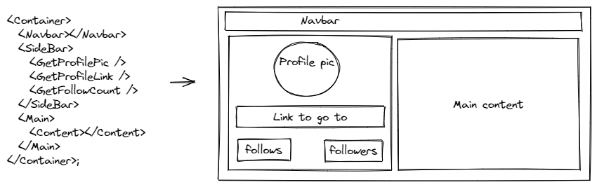

### 2.2. Unidirectional Dataflow

In jQuery or plain JavaScript DOM,  
We have event handlers which are responsible for updating the state of the application which primarily lives in the DOM.

In React,  
Instead of the source of truth for the state of your application living in the DOM, it lives inside of your React components. From there, we can explicitly decide how and when the state should change as well as what the UI looks like based off of that state.

The way to think about this is that your UI is just a function of your state,

`UI = fn(state)`

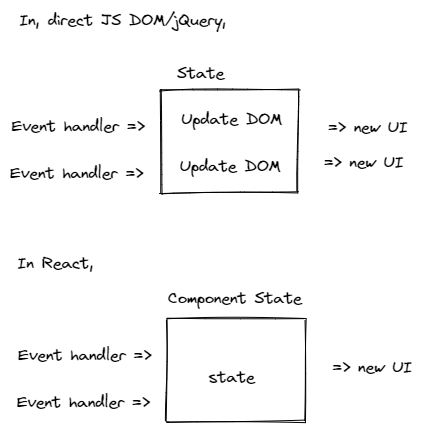

### 2.3. Declarative UI

Imperative code,  
Here we are giving step by step instruction how logic flow should execute and how to update the DOM.

```js
$("span")
  .css("opacity", 1)
  .text("myName = " + myName)
  .fadeIn(30)
  .fadeOut(1000);
```

Declarative code,

```js
<span style={{ opacity: 1 }} fadeIn={30} fadeOut={1000}>
  {myName}
</span>
```

Here we don't give step by step instruction, instead with React, however, that responsibility is abstracted from us. Instead, React allows ud to describe what the UI should look like, not how it gets updated.  
In other words, when a component’s state changes, React will do the hard work of actually updating the DOM.

> HTML, SQL are example of Declarative programming  
> Many (if not all) declarative approaches have some sort of underlying imperative abstraction.

### 2.4. Just JavaScript

In Angular,

```html
<p>Heroes:</p>
<ul>
  <li *ngFor="let hero of heroes">{{ hero }}</li>
</ul>
```

In React,

```js
<p>Heroes:</p>
<ul>
  {heroes.map((hero) => (
    <li>{hero}</li>
  ))}
</ul>
```

## 3. Hello World

How to create an h1 element?

### 3.1. Vanilla JS

index.html

```html
<div id="app"></div>
<script>
  const mountNode = document.getElementById("app");
  const element = document.createElement("h1");
  element.textContent = "Hello World!!";
  element.id = "title"; // or element.setAttribute('id', 'title');
  mountNode.appendChild(element);
</script>
```

### 3.2. React

index.html

```js
<div id="app"></div>

<!-- Obtained from https://reactjs.org/docs/cdn-links.html -->
<script src="https://unpkg.com/react/umd/react.development.js"></script>
<script src="https://unpkg.com/react-dom/umd/react-dom.development.js"></script>

<script>
  const mountNode = document.getElementById("app");
  const element = React.createElement("h1", { id: "title" }, "Hello World!!");
  const root = ReactDOM.createRoot(mountNode);
  root.render(element);
</script>
```

> `React` and `ReactDOM` packages are added to `window` object.

What do we see in browser and Element tab,

```js
<html>
  <head></head>
  <body>
    <div id="app">
      <h1 id="title">Hello World!!</h1>
    </div>

    <!-- Obtained from https://reactjs.org/docs/cdn-links.html -->
    <script src="https://unpkg.com/react/umd/react.development.js"></script>
    <script src="https://unpkg.com/react-dom/umd/react-dom.development.js"></script>

    <script>
      const mountNode = document.getElementById("app");
      const element = React.createElement(
        "h1",
        { id: "title" },
        "Hello World!!"
      );
      ReactDOM.createRoot(mountNode).render(element);
    </script>
  </body>
</html>
```

Let's break this down,

- `div#app`, this is where react application is going to be rendered (created), usually called mount-node or container-node. We can have N number of mount-nodes and each one should have corresponding `ReactDOM.createRoot().render()` associated with them. so all of them can co-exist, also
  this makes easy in embedding the react application in other web projects.
- The `react` package holds the API for elements, components, state, props etc.
- The `react-dom` package (react's browser DOM renderer) is bride between React elements tree and the browser DOM. Often, we only use it for mounting react application to the html page with ReactDOM.createRoot().render()`. Likewise we have react-native as renderer for iOS & Android platform.
- The complete list of React renderers is here `https://github.com/chentsulin/awesome-react-renderer`.
- `React.createElement()` API is responsible for creating react elements like h1, div, input etc.
- `ReactDOM.createRoot(DOMWhere).render(reactWhat)` API is responsible for rendering the react elements to browser DOM (converting react elements or components to respective HTML DOM elements).
- The object(s) we create using React.createElement()/JSX is not HTML or DOM node, they are just object description/representation on HTML elements. When these object goes through renderer (ReactDOM.createRoot().render()), then this function will decide/renders, how each object mapping to HTML elements in browser.

### 3.3. React.createElement API

Let's break postmortem the `createElement` API,

```js
React.createElement(type, props, [...children]);
```

- The **type** argument can be either a tag name string (such as `div` or `span`), a React component type (a `class` or a `function`).
- The **props** argument is an object that specifies the properties (say, DOM properties/attributes) that we want pass on react element.
  Ex, In the above code, { id : "title" } has been passed as props and it's been applied on to h1 element.
- The **children** argument is used to pass the children/nested elements or components.
  Ex, In the above code, we have passed text element "Hello World!!" as a child element (in DOM, text or string passed between open & closed tag is called Text node.

children can be multiple elements or nested elements or combo as shown below,

```js
const element = React.createElement(
  "div",
  { id: "title" },
  React.createElement(
    "p",
    null,
    React.createElement("span", null, "i am nested element")
  ),
  "multiple/nested elements is here"
);
```

maps to,

```html
<div id="app">
  <div id="title">
    <p><span>i am nested element</span></p>
    multiple/nested elements is here
  </div>
</div>
```

### 3.4. Sample login UI using React elements

```html
<div id="app"></div>

<!-- Obtained from https://reactjs.org/docs/cdn-links.html -->
<script src="https://unpkg.com/react/umd/react.development.js"></script>
<script src="https://unpkg.com/react-dom/umd/react-dom.development.js"></script>
<script>
  const mountNode = document.getElementById("app");
  const myForm = React.createElement(
    "div",
    null,
    React.createElement(
      "div",
      null,
      React.createElement("label", null, "Email "),
      React.createElement("input", {
        type: "email",
        placeholder: "enter email here..",
      })
    ),
    React.createElement(
      "div",
      null,
      React.createElement("label", null, "Password "),
      React.createElement("input", {
        type: "password",
        placeholder: "enter password here..",
      })
    ),
    React.createElement(
      "div",
      null,
      React.createElement(
        "button",
        {
          onClick: function handleClick() {
            alert("yo....");
          },
        },
        "Submit"
      )
    )
  );
  ReactDOM.createRoot(mountNode).render(myForm);
</script>
```

No, we don't do this.....🤯🤯!!
We cannot use these kind of React.createElement API for creating complex html document as it's bit unmanageable, and unfriendly for web app designers/developer. So, react has a technology called **JSX** to solve this problem.

## 4. JSX & Forms - in Depth

- JSX is a XML-like syntax extension to ECMAScript.
- JSX stands for JavaScript XML.
- With React, it's an extension for XML-like code for elements and components.

For an example, creating a h1 element using React.createElement() API is,

```js
React.createElement("h1", { id: "title" }, "Hello World!!");
```

Same can be written in JSX as below.

```html
<h1 id="title">Hello World!!</h1>
```

The latter syntax just looks like HTML. but we need to place the JSX inside the script tag or .js file, it will be interpreted as JavaScript code by browser, but browser doesn't understand the JSX syntax, so fails to execute.

So, need to transform (transpile) JSX syntax to pure JavaScript code that browser
can understand. i.e. JSX syntax to corresponding React.createElement() API function calls.

> The transpilation is a process of taking source code and re-writing it to accomplish same results but using the syntax that's understood by old browsers.

### 4.1. Babel

- Babel is a compiler/transpiler that supports latest JavaScript and also includes JSX support.
- Babel can be added as step in the build process where, before serving the app to browser, we can run the babel tool, which generates the browser understandable code.

For the sake of exploring JSX syntax, let us use in-browser transformation instead of focusing on build tools.

> In-browser (client-side) transpilation is not suitable for production grade apps, it's only for prototyping or demo. For real-life application we should have build process in place.  
> Online REPL is available for Babel - `https://babeljs.io/repl/` for any experimentation.

```html
<div id="app"></div>

<!-- Obtained from https://reactjs.org/docs/cdn-links.html -->
<script src="https://unpkg.com/react/umd/react.development.js"></script>
<script src="https://unpkg.com/react-dom/umd/react-dom.development.js"></script>

<!-- Obtained from https://babeljs.io/en/setup/#installation -->
<script src="https://unpkg.com/@babel/standalone/babel.min.js"></script>

<script type="text/babel">
  const mountNode = document.getElementById("app");
  const element = <h1 id="title"> Hello World!!</h1>;
  ReactDOM.createRoot(mountNode).render(element);
</script>
```

- It displays Hello World!! in the browser as earlier.
- `https://unpkg.com/@babel/standalone/babel.min.js` is the In-browser Babel transpiler.
- type="text/babel" , we should add this attribute to our script tag wherever we want to transpile the code.
- So, this way, we don't need to call `React.createElement()`, instead use JSX syntax (looks HTML) to create react elements or components. Babel will take care of transpiling to `React.createElement()` API.

### 4.2. Nesting elements

```html
const element = (
<div id="app">
  <div id="title">
    <p>
      <span>i am nested element</span>
    </p>
    multiple/nested elements is here
  </div>
</div>
);
```

### 4.3. JavaScript in JSX

When building a UI, we often need to use conditional rendering, loops, variables etc . In JSX, it's allowed to use **JavaScript expressions** within curly braces `{ }` (it's called Interpolation also).

An expression produces a value, example, each of these produces or returns a single value. But statements do not produce values.

```js
1+2
labelValue (means a variable or an identifier)
aFunctionCall()
aFunctionName (means, fn expression)
```

Think of these, anything that can be on the right side of an assignment is an
expression, for an example,

```js
var a = 1 + 2;
var b = labelValue;
var c = aFunctionCall();
var d = aFunctionName;
```

Statements, for an example,

```js
var a = i = 5; // NOT A VALID CODE
var b = if(true) { 10;}; // NOT A VALID CODE
var c = while(i < 10) { i++ } // NOT A VALID CODE
var d = switch {} // NOT A VALID CODE
```

> **No JavaScript statements are allowed such as assigning a value to variable, if-else, switch in JSX.**  
> MDN about expressions - `https://developer.mozilla.org/en-US/docs/Web/JavaScript/GuideExpressions_and_Operators#expressions`

```js
const time = new Date().getHours();
const greetings = ["Hi", "Hello", "Good morning", "Good noon", "etc"];
const name = "Jeez";
const element = (
  <div>
    <h3>Greetings,</h3>
    <ul>
      {greetings.map(function (greet) {
        return <li>{greet}</li>;
      })}
    </ul>
    {time < 12 ? <b>Good morning!</b> : <b>I don't care!</b>} {name}
  </div>
);

// Greetings,
// Hi
// Hello
// Good morning
// Good noon
// etc
// Good morning! Jeez
```

Observe, how we inserted our JavaScript expression - ternary operation inside JSX using curly braces { } & Array map for iteration & usage of variables.

Q. How to use JavaScript statements to achieve conditional rendering instead of using ternary, let's say using if else pattern?  
A. Write a function, use any JavaScript syntax and conditionally return a JSX, like below

```js
const mountNode = document.getElementById("app");

const time = new Date().getHours();

function greeting(timeArg) {
  if (timeArg < 12) return <b>Good morning!</b>;
  else if (timeArg > 12) return <b>Good afternoon!</b>;
  else if (timeArg == 12) return <b>I don't care!</b>;
}
const element = <div>{greeting(time)}</div>;
ReactDOM.createRoot(mountNode).render(element);

// Good morning!
```

### 4.4. Comments

```js
const element = (
  <div>
    {
      //<span>1</span> single line comment
    }
    {/* Multi line comment
  <span>2</span>
  <span>2</span>
  <span>2</span>
  */}
    <span>Hmmm....what!!</span>
  </div>
);
// Hmmm....what!!
```

### 4.5. HTML entities

```js
const element = (
  <div>
    <p>1. More info &raquo;</p> {/*HTML ENTITY*/}
    <p>2. More info &#187;</p> {/*HTML CODE*/}
    <p>3. More info &#xbb;</p> {/*HEX CODE*/}
    <p>4. {"More info &raquo;"}</p> {/*HTML ENTITY*/}
    <p>5. {"More info \u00BB"}</p> {/*HTML code*/}
  </div>
);

// 1. More info »

// 2. More info »

// 3. More info »

// 4. More info &raquo;

// 5. More info »
```

4th one did not work, we had put HTML entity inside the JavaScript expression, it is treated as string expression, so, it's double encoded or string escaped.  
So, that's why use Unicode version of HTML ENTITY i.e. \u00BB. See in 5th one.

> To present risk of XSS (Cross Site Scripting) exploits, JSX forces automatic escaping in expressions. String variables in JSX are escaped automatically.

More information about HTML ENTITIES and their various formats

- `https://developer.mozilla.org/en-US/docs/Glossary/Entity`
- `https://www.toptal.com/designers/htmlarrows/arrows/`
- `https://dev.w3.org/html5/html-author/charref`

### 4.6. Fragment - return multiple nodes/elements/components

Below code WILL NOT work, in console it throws below error,
Parse Error: Adjacent JSX elements must be wrapped in an enclosing tag.

```js
const element = (
  <p>1st element</p>
  <p>2nd element</p>
);
```

_It is React's limitation. As JSX syntax is converted to JavaScript function call or
objects, a function cannot return a multiple objects unless with the help of
wrapper object or an array. Also, React expects tree like structure for
rendering/re-rendering/re-conciliation, so, it should return single tree root
node only._

Solutions, it can be solved in multiple ways as below,

```js
const element1 = (
  <React.Fragment>
    <p>1st element</p>
    <p>2nd element</p>
  </React.Fragment>
);

// OR
const element2 = (
  <>
    <p>1st element</p>
    <p>2nd element</p>
  </>
);

// OR
// Think of situation where we are forced to return,
// <td>1</td>
// <td>2</td>, then, <div> can't be used as a wrapper.
// So, it's advisable to use solution 1 or 2.
const element3 = (
  <div>
    <p>1st element</p>
    <p>2nd element</p>
  </div>
);

// OR
const element4 = [<p key="1">1st element</p>, <p key="2">2nd element</p>];
```

It's recommended to use solutions 1 or 2 (2nd one is just a shorthand of 1st one). 3rd one adds unnecessary div & 4th one not is intuitive.

> JSX must always return a single root element.

### 4.7. JSX versus HTML differences

JSX may look like HTML with the advantage of adding dynamic values, loops & conditions. But there are few differences in attributes/props as described below.

#### 4.7.1. class

class attribute will be `className`, Since `class` is reserved keyword in JavaScript

```js
const element = <h1 className="title-card">Hello World!!</h1>;
```

#### 4.7.2. for

for attribute is `htmlFor` in JSX, Since `for` is reserved keyword in JavaScript

```js
const element = <label htmlFor="inputid" />;
```

#### 4.7.3. style

Is an object in JSX

```js
const element = (
  <h1
    style={{
      color: "green",
      backgroundColor: "yellow",
    }}
  >
    Hello World!!
  </h1>
);
```

It's not `background-color`, we should use **camelCase** same as JavaScript API - `backgroundColor`

#### 4.7.4. Unclosed tags

Are not allowed, even though they are fine in HTML.

```js
const element = <br > /* NOT ALLOWED */
const element1 = <br /> /* ALLOWED */
```

#### 4.7.5. camelCase Attributes

All the attributes in JSX needs to be camelCase.

```js
function alertMe() {
  alert("Yo...");
}
const element = (
  <input
    onClick={alertMe}
    value="Try me"
    type="button"
  />
);
```

In HTML `onclick`, but in JSX it is `onClick`

> Exceptions to this rule are all `data-` and `aria-` prefixed attributes;these are just like in HTML.

## 5. Forms, Styling & Events

### 5.1. value v/s defaultValue

In HTML/JavaScript,  
Changing the form control `<input>`, content will not update the control property value. Below is the example,

index.html

```html
<label>Greet: </label>
<input id="greet" value="Hello" type="text" onchange="changeHandler()" />

<script>
  window.onload = function () {
    var control = document.getElementById("greet");
    console.log("prop - value : ", control.value);
    console.log("prop - defaultValue : ", control.defaultValue);
    console.log("attribute - value : ", control.getAttribute("value"));
  };

  function changeHandler() {
    var control = document.getElementById("greet");
    console.log("prop - value : ", control.value);
    console.log("prop - defaultValue : ", control.defaultValue);
    console.log("attribute - value : ", control.getAttribute("value"));
  }
</script>

<!-- 
Page loads,

prop - value :  Hello
prop - defaultValue :  Hello
attribute - value :  Hello 
-->

<!-- 
When we chang the textbox text,

prop - value :  Hi
prop - defaultValue :  Hello
attribute - value :  Hello
-->
```

- HTML attribute - `value` has a equivalent DOM property called - `defaultValue`.
- Changing the attribute `value` reflect in `defaultValue` and vice versa.
- In initial render, HTML attribute - `value` will be copied to DOM property - `value`.
- But changing the DOM property - `value` will not be reflect in either HTML attribute - `value` or DOM property - `defaultValue`.
- So, in the second screen, we only see DOM property `value` has been updated.

In React,

We use `value` property for update-to-date content of a control & to specify default or initial data we use `defaultValue` prop.

```js
function changeHandler(e) {
  console.log("defaultValue prop : ", e.target.defaultValue);
  console.log("value prop : ", e.target.value);
}

const element = (
  <div>
    <label>Greet: </label>
    <input
      id="greet"
      defaultValue="Hello"
      type="text"
      onChange={changeHandler}
    />
  </div>
);

// After the we start changing the text box.

// defaultValue prop :  Hello
// value prop :  Hellos

// defaultValue prop :  Hello
// value prop :  Helloss
```

Instead of `defaultValue`, we can use `value` prop also, then, `value` prop will be copied to defaultValue internally, and we need to have mechanism to update `value` prop back.  
For example,

Try below change and see why it behaves like that?

Change `defaultValue="Hello"` to `value="Hello"` in above code.

**Result:**
I'm trying to change the textbox data, the updated data is appearing in the console but not in the control.
WHY??? Since, "Hello" text is hard-coded to control, react thinks, every render that is the latest value supplied. Hence re-rendering with the same data.

**Solution** : React Controlled Component

### 5.2. onChange for everything

In HTML,  
When using form elements, users change their values when interacting with them.

In React,  
We can subscribe to such changes with `onChange` attribute. This is more consistent than using `checked` for checkboxes & radio buttons, `selected` for `<select>` etc.

`onChange` attributes works in similar fashion for all the form controls such as text, textarea, checkbox, radio, button in React.

### 5.3. Textbox

```js
function chooseLearn(evt) {
  console.log("selected value : ", evt.target.value);
}
const element = (
  <div>
    Last name <input type="text" onChange={chooseLearn} />
  </div>
);

// When we enter text avi in text box
// selected value :  a
// selected value :  av
// selected value :  avi
```

### 5.4. Textarea

```js
function chooseLearn(evt) {
  console.log("selected value : ", evt.target.value);
}
const element = (
  <>
    Summary-1 <textarea defaultValue="can be \n set" onChange={chooseLearn} />
    <br />
    Summary-2 <textarea defaultValue={"can be \n set"} onChange={chooseLearn} />
    <br />
    Summary-3 <textarea onChange={chooseLearn}>can be \n set </textarea>
    <br />
    Summary-4 <textarea onChange={chooseLearn}>{"can be \n set"}</textarea>
    <br />
  </>
);

// Renders in UI

// Summary-1 => can be \n set
// Summary-2 => can be
//               set
// Summary-3 => can be \n set
// Summary-4 => can be
//               set
```

Observe,

- We have used `\n` for multi-line and it works with only JavaScript expression string.
- String literal won't work as JSX escapes them due to XSS.
- In HTML setting the `<textarea>` through `value` is not supported, but in React it is possible just like `<text>` using `value` or `defaultValue` props.
- It's recommended to use `value` or `defaultValue` instead of using the children node.

### 5.5. Radio buttons

```js
function chooseLearn(evt) {
  console.log("selected value : ", evt.target.value);
  console.log("control name : ", evt.target.name);
}
const element = (
  <div>
    Yes
    <input type="radio" value="yes" name="wannalearn" onChange={chooseLearn} />
    <br />
    No
    <input type="radio" value="noo" name="wannalearn" onChange={chooseLearn} />
  </div>
);

// Select Yes, then, in console,
// selected value :  yes
// control name :  wannalearn

// Select No, then, in console,
// selected value :  noo
// control name :  wannalearn
```

### 5.6. Checkboxes

```js
function chooseLearn(evt) {
  console.log("selected value : ", evt.target.value);
}
const element = (
  <div>
    <h3>How many days in a leap year ??</h3>
    <input type="checkbox" value="366" onChange={chooseLearn} />
    366
    <input type="checkbox" value="365" onChange={chooseLearn} />
    365
  </div>
);

// Select 366, then, in console,
// selected value :  366

// Select 365, then, in console,
// selected value :  365
```

### 5.7. `<select>`

In HTML, to pre-select an option, we use `selected` attribute as shown below,

```html
<select>
  <option value="yes">Yes</option>
  <option value="no" selected>No</option>
</select>
```

In React, use `defaultValue` or `value` attribute.

```js
function choosePet(evt) {
  console.log("selected value : ", evt.target.value);
}
const element = (
  <div>
    <h4>Choose a dino pet:</h4>
    <select defaultValue="veloci" onChange={choosePet}>
      <option value="t-rex">Tyrannosaurus Rex</option>
      <option value="tricer">Triceratops</option>
      <option value="veloci">Velociraptor</option>
    </select>
  </div>
);

// When page renders, it selected 'Velociraptor' as default selection

// When Tyrannosaurus Rex selected, in console, we see
// selected value :  t-rex

// When Triceratops selected, in console, we see
// selected value :  tricer
```

For multiple selection, pass an **array of values** & `multiple={true}` attribute.

```js
const element = (
  <div>
    <h4>Choose a dino pet:</h4>
    <select
      defaultValue={["veloci", "t-rex"]}
      multiple={true}
      onChange={choosePet}
    >
      <option value="t-rex">Tyrannosaurus Rex</option>
      <option value="tricer">Triceratops</option>
      <option value="veloci">Velociraptor</option>
    </select>
  </div>
);
```

### 5.8. SyntheticEvent object

event or e or evt argument is React's **SyntheticEvent** object which is a wrapper around the native JavaScript event object.

The event handler function will receive the event object, which looks a lot like a native browser event. It has the standard `stopPropagation` and `preventDefault` functions if you need to prevent bubbling or cancel a form submission.

For example. It’s not actually a native event object though – it is a SyntheticEvent .

The event object passed to a handler function is only valid right at that moment. The SyntheticEvent object is pooled for performance. Instead of creating a new one for every event, React replaces the contents of the one single instance in the event pool.

We can’t access the event object asynchronously (say, after a timeout, or after a state update). If you need to access an event asynchronously, call `event.persist()` and React will keep it around for us.

- If we want to get the native element and all it's props, just navigate through `evt.target`, will get all the native props such as type, name, value etc.
- To have default selection, attribute checked={true} or an expression that evaluates to Boolean like, checked={ someVariable == someothereVar } can be used.

### 5.9. A typical form in React

```js
example here with plain react form and Formik etc
```

## 6. Components & Composition

Until now, we have learned how to create & use React elements.

### 6.1. Elements

React elements are the building blocks of React applications. For an example,

```js
const element = <h1>Hello, world</h1>;
```

### 6.2. Components

React components are small, reusable pieces of code that return a React element to be rendered to the page.

> The simplest version of React component is a plain JavaScript function that returns a React element:

```js
function Welcome() {
  return <h1>Hello, World</h1>;
}
```

Typically, elements are not used directly, but get returned from components.

But, how to render React components??

We can use same `React.createElement()` API to create an "instance" or object of component or JSX way.

Using React.createElement()

```js
const mountNode = document.getElementById("app");

function Welcome() {
  return <h1>Hello, World</h1>;
}

const anInstance = React.createElement(Welcome);

ReactDOM.createRoot(mountNode).render(anInstance);

// Can be used directly inside the render method
// ReactDOM.createRoot(mountNode).render(React.createElement(Welcome));
```

JSX way

```js
const mountNode = document.getElementById("app");

function Welcome() {
  return <h1>Hello, World</h1>;
}

const anInstanceJsx = <Welcome />;
ReactDOM.createRoot(mountNode).render(anInstanceJsx);

// Can be used directly inside the render method
// ReactDOM.createRoot(mountNode).render(<Welcome />);
```

> - **Always start component names with a capital letter.**
> - **React treats components starting with lowercase letters as DOM tags (React elements).**
> - **For example, `<div />` represents an HTML div tag, but `<Welcome />` represents a component.**

## 7. Frontend tooling

Until now, we have been using below techniques for our discussion as a development environment,

- Babel in browser transpilation.
- Inline JavaScript code in the index.html page
- CDN for react, react-dom & babel.js
- No HTTP server usage to serve HTML, CSS & JavaScript files to browser.

When we build a prod application, we cannot use the above techniques or tools as they are not meant for prod use.  
In real apps, we need transpiler, minify JS & CSS, bundling, bundle splitting etc all at the build time.

### 7.1. Node.js & npm

Install Node.js and npm - `https://nodejs.org/en/`

```console
> node --version
  v14.16.1

> npm --version
    6.14.12
```

### 7.2. Webpack - write a build tool from scratch

Let's build our own build tool using webpack.

- At its core, webpack is a **static module bundler** for modern JavaScript applications.
- It examines all of the modules in your application, creates a dependency graph, then intelligently puts all of them together into one or more bundle(s) that your html file can reference.

```md
App.js ---> | | |
Contact.js ---> | Transform | Bundler | -> bundle.js
Sales.js ---> | (optional) | |
```

Official docs

`https://webpack.js.org/`  
`https://webpack.js.org/concepts/`

Problem with existing workflow?

```html
<body>
  // some HTML
  <script src="https://unpkg.com/three@0.136.0/build/three.js"></script>
  <script src="libs/lodash.min.js"></script>
  <script src="src/Contact.js"></script>
  <script src="src/Sales.js"></script>
</body>
```

Problems with above approach is typos, order of scripts, cross browser compatibility of code inside each script etc.

Solution,

```html
<body>
  <script src="dist/bundle.js"></script>
</body>
```

#### 7.2.1. react-arena

```console
> mkdir react-arena; cd react-arena; echo "" > webpack.config.js; echo "" > index.html; npm init -y; mkdir src; echo "" > src/index.js; echo "" > src/styles.css
```

Directory structure

```md
react-arena
├── webpack.config.js
├── src
│ └── index.js
├── package.json
├── index.html
```

```console
npm install --save-dev webpack webpack-cli
```

The whole point of webpack is to “examine all of your modules, (optionally) transform them, then intelligently put all of them together into one or more bundle(s)” , in order to do that, it needs to know three things.

- The entry point of your application
- Which transformations, if any, to make on your code
- The location to put the newly formed bundle(s)

#### 7.2.2. The entry point & output

A typical JavaScript application is composed of modules, for all of them, there must be root ES module file. Let's say `src/index.js`

```js
// webpack.config.js
const path = require("path");
module.exports = {
  entry: "./src/index.js",
  output: {
    path: path.resolve(__dirname, "dist"),
    filename: "bundle.js",
  },
};
```

Now, run webpack, let it bundle our code and generate bundle.js

```console
C:\\...\react-mern > npx webpack
```

```md
react-arena
├── dist
│ └── bundle.js
```

#### 7.2.3. Transformations with Loaders

When `webpack` is building its dependency graph by examining all of your `import / require()` statements, it’s only able to process JavaScript and JSON files. It DOES NOT KNOW how to process `.css`, `.svg`, `.jpg` etc.

```js
// webpack can read and process these files (modules)
import auth from "./api/auth.js"; //
import config from "./utils/config.json"; //

// webpack DOES NOT KNOW how to process below files
import "./styles.css"; // ⁉
import logo from "./assets/logo.svg"; // ⁉
import "./styles.scss"; // ⁉
```

- The primary purpose of a `loader`,as the name suggests, is to give webpack the ability to process more than just JavaScript and JSON files. It teaches webpack how to process other kind of assets and convert them into valid modules that can be consumed by your application and added to the dependency graph.
- These loaders are separate node modules/packages, we should install them and add it to `webpack.config.js`

- All of the information for your loaders will go into an array of objects under `module.rules`.
- Two pieces of information we need to give webpack about each loader.
  - The `test` property identifies which file or files should be transformed.
  - The `use` property indicates which loader should be used to do the transforming.

Ex,

`svg-inline-loader` this webpack loader inlines SVG file as module.

```console
npm install --save-dev svg-inline-loader
```

```js
// webpack.config.js
const path = require("path");
module.exports = {
  entry: "./src/index.js",
  output: {
    path: path.resolve(__dirname, "dist"),
    filename: "bundle.js",
  },
  module: {
    rules: [{ test: /\.svg$/, use: "svg-inline-loader" }],
  },
};
```

- `css-loader` we will be able to import .css files.
- `style-loader` instructs webpack to inject imported CSS in to DOM through a `<style>` tag.
- `babel-loader` loader for transforming “next generation JavaScript” to the JavaScript of today that browsers can understand using Babel (that is - `@babel/core`, `@babel preset-env` & `@babel/preset-react`
- `@babel/core` core Babel library
- `@babel/preset-env` Babel preset that lets you specify an environment (browsers or ECMA script version) and automatically enables the necessary plugins. It determines which features needs to be transformed to run within different browsers or runtime versions.
- `@babel/preset-react` Babel preset is used to transform all your React JSX into functions call.

So,

```console
npm install --save-dev style-loader css-loader babel-loader @babel/preset-env @babel/preset-react @babel/core
```

```js
// webpack.config.js
const path = require("path");
module.exports = {
  entry: "./src/index.js",
  output: {
    path: path.resolve(__dirname, "dist"),
    filename: "bundle.js",
  },
  module: {
    rules: [
      { test: /\.svg$/, use: "svg-inline-loader" },
      { test: /\.css$/, use: ["style-loader", "css-loader"] },
      {
        test: /\.(js)$/,
        use: {
          loader: "babel-loader",
          options: {
            presets: ["@babel/preset-env", "@babel/preset-react"],
          },
        },
      },
    ],
  },
};
```

Notice that we have `style-loader` before `css-loader`. This is important. `webpack` will process those in reverse order. So `css-loader` will interpret the import `'./styles.css'` line then `style-loader` will inject that CSS into the DOM.

So the full process looks something like this.

1. webpack grabs the entry point located at `./src/index.js`.
2. It examines all of our import and require statements and creates a dependency graph.
3. webpack starts creating a bundle, whenever it comes across a path we have a loader for, it transforms the code according to that loader then adds it to the bundle.
4. It takes the final bundle and outputs it at dist/bundle.js.

#### 7.2.4. Plugins

**Plugins allow you to execute certain tasks after the bundle has been created**. Because of this, these tasks can be on the bundle itself, or just to our codebase.

**HtmlWebpackPlugin**  
This plugin will generate an HTML5 file for you that includes all your webpack bundles in the body using `script` tags.

```console
npm install --save-dev html-webpack-plugin
echo "" > index.html
```

index.html

```html
<!DOCTYPE html>
<html lang="en">
  <head>
    <meta charset="UTF-8" />
    <meta
      name="viewport"
      content="width=device-width, initial-scale=1.0"
    />
    <meta http-equiv="X-UA-Compatible" content="ie=edge" />
    <title>react-arena</title>
  </head>
  <body>
    <div id="root"></div>
  </body>
</html>
```

Now, so will tell `HtmlWebpackPlugin` to use this as a template and create a HTML page in dist/ folder with script tag referencing bundle.js.

so,

```js
// webpack.config.js
const path = require("path");
const HtmlWebpackPlugin = require("html-webpack-plugin");
module.exports = {
  entry: "./src/index.js",
  output: {
    path: path.resolve(__dirname, "dist"),
    filename: "bundle.js",
  },
  module: {
    rules: [
      { test: /\.svg$/, use: "svg-inline-loader" },
      { test: /\.css$/, use: ["style-loader", "css-loader"] },
      {
        test: /\.(js)$/,
        use: {
          loader: "babel-loader",
          options: {
            presets: ["@babel/preset-env", "@babel/preset-react"],
          },
        },
      },
    ],
  },
  plugins: [
    new HtmlWebpackPlugin({
      filename: "index.html", // Where and what is the name of the HTML page to create.
      template: "./index.html", // This specifies which file to use as template for the index.html being created.
    }),
  ],
};
```

Now, run webpack, let it bundle our code and generate bundle.js

```console
C:\\...\react-mern > npx webpack
```

```md
react-arena
├── dist
│ └── bundle.js
│ └── index.html
```

dist/index.html - observe the script tag

```html
<!DOCTYPE html>
<html lang="en">
  <head>
    <meta charset="UTF-8" />
    <meta name="viewport" content="width=device-width,initial-scale=1" />
    <meta http-equiv="X-UA-Compatible" content="ie=edge" />
    <title>react-arena</title>
    <script defer="defer" src="bundle.js"></script>
  </head>
  <body>
    <div id="root"></div>
  </body>
</html>
```

#### 7.2.5. webpack DevServer

webpack-dev-server is a development server for webpack . Instead of generating a dist directory, it’ll keep track of your files in memory and serve them via a local server. More than that, it supports live reloading.

```console
npm install webpack-dev-server --save-dev
```

#### 7.2.6. Production vs Development Modes

- To generate production build assets we will use the command webpack it creates the assets in dist folder.
- To run our app in development mode, we will invoke webpack-dev-server it intern uses webpack but it won't generates assets in dist folder instead directly serve them in browser via localhost.

We will use npm-scrips to achieving the mode switching.
package.json

package.json

```json
"scripts": {
  "build": "SET NODE_ENV='production' && webpack",
  "start": "webpack-dev-server"
},
```

Final webpack.config.js

```js
// webpack.config.js
const path = require("path");
const HtmlWebpackPlugin = require("html-webpack-plugin");

module.exports = {
  entry: "./src/index.js",
  output: {
    path: path.resolve(__dirname, "dist"),
    filename: "bundle.js",
  },
  module: {
    rules: [
      {
        test: /\.svg$/,
        use: "svg-inline-loader",
      },
      { test: /\.css$/, use: ["style-loader", "css-loader"] },
      {
        test: /\.(js)$/,
        use: {
          loader: "babel-loader",
          options: {
            presets: ["@babel/preset-env", "@babel/preset-react"],
          },
        },
      },
    ],
  },
  plugins: [
    new HtmlWebpackPlugin({
      filename: "index.html", // Where and what is the name of the HTML page to create.
      template: "./index.html", // This specifies which file to use as template for the index.html being created.
    }),
  ],
  mode: process.env.NODE_ENV === "production" ? "production" : "development",
};
```

Till now whatever we did is for any general web development with webpack.

#### 7.2.7. Add react & react-dom

```console
npm install --save react react-dom
```

create addition filed like below.

```md
react-arena
├── webpack.config.js
├── src
│ └── index.js
│ └── styles.css
├── package.json
├── index.html
```

```js
// src/index.js
import React from "react";
import ReactDOM from "react-dom";
import "./styles.css";
function Hello({ name }) {
  return (
    <div className="title-card ">
      <h1>Hello {name}</h1>
    </div>
  );
}
const mountNode = document.querySelector("#root");
ReactDOM.createRoot(mountNode).render(<Hello name="World!!"></Hello>);
```

```css
/* src/styles.css */
.title-card {
  color: blue;
}
```

Run app in development mode,

```console
npm start
```

`http://localhost:8080/`

Run app in production mode to generate the static build files,

```console
npm run build
```

This will generate the asset like below,

```md
react-arena
├── dist
│ └── bundle.js
│ └── index.html
```

> Use any server application like VSCode ext or Chrome ext to run this static `dist` folder and open index.html file.

Complete code available here [avinash2wards/react-arena](https://github.com/avinash2wards/react-arena) with instructions to run.

### 7.3. Zero config build tools

- We really don't have do this every time, want build a react application.
- We already have no config tools which make use of some bundler and we can start the application just using few CLI commands.

#### 7.3.1. Create React App

This CLI app uses webpack as a bundler

```console
npx create-react-app my-app
cd my-app
npm start
```

That's all.
Whatever we been writing by ourself its already built-in.  
Look at their source code [CRA-webpack.config.js](https://github.com/facebook/create-react-app/blob/main/packages/react-scripts/config/webpack.config.js)

Note: `npm run eject` to see the webpack.config.js locally.

Documentation for CRA can be found here - [CRA](https://create-react-app.dev/)

#### 7.3.2. Vite

This CLI app uses [esbuild](https://esbuild.github.io) and [rollup](https://rollupjs.org/guide/en/) as a bundler

```console
npm init vite@latest
cd vite-project
npm install
npm run dev
```

Documentation for Vite can be found here - [Vite](https://vitejs.dev/)

## 8. Thinking in Components (React Tweet)

Let's build a meaningful user interface using React components.

A Tweet

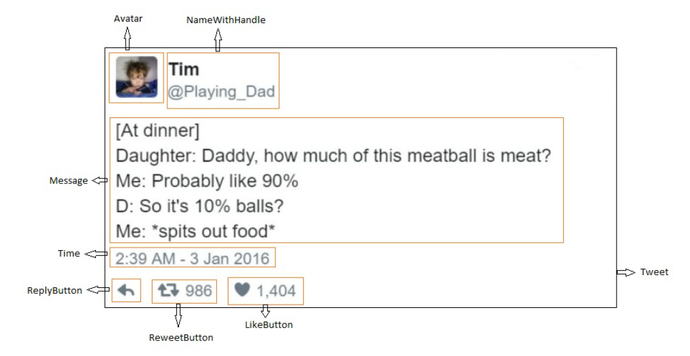

The mental model to build above UI is goes like, a Tweet is a parent component which consist of smaller components in given placement. So the hierarchy looks like below,

- Tweet
  - Avatar
  - NameWithHandle
  - Message
  - Time
  - ReplyButton
  - RetweetButton
  - LikeButton

Create and start the app.

```console
npx create-react-app a-react-tweet
cd a-react-tweet
npm start
```

Add Font Awesome CDN to index.html

```html
<link
  rel="stylesheet"
  href="https://use.fontawesome.com/releases/v5.0.12/css/all.css"
/>
```

src/index.css

```css
.tweet {
  border: 2px solid #ccc;
  width: 564px;
  min-height: 68px;
  padding: 10px;
  display: flex;
  flex-direction: column;
  font-family: "Helvetica", arial, sans-serif;
  font-size: 14px;
  line-height: 18px;
}
.header {
  display: flex;
}
```

src/index.js

```js
import React from "react";
import ReactDOM from "react-dom";
import "./index.css";

function Tweet() {
  return (
    <div className="tweet">
      <div className="header">Tweet</div>
    </div>
  );
}
ReactDOM.createRoot(document.querySelector("#root")).render(<Tweet />);
```

A basic layout will be rendered something like this,


src/Avatar.js;

```js
import React from "react";
import "./Avatar.css";

function Avatar() {
  return ;
}
export { Avatar };
```

src/Avatar.css

```css
.avatar {
  width: 50px;
  height: 50px;
  border-radius: 5px;
  margin-right: 10px;
}
```

src/index.js; updated,

```js
import React from "react";
import ReactDOM from "react-dom";
import "./index.css";
import { Avatar } from "./Avatar";
function Tweet() {
  return (
    <div className="tweet">
      <div className="header">
        <Avatar />
      </div>
    </div>
  );
}
ReactDOM.createRoot(document.querySelector("#root")).render(<Tweet />);
```

src/NameWithHandle.js

```js
import React from "react";
import "./NameWithHandle.css";
function NameWithHandle() {
  return (
    <span className="name-with-handle">
      <div className="name">Tim</div>
      <div className="handle">@Playing_Dad</div>
    </span>
  );
}
export { NameWithHandle };
```

src/NameWithHandle.css

```css
.name {
  font-weight: bold;
  margin-bottom: 0.1em;
}
.handle {
  color: #8899a6;
  font-size: 13px;
  margin-bottom: 0.1em;
}
```

src/Message.js

```js
import React from "react";
import "./Message.css";
function Message() {
  return (
    <div className="message">
      [At dinner] <br />
      Daughter: Daddy, how much of this meatball is meat?
      <br />
      Me: Probably like 90% <br />
      D: So it's 10% balls? <br />
      Me:*spits out food*
    </div>
  );
}
export { Message };
```

src/Message.css

```css
.message {
  color: #584600;
  font-size: 15px;
  margin-top: 0.5em;
  line-height: 25px;
}
```

src/index.js; updated,

```js
import React from "react";
import ReactDOM from "react-dom";
import "./index.css";
import { Avatar } from "./Avatar";
import { Message } from "./Message";
import { NameWithHandle } from "./NameWithHandle";
function Tweet() {
  return (
    <div className="tweet">
      <div className="header">
        <Avatar />
        <NameWithHandle />
      </div>
      <Message />
    </div>
  );
}
ReactDOM.createRoot(document.querySelector("#root")).render(<Tweet />);
```

src/ActionButtons.js

```js
import React from "react";
import "./ActionButtons.css";

const Time = () => <span className="time">2:39 AM - 3 Jan 2016</span>;

const ReplyButton = () => <i className="fa fa-reply reply-button" />;

const RetweetButton = () => (
  <i className="fa fa-retweet retweet-button">
    <span> 986</span>
  </i>
);

const LikeButton = () => (
  <i className="fa fa-heart like-button">
    <span> 1,404</span>
  </i>
);

export { Time, ReplyButton, RetweetButton, LikeButton };
```

src/ActionButtons.css

```css
.time {
  color: #8899a6;
}
```

src/index.js; updated,

```js
import React from "react";
import ReactDOM from "react-dom";
import "./index.css";
import { Avatar } from "./Avatar";
import { Message } from "./Message";
import { NameWithHandle } from "./NameWithHandle";
import { Time, ReplyButton, LikeButton, RetweetButton } from "./ActionButtons";
function Tweet() {
  return (
    <div className="tweet">
      <div className="header">
        <Avatar />
        <NameWithHandle />
      </div>
      <Message />
      <div className="time-container">
        <Time />
      </div>
      <div className="buttons">
        <ReplyButton />
        <RetweetButton />
        <LikeButton />
      </div>
    </div>
  );
}
ReactDOM.createRoot(document.querySelector("#root")).render(<Tweet />);
```

src/index.css; updated,

```css
.tweet {
  border: 2px solid #ccc;
  width: 564px;
  min-height: 68px;
  padding: 10px;
  display: flex;
  flex-direction: column;
  font-family: "Helvetica", arial, sans-serif;
  font-size: 14px;
  line-height: 18px;
}
.header {
  display: flex;
}
.time-container {
  padding-top: 0.3em;
  padding-bottom: 0.3em;
  font-size: 1.1em;
}
.buttons {
  margin-top: 10px;
  margin-left: 2px;
  font-size: 1.4em;
  color: #aab8c2;
}
.buttons span {
  font-size: 0.9em;
  font-weight: normal;
  color: #8899a6;
}
.buttons i {
  width: 80px;
}
```

The full source code available here [avinash2wards/react-tweet](https://github.com/avinash2wards/a-react-tweet/tree/master) with instructions to run.

The final component will be like,


Try adding more components like Follow, ShareOptions etc.

Now the Tweet's content is static/hard-coded, but will learn how to pass the data dynamically through properties (props) & make it reusable component by generating list of Tweets.

## 9. Props

- In HTML elements we have `attributes`
- React components have `props` (short for “properties”).
- Props are the way to pass the data between components in React.

> Props are to components what arguments are to functions.

**Props carry the data from parent components to children & vice versa.**

### 9.1. Passing Props (Parent to Child)

We can pass any valid expression just like in JSX as props to any React components.

> The JavaScript statements cannot be used!! again!.

```js
import React from "react";
import ReactDOM from "react-dom";

const isOfficial = true;
const showCapital = false;

const getCoordinates = () => "20.5937° N, 78.9629° E";

function CountryCard() {
  return <div />;
}
const rootElement = document.getElementById("root");

ReactDOM.createRoot(rootElement).render(
  <CountryCard
    className="country-detail"
    name={isOfficial ? "Republic of India" : "India"}
    capital={showCapital && "Delhi"}
    independence={1900 + 47}
    population={133.92}
    coordinates={getCoordinates()}
    languages={["Hindi", "English", "Kannada"]}
  />
);
```

### 9.2. Receiving Props (Parent to Child)

Props are passed as the first argument to a component function, like this: and it's an object as you see in the console.

```js
function CountryCard(props) {
  console.log(props);
  return (
    <div>
      <p>Name : {props.name}</p>
      <p>Capital : {props.capital}</p>
      <p>Independence : {props.independence}</p>
      <p>Population : {props.population} crores</p>
      <p>
        Coordinates : <code>{props.coordinates} </code>
      </p>
      <div>
        Languages :
        {
          <ol>
            {props.languages.map((lang) => {
              return <li>{lang}</li>;
            })}
          </ol>
        }
      </div>
    </div>
  );
}

// In UI

/*
Name : Republic of India

Capital :

Independence : 1947

Population : 133.92 crores

Coordinates : 20.5937° N, 78.9629° E

Languages :
   1. Hindi
   2. English
   3. Kannada
*/

// In Console

/*
{
    "className": "country-detail",
    "name": "Republic of India",
    "capital": false,
    "independence": 1947,
    "population": 133.92,
    "coordinates": "20.5937° N, 78.9629° E",
    "languages": [
        "Hindi",
        "English",
        "Kannada"
    ]
}
*/
```

> We ca use object destructing for argument and arrow function for component definition

### 9.3. Communicating With Parent Components (Child to Parent)

- One important thing to know is that props are read-only.
- Components that receive props must not change them.
- In React, data flows one way. Props are read-only, and can only be passed down to children.

If we cannot change the props, then how to communicate/send data from child to parent component??

If a child needs to send data to its parent, the parent can send down a function as a prop, like this:

Ex-1,

```js
import React from "react";
import ReactDOM from "react-dom";

function handleAction(event) {
  console.log("coming from child component:", event);
}

function Parent() {
  return <Child onAction={handleAction} />;
}

function Child(props) {
  return <button onClick={props.onAction}>Child</button>;
}

const rootElement = document.getElementById("root");

ReactDOM.createRoot(rootElement).render(<Parent />);

// In Consol, after clicking on button
// coming from child component: SyntheticBaseEvent {_reactName: 'onClick' …}
```

- The Child component receives the onAction prop, which it can call whenever it needs to send up the data or notify the parent that something happened.
- One place where it’s common to pass functions as props is for handling events.

Ex-2, A practical one,

```js
goes here
```

### 9.4. Children

`props.children` is what is used to display whatever we include between the opening and closing tags when invoking a component.

```js
import React from "react";
import ReactDOM from "react-dom";

const rootElement = document.getElementById("root");

const MovieTitleCard = (props) => {
  console.log(props);
  return <h3>I'm from MovieTitleCard & staying in MovieTitleCard</h3>;
};

ReactDOM.createRoot(rootElement).render(
  <MovieTitleCard>What!!! Am i abandoned???</MovieTitleCard>
);

// In UI,
// I'm from MovieTitleCard & staying in MovieTitleCard

// In Console
// {
//   "children": "What!!! Am i abandoned???"
// }
```

- When React renders `MovieTitleCard`, it will pass all of its sub-elements (in this case, the text “What!!! Am i abandoned?? ”) into MovieTitleCard as a prop called `children`. We can see that in console.
- The children are automatically passed in, but they’re not automatically displayed anywhere. We have to explicitly render the children somewhere in your component. If you don’t they are ignored.

Let's capture children prop & render.

```js
import React from "react";
import ReactDOM from "react-dom";

const rootElement = document.getElementById("root");

const MovieTitleCard = (props) => {
  const { children } = props;
  return (
    <>
      <h3>I'm from MovieTitleCard & staying in MovieTitleCard</h3>
      <h4>{children}</h4>
    </>
  );
};

ReactDOM.createRoot(rootElement).render(
  <MovieTitleCard>
    I'm an alien, I don't know where I am from but now staying in MovieTitleCard
  </MovieTitleCard>
);

// In UI,
// I'm from MovieTitleCard & staying in MovieTitleCard
// I'm an alien, I don't know where I am from but now staying in MovieTitleCard
```

This can be achieved by passing normal props like `children={"sometext"}`. prop name need not be children it can be anything.

More practical example,

Think of passing a graphic movie name, like passing nested elements, then its natural to use children prop. For an example,

```js
import React from "react";
import ReactDOM from "react-dom";

const rootElement = document.getElementById("root");

const MovieTitleCard = ({ children, releaseDate }) => {
  return (
    <>
      <p>Releasing on {releaseDate}</p>
      {children}
    </>
  );
};

ReactDOM.createRoot(rootElement).render(
  <MovieTitleCard releaseDate={2015}>
    <div>
      <p>
        MAD MAX <sub>FURY ROAD</sub>
      </p>
      
    </div>
  </MovieTitleCard>
);
```

Output UI,


This way we can build reusable components easily.  
For example error message boxes, Modal dialog etc where layout is fixed but the content is passed based on the situations.

There is, however, one major limitation to this pattern: props.children must be rendered as-is.

Q. What if we want the host component (MovieTitleCard) to pass its own props or some data to those children?

A/solution: Render Props or Function as Children pattern.  
CHECK CLASS BASED COMPONENT SECTION.

### 9.5. Manipulating children

- Host components never know what type of data their `children` prop will be.
- It could be an array, it could be an element, it could be just text.
- It could be anything. React provides utility functions for dealing with this opaque data structure.

- React.Children.map(children, function)
- React.Children.forEach(children, function)
- React.Children.count(children)
- React.Children.only(children)
- React.Children.toArray(children)

**map** and **forEach**: They accept children, whether it’s a single element or an array, and a function that’ll be called for each element. forEach iterates over the children and returns nothing, whereas map returns an array made up of the values you return from the function you provide.

**count**: it returns the number of items in children.

**toArray**: it converts children into a flat array, whether it was an array or not.

**only**: returns the single child, or throws an error if there is more than one child.

We have access to every child element individually, so you can reorder them, remove some, insert new ones, pass the children down to further children, and so on.

For an example,

```js
import React from "react";
import ReactDOM from "react-dom";

const rootElement = document.getElementById("root");

function Nav({ children }) {
  const oldMenus = React.Children.toArray(children);
  const newMenus = [];
  for (let i = 0; i < oldMenus.length; i++) {
    newMenus.push(oldMenus[i]);
    newMenus.push(" | ");
  }
  newMenus.push(<NavItem>Help</NavItem>);
  return <ul>{newMenus}</ul>;
}

function NavItem({ children }) {
  return (
    <li style={{ display: "inline" }}>
      <a href="#">{children}</a>
    </li>
  );
}

ReactDOM.createRoot(rootElement).render(
  <Nav>
    <NavItem key="1">Home</NavItem>
    <NavItem key="2">Products</NavItem>
    <NavItem key="3">Services</NavItem>
  </Nav>
);

// In UI,
// Home | Products | Services | Help
```

### 9.6. Default props

```js
import React from "react";
import ReactDOM from "react-dom";

class DisplayMonitorClass extends React.Component {
  render() {
    return (
      <p>
        {this.props.message} and size is {this.props.size}
      </p>
    );
  }
}

DisplayMonitorClass.defaultProps = {
  size: "21 inch",
};

function DisplayMonitorFunc({ size = "21 inch", message }) {
  return (
    <p>
      {message} and size is {size}
    </p>
  );
}

const  = document.querySelector("#root");

ReactDOM.createRoot(mountNode).render(
  <>
    <h3>Class component</h3>
    <DisplayMonitorClass size="14 inch" message="prop has be en passed" />
    <DisplayMonitorClass message="No prop has been passed, so using the default prop" />
    <hr />
    <h3>Functional component</h3>
    <DisplayMonitorFunc size="14 inch" message="prop has been passed" />
    <DisplayMonitorFunc message="No prop has been passed, so using the default prop" />
  </>
);

// In UI
/*
Class component
prop has be en passed and size is 14 inch

No prop has been passed, so using the default prop and size is 21 inch

Functional component
prop has been passed and size is 14 inch

No prop has been passed, so using the default prop and size is 21 inch
*/
```

## 10. React Tweet with props

We’ll take the a-tweet-react example and rework it to display dynamic data by using props.

src/Avatar.js; updated,

```js
import React from "react";
import "./Avatar.css";

function Avatar({ gravatar }) {
  return ;
}

export { Avatar };
```

src/Message.js; updated,

```js
import React from "react";
import "./Message.css";

function Message({ text }) {
  return <div className="message" dangerouslySetInnerHTML={{ __html: text }} />;
}

export { Message };
```

`dangerouslySetInnerHTML` is React’s replacement for using `innerHTML` in the browser DOM. Since we have `<br/>` in the text, React will escape them by default, so, using `dangerouslySetInnerHTML`.

src/NameWithHandle.js; updated,

```js
import React from "react";
import "./NameWithHandle.css";

function NameWithHandle({ author }) {
  const { handle, name } = author;
  return (
    <span className="name-with-handle">
      <div className="name">{name}</div>
      <div className="handle">{handle}</div>
    </span>
  );
}

export { NameWithHandle };
```

src/ActionButtons.js; updated,

```js
import React from "react";
import "./ActionButtons.css";

const Time = ({ time }) => <span className="time">{time}</span>;

const ReplyButton = () => <i className="fa fa-reply reply-button" />;

const RetweetButton = ({ count }) => (
  <i className="fa fa-retweet retweet-button">
    <span> {count}</span>
  </i>
);

const LikeButton = ({ count }) => (
  <i className="fa fa-heart like-button">
    <span> {count}</span>
  </i>
);

export { Time, ReplyButton, RetweetButton, LikeButton };
```

- We can add validations for LikeButton & RetweetButton such as what if count is zero.
- Conditional rendering - use ternary or && or function with if-else.

src/TWEETS_DATA.js; added

```js
const TWEETS_DATA = [
  {
    id: 1,
    message: `life is soup, i am a fork
  `,
    gravatar: "https://i.pravatar.cc/50",
    author: {
      handle: "@pakalupapito",
      name: "pakalu papito",
    },
    likes: 420,
    retweets: 840,
    timestamp: "2:39 AM - 3 Jan 2016",
  },
  {
    id: 2,
    message: `
  [At dinner] <br />
  Daughter: Daddy, how much of this meatball is meat?
  <br />
  Me: Probably like 90% <br />
  D: So it's 10% balls? <br />
  Me:*spits out food*
  `,
    gravatar: "https://i.pravatar.cc/50",
    author: {
      handle: "@Playing_Dad",
      name: "Tim",
    },
    likes: 1404,
    retweets: 986,
    timestamp: "2:39 AM - 3 Jan 2016",
  },
  {
    id: 3,
    message: `
  i pretend i don't care but deep down i really
  still don't care
  `,
    gravatar: "https://i.pravatar.cc/50",
    author: {
      handle: "@pakalupapito",
      name: "pakalu papito",
    },
    likes: 110,
    retweets: 9,
    timestamp: "2:39 AM - 3 Jan 2016",
  },
];
export { TWEETS_DATA };
```

src/index.js; updated,

```js
import React from "react";
import ReactDOM from "react-dom";

import "./index.css";
import { Avatar } from "./Avatar";
import { Message } from "./Message";
import { NameWithHandle } from "./NameWithHandle";
import { Time, ReplyButton, LikeButton, RetweetButton } from "./ActionButtons";
import { TWEETS_DATA } from "./TWEETS_DATA";

function Tweets(props) {
  const { tweets } = props;
  return (
    <>
      {tweets.map((t) => (
        <Tweet key={t.id} tweet={t} />
      ))}
    </>
  );
}

function Tweet({ tweet }) {
  return (
    <div className="tweet">
      <div className="header">
        <Avatar gravatar={tweet.gravatar} />
        <NameWithHandle author={tweet.author} />
      </div>
      <Message text={tweet.message} />
      <div className="time-container">
        <Time time={tweet.timestamp} />
      </div>
      <div className="buttons">
        <ReplyButton />
        <RetweetButton count={tweet.retweets} />
        <LikeButton count={tweet.likes} />
      </div>
    </div>
  );
}

ReactDOM.createRoot(document.querySelector("#root")).render(
  <Tweets tweets={TWEETS_DATA} />
);
```

The final output,


The full source code available here [avinash2wards/react-tweet-with-props](https://github.com/avinash2wards/a-react-tweet/tree/a-react-tweet-with-props) with instructions to run.

Challenge:  
Build - Credit/Debit, PAN, Aadhar card components or a Facebook post.

## 11. useState - The State Hook

Till this point we’ve used props to pass data to components those were pretty static or _stateless_.

- React has a concept of state, which is, the data our component uses to render itself.
- When state changes, React rebuilds the necessary UI (component) without us having to do anything like DOM traversing or manipulation.
- Whenever we think of changing the UI, then change the state, React efficiently updates the UI.

What to Put in State?  
As a general rule, data that is stored in state should be referenced inside render somewhere.

Component state is for storing UI state – things that affect the visual rendering of the page. This makes sense because any time state is updated, the component will re-render.

that is,

```md
UI = fn(State)
```

So, If modifying a piece of data does not visually change the component, that data shouldn’t go into state.

Here are some things that make sense to put in state:

- User-entered input (values of text boxes and other form fields)
- Current or selected item (the current tab, the selected row etc)
- Data from the server (a list of products, the number of “likes” on a page)
- Open/closed state (modal open/closed, sidebar expanded/hidden, accord-in open/close etc)

Ex-1,  
Why searchTerm is not updating in UI, though it show latest value in console?

```js
import React from "react";
import ReactDOM from "react-dom";

const Form = () => {
  let searchTerm = "lucky";
  const handleChange = (e) => {
    searchTerm = e.target.value;
    console.log(searchTerm);
  };

  return (
    <form>
      <input onChange={handleChange} />
      <div>You are searching for : {searchTerm}</div>
    </form>
  );
};

const rootElement = document.getElementById("root");
ReactDOM.createRoot(rootElement).render(<Form />);
```

- Here, Component rendered first time with initial value lucky but react does not know that we are changing the value of searchTerm.
- So it can re-render itself, so it can show latest value stored in searchTerm.
- But how?

### 11.1. useState

`useState` comes built-in with React and can be accessed via `React.useState`

It takes in a single argument, the initial value for that piece of state, and returns an array with the first item being the state value and the second item being a way to update that state.

Ex-1

```js
import React from "react";
import ReactDOM from "react-dom";

const Form = () => {
  let [searchTerm, setSearchTerm] = React.useState("lucky");
  const handleChange = (e) => {
    setSearchTerm(e.target.value);
  };

  return (
    <form>
      <input onChange={handleChange} />
      <div>You are searching for : {searchTerm}</div>
    </form>
  );
};

const rootElement = document.getElementById("root");
ReactDOM.createRoot(rootElement).render(<Form />);

// Now searchTerm is in sync with UI
```

But, when page first renders, i want default searchTerm to show in the text as well? How do i do it?

Ex-2

Controlled Component

```js
import React from "react";
import ReactDOM from "react-dom";

const Form = () => {
  let [searchTerm, setSearchTerm] = React.useState("lucky");
  const handleChange = (e) => {
    // Filter out, special characters number etc etc
    let temp = e.target.value.replace(/[^a-zA-Z]+/, "");
    setSearchTerm(temp);
  };

  return (
    <form>
      <input value={searchTerm} onChange={handleChange} />
      <div>You are searching for : {searchTerm}</div>
    </form>
  );
};

const rootElement = document.getElementById("root");
ReactDOM.createRoot(rootElement).render(<Form />);

// Try typing anything other than text, it will sanitize it.
```

> Note : Remove `onChange={handleChange}` on `input` control and observe the behavior.

### 11.2. The Mental Model

`useState` allows you to,

- trigger the component re-render
- it can preserve values between renders.

Trigger Re-renders

Whenever we invoke the updater function that useState gives us, assuming the argument you pass in is different from the current state value, React will cause a re-render to the component, updating the UI.

Preserve Values

Typically when you invoke a function in JavaScript, unless you’re utilizing closures you expect any values defined in that function to get garbage collected once the function is finished executing and you expect each subsequent call to that function to produce its own unique values. But in React.useState it does preserve.

So, what is `useState` now?

**useState is a tool to add state to functional components and to preserve values between function calls/renders and to trigger a re-render of the component.**

> We’ll learn of another Hook (useRef) that, like useState, allows you to preserve values between renders but, unlike useState, won’t trigger a rerender to the component.

### 11.3. Functional update

Whenever you’re setting the current state based on the previous state, you’ll want to pass a function to your updater function so you get the correct, most up to date value. This's because setting/updating the state is asynchronous.

Ex-3

```js
import React from "react";
import ReactDOM from "react-dom";

const Counter = () => {
  const [count, setCount] = React.useState(0);

  const increment = () => setCount((count) => count + 1);
  const decrement = () => setCount((count) => count - 1);

  return (
    <React.Fragment>
      <button onClick={decrement}>-</button>
      <h1>{count}</h1>
      <button onClick={increment}>+</button>
    </React.Fragment>
  );
};

const rootElement = document.getElementById("root");
ReactDOM.createRoot(rootElement).render(<Counter />);
```

In smaller apps, we may get the most updated value by just putting count+1 , but in big apps where it involved heavy computation;the function updater is must i.e. `count => count + 1`

### 11.4. Lazy State Initialization

Q. What if the initial value for a piece of state was the result of an expensive calculation?

A.

- If the initial value for a piece of state is the result of an expensive calculation, we can pass useState a function that when invoked, will resolve to the initial state.
- **When useState sees that it received a function as its initial state argument, it’ll only invoke it once on the initial render**.

Ex-4

```js
import React from "react";
import ReactDOM from "react-dom";

const getExpensiveCount = () => {
  console.log("Calculating initial count");
  return 999;
};
const Counter = () => {
  const [count, setCount] = React.useState(() => getExpensiveCount()); // Or just getExpensiveCount

  const increment = () => setCount((count) => count + 1);
  const decrement = () => setCount((count) => count - 1);

  return (
    <React.Fragment>
      <button onClick={decrement}>-</button>
      <h1>{count}</h1>
      <button onClick={increment}>+</button>
    </React.Fragment>
  );
};

const rootElement = document.getElementById("root");
ReactDOM.createRoot(rootElement).render(<Counter />);

// Look in the console, below message only prints on first render, there onwards
// it will use the state value from react internals and ignore the initial state value.

// Calculating initial count
```

> Change from `() => getExpensiveCount()` to `getExpensiveCount()`, now this is same as passing the value directly. Difference is on every re-render of component, unnecessary this function gets invoked and causes memory leakage.  
> Check the message prints multiple times.

More examples,

Ex-5,Todo app,

```js
import React from "react";
import ReactDOM from "react-dom";

function generateId() {
  return new Date().getTime(); // Represents milliseconds elapsed between 1 January 1970 00:00:00 UTC and the given date.
}

const Todo = () => {
  const [todos, setTodos] = React.useState([]);
  const [input, setInput] = React.useState("");

  const handleSubmit = () => {
    setTodos((todos) =>
      todos.concat({
        text: input,
        id: generateId(),
      })
    );
    setInput("");
  };

  const removeTodo = (id) =>
    setTodos((todos) => todos.filter((t) => t.id !== id));

  return (
    <div>
      <input
        type="text"
        value={input}
        onChange={(e) => setInput(e.target.value)}
        placeholder="New Todo"
      />
      <button onClick={handleSubmit}>Submit</button>
      <ul>
        {todos.map(({ text, id }) => (
          <li key={id}>
            <span>{text}</span>
            <button onClick={() => removeTodo(id)}>X</button>
          </li>
        ))}
      </ul>
    </div>
  );
};

const rootElement = document.getElementById("root");
ReactDOM.createRoot(rootElement).render(<Todo />);
```

## 12. useEffect - Handling Side Effects

- A side effect is anything that interacts with the outside world (in our case, “outside” meaning outside of the local function (component) that’s being executed)
- Mutating non-local variables, making network requests, and updating the DOM are all examples of common side effects.

Ex,

```js
// 1. Mutating non-local variables
function addTodo(todo) {
  todos.push(todo);
}

// 2. making network requests
function getData() {
  return fetch("https://jsonplaceholder.typicode.com/todos/1")
    .then((response) => response.json())
    .then((json) => console.log(json));
}

// 3. updating the DOM
function updateDocumentTitle(title) {
  document.title = title;
  document.addEventListener("scroll", () => {});

  // May be the #name element is in the dom, want to directly talk to it
  document.querySelector("#name").addEventListener("change", () => {});
}
```

**Whenever we want to interact with the world, outside of React (whether that’s to make a network request, manually update the DOM, etc.), we’d reach for `useEffect`.**

- How to add an effect
- How to skip re-invoking the effect
- How to (optionally) clean up that effect.

### 12.1. Add an effect

To add a side effect to your React component, you invoke useEffect passing it a function which defines your side effect.

Ex-1,

```js
import React from "react";
import ReactDOM from "react-dom";

const Example = () => {
  React.useEffect(() => {
    console.log("Hi, useEffect");
    document.title = "Hi, useEffect";
  });
  return <></>;
};

const rootElement = document.getElementById("root");
ReactDOM.createRoot(rootElement).render(<Example />);

// In console and chrome's tab name,
// Hi, useEffect
```

**By default, React will re-invoke the effect after every render or re-render.**

The `console.count()` method logs the number of times that this particular call to count() has been called.

Ex-2,

```js
import React from "react";
import ReactDOM from "react-dom";

const Counter = () => {
  const [count, setCount] = React.useState(0);

  React.useEffect(() => {
    console.count("In useEffect, after render");
    document.title = `I'ma also changing - ${count}`;
  });

  console.count("Rendering");

  return (
    <>
      <button onClick={() => setCount((c) => c - 1)}>-</button>
      <h1>Count: {count}</h1>
      <button onClick={() => setCount((c) => c + 1)}>+</button>
    </>
  );
};

const rootElement = document.getElementById("root");
ReactDOM.createRoot(rootElement).render(<Counter />);
```

When initial render,

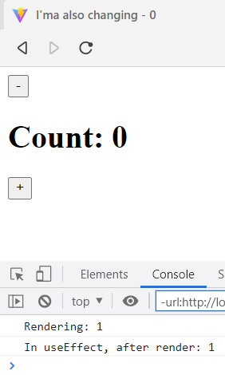

Click on [+] button 2 times (re-render), we arrive at below result.

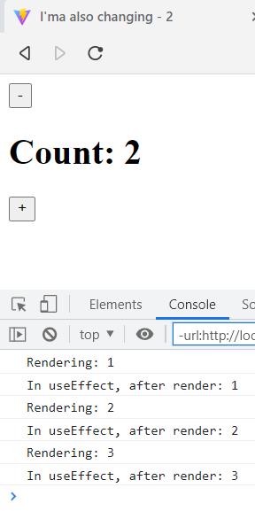

The Mental Model

```md
Initial Render
count: 0
Register Effect: () => document.title = `I'm also changing - 0`
Description of UI (in memory): `Count: 0`
React: Updates the DOM
Browser: Re-paints with DOM updates
React invokes Effect: () => document.title = `I'm also changing - 0`

User clicks on [+] Button
React increments "count" by 1, **causing a re-render**

Next Render
count: 1
Register Effect : () => document.title = `I'm also changing - 1`
Description of UI (in memory): `Count: 1`
React: Updates the DOM
Browser: Re-paints with DOM updates
React invokes Effect: () => document.title = `I'm also changing - 1`

User clicks on [+] Button, again
React increments "count" by 1, **causing a re-render**

Next Render
count: 2
Register Effect : () => document.title = `I'm also changing - 2`
Description of UI (in memory): `Count: 2`
React: Updates the DOM
Browser: Re-paints with DOM updates
React invokes Effect: () => document.title = `I'm also changing - 2`
```

Ex-3, useEffect with HTTP call as a side effect

```js
import React from "react";
import ReactDOM from "react-dom";

const getGithubProfile = async (username) => {
  const res = await fetch(`https://api.github.com/users/${username}`);
  return res.json();
};
const Profile = () => {
  const [profile, setProfile] = React.useState(null);

  React.useEffect(() => {
    getGithubProfile("ry").then((data) => {
      // Uncommenting the below line will cause an infinite loop;
      // setProfile(data);
    });
  });

  if (profile === null) {
    return <p>Loading...</p>;
  }

  return (
    <>
      <p>{profile.name}</p>
      <p>{profile.blog}</p>
      <p>{profile.location}</p>
    </>
  );
};

const rootElement = document.getElementById("root");
ReactDOM.createRoot(rootElement).render(<Profile />);
```

The Mental Model

Our component gets rendered then invokes our effect, which updates our state, which triggers a re-render, which then invokes our effect, which updates our state, which triggers a re-render, and on and on. So, result in an **infinite loop**.

```md
Initial Render
profile: null
Register Effect: () => getGithubProfile('ry').then(setProfile)
Description of UI (in memory): Loading...
React: Updates the DOM
Browser: Re-paints with DOM updates
React invokes Effect: () => getGithubProfile('ry').then(setProfile)

setProfile was invoked
React updates "profile", **causing a re-render**

Next Render
profile: { name: "Ryan Dahl", id: 80 }
Register Effect: () => getGithubProfile('ry').then(setProfile)
Description of UI (in memory): <p>Ryan Dahl</p> ...
React: Updates the DOM
Browser: Re-paints with DOM updates
React invokes Effect: () => getGithubProfile('ry').then(setProfile)

setProfile was invoked
React updates "profile", **causing a re-render**

Next Render
.
.
.

setProfile was invoked
React updates "profile", **causing a re-render**

Next Render
.
.
.

**So, Causing infinite loop**
```

How to solve this issue?

### 12.2. Skipping side effects

`useEffect` receives second argument, that must be used to control when to invoke useEffect.

1. If we **don't pass the second argument**, then useEffect initial render and every subsequent re-renders.

    ```js
    React.useEffect(() => {
      // Will be invoked on the initial render
      // and all subsequent re-renders.
    });
    ```

2. If we pass an **array of all outside values** the effect depends on, then React can infer when to re-invoke the effect based on if any of those values change between renders.

    ```js
    React.useEffect(() => {
      // Will be invoked on the initial render
      // and when "id" or "name" changes.
    }, [id, name]);
    ```

3. If we pass an **empty array**, then useEffect only be invoked on the initial render.

```js
React.useEffect(() => {
  // Will only be invoked on the initial render
}, []);
```

Q. So, which one to use among these 3 to stop the infinite loop issue we faced in above example ???

A. Since we hard-coded the username to be **ry** , our effect isn’t dependent on any outside values. This means we can safely pass an empty array as the second argument so our effect will only be invoked on the initial render.

```js
React.useEffect(() => {
  getGithubProfile("ry").then((data) => {
    setProfile(data);
  });
}, []);
```

Lets rewrite the code fetch the multiple profiles based the username.

By adding `username` inside of our effect, we’ve introduced an outside value that it depends on. This means we can no longer use an empty array as our second argument. Update the dependency array with what the effect depends on, `username`.

```js
import React from "react";
import ReactDOM from "react-dom";

const getGithubProfile = async (username) => {
  const res = await fetch(`https://api.github.com/users/${username}`);
  return res.json();
};

const Profile = ({ username }) => {
  const [profile, setProfile] = React.useState(null);

  React.useEffect(() => {
    getGithubProfile(username).then((data) => {
      setProfile(data);
    });
  }, [username]);

  if (profile === null) {
    return <p>Loading...</p>;
  }

  return (
    <>
      <p>{profile.name}</p>
      <p>{profile.blog}</p>
      <p>{profile.location}</p>
    </>
  );
};

const ProfileContainer = () => {
  const [user, setUser] = React.useState("ry");

  return (
    <>
      <button onClick={(e) => setUser("ry")}>ry</button>
      <button onClick={(e) => setUser("tj")}>tj</button>
      <Profile username={user} />
    </>
  );
};

const rootElement = document.getElementById("root");
ReactDOM.createRoot(rootElement).render(<ProfileContainer />);
```

Now, anytime `username` changes (and only when username changes), once the component re-renders and the browser re-paints the view, our effect will be invoked and the profile state will be synchronized with the result of our API request.

### 12.3. Cleaning up side effects

If we return a function from `useEffect`,

- If the component is removed from the DOM, React will make sure that function is invoked right before it's getting removed from DOM.
- If the component is re-rendering, the **cleanup function for the previous render’s effect will be invoked before re-invoking the new effect.**

Cleanup functions are mostly used for avoiding the memory leaks by such as timers, web socket subscriptions or unbind the event listeners from event.

```js
React.useEffect(() => {
  return () => {
    // invoked right before invoking
    // the new effect on a re-render AND
    // right before removing the component
    // from the DOM
  };
});
```

#### 12.3.1. Demo for invoking the cleanup function before component is removed from DOM

Ex-1,

```js
import React from "react";
import ReactDOM from "react-dom";

const WindowResizer = () => {
  const [width, setWidth] = React.useState(window.innerWidth);

  React.useEffect(() => {
    console.log(`In Effect WindowResizer`);
    function handleResize() {
      setWidth(window.innerWidth);
    }
    window.addEventListener("resize", handleResize);

    return function () {
      console.log(`Cleaning up Effect for WindowResizer`);
      window.removeEventListener("resize", handleResize);
    };
  }, []);

  console.log(`Rendering WindowResizer`);

  return <>{<h1>{width}</h1>}</>;
};

const ManageDisplay = () => {
  const [toggle, setToggle] = React.useState(true);

  return (
    <>
      <button onClick={(e) => setToggle((a) => !a)}>toggle</button>
      {toggle && <WindowResizer />}
    </>
  );
};

const rootElement = document.getElementById("root");
ReactDOM.createRoot(rootElement).render(<ManageDisplay />);
```

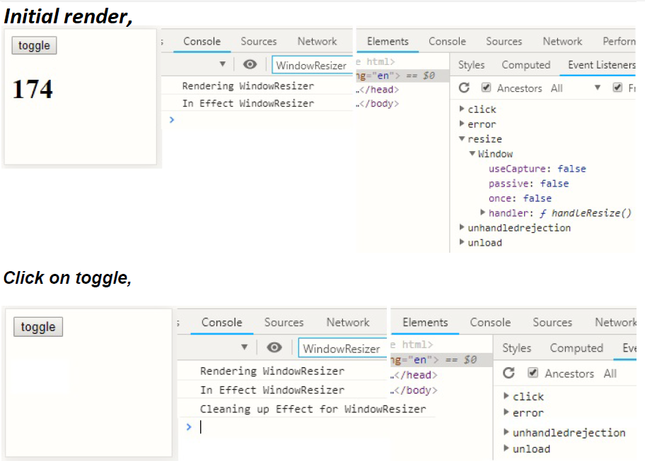

Ex-2, In this example, when we click toggle, component removed from DOM and timer cleaned up. no more time prints the message after it removed from DOM.

```js
import React from "react";
import ReactDOM from "react-dom";

const RepeatMessage = ({ message }) => {
  React.useEffect(() => {
    console.log(`In Effect RepeatMessage`);
    const timerId = setInterval(() => {
      console.log(message);
    }, 2000);

    return () => {
      console.log(`Cleaning up Effect - RepeatMessage timer ${timerId}`);
      clearInterval(timerId);
    };
  }, [message]);

  console.log(`Rendering RepeatMessage`);

  return <div>Look at the console, Bruh!</div>;
};

const ManageDisplay = () => {
  const [toggle, setToggle] = React.useState(true);

  return (
    <>
      <button onClick={(e) => setToggle((a) => !a)}>toggle</button>
      {toggle && <RepeatMessage message={"Hello, Cleany!!"} />}
    </>
  );
};

const rootElement = document.getElementById("root");
ReactDOM.createRoot(rootElement).render(<ManageDisplay />);
```

> Note: Try same example by excluding the cleanup function and click on toggle, though it removed the component from DOM, timer still in memory and printing the message 😲😲.  
> Example for memory leak

#### 12.3.2. Demo for invoking the cleanup function every time useEffect dependency changes

Ex-3

```js
import React from "react";
import ReactDOM from "react-dom";

const Profile = ({ username }) => {
  const [profile, setProfile] = React.useState(null);

  React.useEffect(() => {
    console.log(`Running Effect for : ${username}`);
    const abortController = new AbortController();
    const opts = { signal: abortController.signal };

    const getGithubProfile = () => {
      fetch(`https://api.github.com/users/${username}`, opts)
        .then((res) => res.json())
        .then((data) => {
          setProfile(data);
        })
        .catch((error) => {
          if (error.name == "AbortError") {
            console.log(`Running cleanup - abort the API for : ${username}`);
            console.log("request was cancelled");
          }
        });
    };
    getGithubProfile(username);

    return () => {
      console.log();
      abortController.abort();
    };
  }, [username]);

  console.log("Rendering Profile");

  if (profile === null) {
    return <p>Loading...</p>;
  }

  return (
    <>
      <p>{profile.name}</p>
      <p>{profile.blog}</p>
      <p>{profile.location}</p>
    </>
  );
};

const ProfileContainer = () => {
  const [user, setUser] = React.useState("ry");

  return (
    <>
      <button onClick={(e) => setUser("ry")}>ry</button>
      <button onClick={(e) => setUser("tj")}>tj</button>
      <Profile username={user} />
    </>
  );
};

const rootElement = document.getElementById("root");
ReactDOM.createRoot(rootElement).render(<ProfileContainer />);
```

The Mental Model

```md
Step by step mental model for above code goes here
```

### 12.4. More use cases - useEffect

Ex-4

Tweet post component - limit the char length to 240 & show the remaining count in document title.

```js
import React from "react";
import ReactDOM from "react-dom";

const App = () => {
  const maxChars = 20;
  const [chars, setChars] = React.useState("");

  React.useEffect(() => {
    document.title = `${maxChars - chars.length} chars left`;
  }, [chars]);

  return (
    <>
      <textarea value={chars} onChange={(e) => setChars(e.target.value)} />
      <br />
      <button disabled={chars.length === 0 || chars.length > 20}>Tweet</button>
    </>
  );
};

const rootElement = document.getElementById("root");
ReactDOM.createRoot(rootElement).render(<App />);
```

Ex-5 Wait component.

The purpose of Wait is to render the `ui` prop after `delay` seconds. Before `delay` seconds, it should render `placeholder`.

```js
import React from "react";
import ReactDOM from "react-dom";

const Wait = ({ delay = 1000, placeholder, ui }) => {
  const [show, setShow] = React.useState(false);

  React.useEffect(() => {
    const timer = setTimeout(() => {
      setShow(true);
    }, delay);
    return () => clearTimeout(timer);
  }, [delay]);

  return show === true ? ui : placeholder;
};

const App = () => {
  return (
    <div className="App">
      <Wait
        delay={3000}
        placeholder={<p>Waiting...</p>}
        ui={<p>This text should appear after 3 seconds.</p>}
      />
    </div>
  );
};

const rootElement = document.getElementById("root");
ReactDOM.createRoot(rootElement).render(<App />);
```

## 13. `useLayoutEffect`

In general, you should use useEffect().  

- `useLayoutEffect()` works like `useEffect()`, the only difference being that it’s invoked before React is done painting all the DOM nodes of a render.
- `useEffect()` is asynchronous & called after DOM mutation is calculated and after browser engine paints the DOM to browser UI.
- `useLayoutEffect()` is synchronous and called after DOM mutation is calculated and before browser engine paints the DOM to browser UI.
- After DOM mutation is calculated, the React knows, what is finally going be to seen in UI so, one final change can be made here, before letting the browser paint the DOM pixel by pixel.
- Unless we need to measure something on the page (maybe dimensions of a rendered component or scrolling position after an update) and then rerender based on this information.
- Because `useLayoutEffect()` is called sooner, we can recalculate and rerender and the user sees only the last render. Otherwise (if we use useEffect), they see the initial render first, then the second render. Depending on how complicated the layout use, users may perceive a flicker between the two renders.

Ex,  
We are setting the width of table with dynamically in both the effects.

- `useEffect` - we see two renders, it's flickering and second render is the final UI. Two renders because, useEffect ran after DOM painting and after that,we changed the width, so second render
- `useLayoutEffect` - We see only one render and no flickering. One render because, useLayoutEffect ran before DOM painting and we changed the width here only, so it took that also for consideration and painted DOM with new width change.
- flickering is caused by table re-size.

```js
import React from "react";
import ReactDOM from "react-dom";

function Example({ layout }) {
  if (layout === null) {
    return null;
  }

  if (layout) {
    React.useLayoutEffect(() => {
      const table = document.getElementsByTagName("table")[0];
      table.width = "250px";
    }, []);
  } else {
    React.useEffect(() => {
      const table = document.getElementsByTagName("table")[0];
      table.width = "250px";
    }, []);
  }

  return (
    <table width="500px" border="1">
      <thead>
        <tr>
          <th>Random</th>
        </tr>
      </thead>
      <tbody>
        {Array.from(Array(10000)).map((_, idx) => (
          <tr key={idx}>
            <td width={Math.random() * 800}>{Math.random()}</td>
          </tr>
        ))}
      </tbody>
    </table>
  );
}

function App() {
  const [layout, setLayout] = React.useState(null);
  return (
    <div>
      <button onClick={() => setLayout(false)}>useEffect</button>{" "}
      <button onClick={() => setLayout(true)}>useLayoutEffect</button>{" "}
      <button onClick={() => setLayout(null)}>clear</button>
      <Example layout={layout} />
    </div>
  );
}
const rootElement = document.getElementById("root");
ReactDOM.createRoot(rootElement).render(<App />);
```

## 14. Custom Hooks

### 14.1. Rules of Hooks

**Only call Hooks from the top-level of a function component or a custom Hooks.**

Means,

- We can’t call them from a normal function.
- We can’t call them from a class component.
- We can’t call them anywhere that’s not on the top level like inside of a loop, if statement, or event handler.

Ex,

```js
function Counter() {
  // from the top level function component
  const [count, setCount] = React.useState(0);

  if (count % 2 === 0) {
    // not from the top level
    React.useEffect(() => {});
  }

  const handleIncrement = () => {
    setCount((c) => c + 1);
    // not from the top level
    React.useEffect(() => {});
  };
}

function useWindow() {
  // from the top level of a custom Hook
  const [width, setWidth] = React.useState(0);
}

class Counter extends React.Component {
  render() {
    // not from inside a Class component
    const [count, setCount] = React.useState(0);
  }
}

function getUser() {
  // not from inside a normal function
  const [user, setUser] = React.useState(null);
}
```

The reason for this rule is because React relies on the call order of Hooks to keep track of internal state and references. If the Hooks aren’t called consistently in the same order across renders, React can’t do that.

- A custom Hook is a JavaScript function whose name starts with `use` and that may call other Hooks.
- **Custom Hooks are a mechanism to reuse stateful logic or sharing non-visual logic.**

What problem are these custom hooks are solving?

```js
import React from "react";
import ReactDOM from "react-dom";

const styles = {
  container: {
    position: "relative",
    display: "flex",
  },
  tooltip: {
    boxSizing: "border-box",
    position: "absolute",
    width: "200px",
    bottom: "100%",
    left: "40%",
    marginLeft: "-80px",
    borderRadius: "3px",
    backgroundColor: "hsla(0, 0%, 20%, 0.9)",
    padding: "7px",
    marginBottom: "5px",
    color: "#fff",
    textAlign: "center",
    fontSize: "14px",
  },
};

const getData = async (path) => {
  const res = await fetch(`https://jsonplaceholder.typicode.com/${path}`);
  return res.json();
};

const Loading = () => {
  return <div>Yo, loading</div>;
};

const App = () => {
  return (
    <>
      <Author />
      <Post />
      <br />
      <i>Note: Mouseover on username and title, will see the tooltips</i>
    </>
  );
};

const Author = () => {
  const [author, setAuthor] = React.useState(null);
  const [hovering, setHovering] = React.useState(false);

  React.useEffect(() => {
    getData("users/1").then(setAuthor);
  }, []);

  const mouseOver = () => {
    setHovering(true);
  };

  const mouseOut = () => {
    setHovering(false);
  };

  if (author == null) return <Loading />;

  return (
    <>
      <h4>Author:</h4>
      <div
        style={styles.container}
        onMouseOver={mouseOver}
        onMouseOut={mouseOut}
      >
        {hovering && <span style={styles.tooltip}>{author.name}</span>}
        Username: {author.username}
      </div>
    </>
  );
};

const Post = () => {
  const [post, setPost] = React.useState(null);
  const [hovering, setHovering] = React.useState(false);

  React.useEffect(() => {
    getData("posts/1").then(setPost);
  }, []);

  const mouseOver = () => {
    setHovering(true);
  };

  const mouseOut = () => {
    setHovering(false);
  };

  if (post == null) return <Loading />;

  return (
    <div>
      <h3>Post:</h3>
      <div
        style={styles.container}
        onMouseOver={mouseOver}
        onMouseOut={mouseOut}
      >
        {hovering && <span style={styles.tooltip}>{post.body}</span>}
        Title: {post.title}
      </div>
    </div>
  );
};

const rootElement = document.getElementById("root");
ReactDOM.createRoot(rootElement).render(<App />);
```

If we observe above code, everything works fine, but

- We have made a re-usable UI component `Loading`. Since it's static message, it has been abstracted away. Its good practice too. We can pass properties that can be rendered dynamically. This is primary advantage of component based UI library such as React.

- What about non visual logic or stateful logic like `mouseOver`, `mouseOut`, `hovering` & `setHovering`. These are duplicated across the components.

  ```js
  const [hovering, setHovering] = React.useState(false);
  const mouseOver = () => {
    setHovering(true);
  };

  const mouseOut = () => {
    setHovering(false);
  };
  ```

- Consumption may vary, for an example, based on hovering variable, one can display a tooltip with different text or nested elements, panel, popup or hide & show div etc.
- For 1 or 2 components, duplicating is ok. Think of a scenario, where we want build stock market kind of financial or statistical application which involves 1000s of components needs hovering/popup feature.

How to share non-visual logic or stateful logic between components?

We can create a custom hook to share these non visual logic or stateful logic. For an example,

```js
const useHover = () => {
  const [hovering, setHovering] = React.useState(false);

  const mouseOver = () => {
    setHovering(true);
  };
  const mouseOut = () => {
    setHovering(false);
  };
  return [hovering, mouseOver, mouseOut];
};
```

Now,

```js
// Replace
const [hovering, setHovering] = React.useState(false);

//with,
const [hovering, mouseOver, mouseOut] = useHover();
```

Now, everything should work as earlier, except, now we have shared the non-visual the logic between the components.

- A custom hook can, return anything or nothing, also can take anything as the arguments or nothing.
- Usually custom hook returns what a component is requires like a variable to use & updater function to update it or any function that intern updates state variables like above. In one word, interfaces.
- Custom hooks should follow all the rules as built-in hooks.
- Custom hooks call built-in hooks & can be called from other custom hooks.

More use cases:

Ex-1, Implement the `useWait` custom Hook. `useWait` should return a boolean that changes from false to true after delay seconds.

```js
import React from "react";
import ReactDOM from "react-dom";

const useWait = (delay) => {
  const [show, setShow] = React.useState(false);

  React.useEffect(() => {
    const timer = setTimeout(() => {
      setShow(true);
    }, delay);
    return () => clearTimeout(timer);
  }, [delay]); // If we don't mention the dependency, then use Effect in useWait will be called on every re-render.

  return show;
};

const Wait = ({ delay, placeholder, ui }) => {
  const show = useWait(delay);
  return show === true ? ui : placeholder;
};

const App = () => {
  return (
    <div className="App">
      <Wait
        delay={3000}
        placeholder={<p>Waiting...</p>}
        ui={<p>This text should appear after 3 seconds.</p>}
      />
    </div>
  );
};

const rootElement = document.getElementById("root");
ReactDOM.createRoot(rootElement).render(<App />);
```

Ex-2, Create a `useWindowDimensions` custom Hook. It should return an object with a `width` property that represents the current width of the window and a `height` property which represents the current height.

```js
import React from "react";
import ReactDOM from "react-dom";

const useWindowDimensions = () => {
  const [width, setWidth] = React.useState(window.innerWidth);
  const [height, setHeight] = React.useState(window.innerHeight);

  const handleResize = () => {
    setWidth(window.innerWidth);
    setHeight(window.innerHeight);
  };

  React.useEffect(() => {
    window.addEventListener("resize", handleResize);
    return () => window.removeEventListener("resize", handleResize);
  });
  return [width, height];
};

const Comp1 = () => {
  const [width, height] = useWindowDimensions();

  return (
    <>
      {Comp1.name}
      <br />
      Width: {width}
      <br />
      Height: {height}
    </>
  );
};

const Comp2 = () => {
  const [width, height] = useWindowDimensions();

  return (
    <>
      {Comp2.name}
      <br />
      Width: {width}
      <br />
      Height: {height}
    </>
  );
};

const rootElement = document.getElementById("root");
ReactDOM.createRoot(rootElement).render(
  <>
    <Comp1 />
    <hr></hr>
    <Comp2 />
  </>
);
```

Ex-3, useFetch

A lot useful custom hooks are written and maintained in the React community.  
Check below links.

[ahooks](https://ahooks.js.org)  
[Hook.guide](https://hooks-guide.netlify.app)

## 15. useReducer

### 15.1. Array.prototype.reduce()

The `reduce()` method executes a **reducer function** (that we provide) on each element of the array, resulting in a single output value.

```js
const nums = [2, 4, 6];
const initialState = 0;

const reducerFn = (stateOrAccumulator, value) => {
  return stateOrAccumulator + value;
};
const total = nums.reduce(reducerFn, initialState);
console.log(total); // 12
```

How `reduce()` works, `initialState` will copied to `stateOrAccumulator` initially.

| reducerFn      | stateOrAccumulator | value | return value |
| -------------- | ------------------ | ----- | ------------ |
| 1st invocation | 0                  | 2     | 2            |
| 2nd invocation | 2                  | 4     | 6            |
| 3rd invocation | 6                  | 6     | 12           |

Final output is 12

What if nums is a collection of user actions that happened over time? Then, whenever a new user action occurred, we could invoke the reducer function which would get us the new state.

### 15.2. useReducer

The API for `useReducer` is similar to JavaScript `reduce` however, there’s one difference.

Instead of just returning the state, we need a way for user actions to invoke our reducer function. Because of this, `useReducer` returns an array with the first element being the state and the second element being a dispatch function which when called, will invoke the reducer function.

The signature,

```js
const reducerFn = (state, value) => {};
const [state, dispatch] = React.useReducer(reducerFn, initialState);
```

When `dispatch` invoked/called, whatever we pass to dispatch will be passed as the second argument (value) to the reducer. The first argument (`state`) will be passed implicitly by React and will be whatever the `initialState` on first call and previous state on subsequent call.

Ex-1,

```js
import React from "react";
import ReactDOM from "react-dom";

const reducer = (state, value) => {
  return state + value;
};

const Counter = () => {
  const [count, dispatch] = React.useReducer(reducer, 0);
  return (
    <>
      <h1>{count}</h1>
      <button onClick={() => dispatch(1)}>+</button>
      <button onClick={() => dispatch(-1)}>-</button>
    </>
  );
};

const rootElement = document.getElementById("root");
ReactDOM.createRoot(rootElement).render(<Counter />);
```

How to **Reset** the Counter, with the current implementation; it's not possible. What if instead of dispatching the value directly, we **dispatch the type of action** that occurred? That way, based on the type of action, our reducer can decide how to update the state.

Let's add reset feature.

```js
import React from "react";
import ReactDOM from "react-dom";

const reducer = (state, action) => {
  if (action.type === "increment") {
    return state + action.step;
  } else if (action.type === "decrement") {
    return state - action.step;
  } else if (action.type === "reset") {
    return 0;
  } else {
    throw new Error(`This action type isn't supported.`);
  }
};

const Counter = () => {
  const [count, dispatch] = React.useReducer(reducer, 0);

  return (
    <>
      <h1>{count}</h1>
      <button onClick={() => dispatch({ type: "increment", step: 1 })}>
        +
      </button>
      <button onClick={() => dispatch({ type: "decrement", step: 2 })}>
        -
      </button>
      <button onClick={() => dispatch({ type: "reset" })}>Reset</button>
    </>
  );
};

const rootElement = document.getElementById("root");
ReactDOM.createRoot(rootElement).render(<Counter />);
```

### 15.3. useState vs useReducer

Fundamentally, useState and useReducer both allow us to add state to function components.

Let's build a same app using using `useState` & `useReducer` separately.

Ex-2 useState

```js
import React from "react";
import ReactDOM from "react-dom";

const newUser = (user) => {
  return Promise.resolve(console.log(user));
};

const Redirect = () => {
  return <h1>Dashboard</h1>;
};

const Loading = () => {
  return <p>Loading...</p>;
};

const Register = () => {
  const [username, setUsername] = React.useState("");
  const [email, setEmail] = React.useState("");
  const [password, setPassword] = React.useState("");
  const [loading, setLoading] = React.useState(false);
  const [error, setError] = React.useState("");
  const [registered, setRegistered] = React.useState(false);

  const handleSubmit = (e) => {
    e.preventDefault();
    setLoading(true);
    setError("");

    newUser({ username, email, password })
      .then(() => {
        setLoading(false);
        setError("");
        setRegistered(true);
      })
      .catch((error) => {
        setLoading(false);
        setError(error);
      });
  };

  if (registered === true) {
    return <Redirect to="/dashboard" />;
  }

  if (loading === true) {
    return <Loading />;
  }

  return (
    <>
      {error && <p>{error}</p>}
      <form onSubmit={handleSubmit}>
        <input
          type="text"
          placeholder="email"
          onChange={(e) => setEmail(e.target.value)}
          value={email}
        />
        <input
          type="text"
          placeholder="username"
          onChange={(e) => setUsername(e.target.value)}
          value={username}
        />
        <input
          placeholder="password"
          onChange={(e) => setPassword(e.target.value)}
          value={password}
          type="password"
        />
        <button type="submit">Submit</button>
      </form>
    </>
  );
};

const rootElement = document.getElementById("root");
ReactDOM.createRoot(rootElement).render(<Register />);
```

The above code is pretty imperative approach to solving the problem. We’re conforming to the operational model of the machine by describing how we want to accomplish the task.

Ex-3 useReducer

```js
import React from "react";
import ReactDOM from "react-dom";

const newUser = (user) => {
  return Promise.resolve(console.log(user));
};

const Redirect = () => {
  return <h1>Dashboard</h1>;
};

const Loading = () => {
  return <p>Loading...</p>;
};

const registerReducer = (state, action) => {
  if (action.type === "login") {
    return {
      ...state,
      loading: true,
      error: "",
    };
  } else if (action.type === "success") {
    return {
      ...state,
      loading: false,
      error: "",
      registered: true,
    };
  } else if (action.type === "error") {
    return { ...state, loading: false, error: action.error };
  } else if (action.type === "input") {
    return {
      ...state,
      [action.name]: action.value,
    };
  } else {
    throw new Error(`This action type isn't supported.`);
  }
};

const initialState = {
  username: "",
  email: "",
  password: "",
  loading: false,
  error: "",
  registered: false,
};

const Register = () => {
  const [state, dispatch] = React.useReducer(registerReducer, initialState);

  const handleSubmit = (e) => {
    e.preventDefault();
    dispatch({ type: "login" });
    newUser({
      username: state.username,
      email: state.email,
      password: state.password,
    })
      .then(() => dispatch({ type: "success" }))
      .catch((error) => dispatch({ type: "error", error }));
  };

  if (state.registered === true) {
    return <Redirect to="/dashboard" />;
  }

  if (state.loading === true) {
    return <Loading />;
  }

  return (
    <>
      {state.error && <p>{state.error}</p>}
      <form onSubmit={handleSubmit}>
        <input
          type="text"
          placeholder="email"
          onChange={(e) =>
            dispatch({
              type: "input",
              name: "email",
              value: e.target.value,
            })
          }
          value={state.email}
        />
        <input
          type="text"
          placeholder="username"
          onChange={(e) =>
            dispatch({
              type: "input",
              name: "username",
              value: e.target.value,
            })
          }
          value={state.username}
        />
        <input
          placeholder="password"
          onChange={(e) =>
            dispatch({
              type: "input",
              name: "password",
              value: e.target.value,
            })
          }
          value={state.password}
          type="password"
        />
        <button type="submit">Submit</button>
      </form>
    </>
  );
};

const rootElement = document.getElementById("root");
ReactDOM.createRoot(rootElement).render(<Register />);
```

Instead of describing how we want to accomplish the task, above code snippet using useReducer describe what we’re trying to accomplish. It's declarative approach.

### 15.4. Corollary

`useState` and `useReducer` both allow us to add state to function components. `useReducer` offers a bit more flexibility since it allows you to decouple how the state is updated from the action that triggered the update - typically leading to more declarative state updates.

**If different pieces of state update independently from one another (hovering, selected, etc.), useState should work fine. If your state
tends to be updated together or if updating one piece of state is based on another piece of state, go with useReducer.**

**In other words, If we have multiple pieces of interrelated state, consider using a reducer to clearly define the actions that can change the state.**

## 16. useRef

> **New Render, Same Value or In other words, New value, No re-render**

### 16.1. Problem statement, a stopwatch

```js
import React from "react";
import ReactDOM from "react-dom";

const StopWatch = () => {
  const [count, setCount] = React.useState(0);
  let id = undefined;

  const stop = () => {
    clearInterval(id);
  };
  console.log(id);

  React.useEffect(() => {
    id = setInterval(() => {
      setCount((c) => c + 1);
    }, 1000);
    console.log(id);
    return stop;
  }, []);

  return (
    <>
      <h1>{count}</h1>
      <button onClick={stop}>Stop</button>
    </>
  );
};

const rootElement = document.getElementById("root");
ReactDOM.createRoot(rootElement).render(<StopWatch />);
```

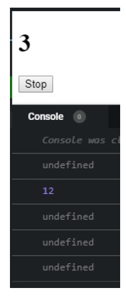

Since we have `stop` function at the component level. We had to move the declaration of `id` up to the main scope and then initialize it with the id when the effect runs. so, it will be available at functional level to stop the count.

Clicking on the Stop button will not stop the count, why??

The reason for this is because `id` doesn’t persist across renders. As soon as our count state variable changes, React will re-render Counter , re-declaring `id` setting it back to `undefined`. Look at the console logs.

Now,

Q. How to preserve values between renders and to trigger a re-render whenever you change the value?

A. `useState`

In our case, we don't need to update the value, we just need to persist/preserve the value between the renders. So, let's create a custom hook.

```js
const usePersistentValue = (initialValue) => {
  return React.useState({
    current: initialValue,
  })[0];
};
```

Full ex,

```js
import React from "react";
import ReactDOM from "react-dom";

const usePersistentValue = (initialValue) => {
  return React.useState({
    current: initialValue,
  })[0];
};

const StopWatch = () => {
  const [count, setCount] = React.useState(0);
  let id = usePersistentValue(undefined);

  const stop = () => {
    clearInterval(id.current);
  };
  console.log(id);

  React.useEffect(() => {
    id.current = setInterval(() => {
      setCount((c) => c + 1);
    }, 1000);

    console.log(id);

    return stop;
  }, []);

  return (
    <>
      <h1>{count}</h1>
      <button onClick={stop}>Stop</button>
    </>
  );
};

const rootElement = document.getElementById("root");
ReactDOM.createRoot(rootElement).render(<StopWatch />);
```

Now instead of `id` being re-declared on every render, because it’s really a value coming from useState , React will persist it across renders.

### 16.2. useRef

The ability to persist a value across renders without causing a re-render is so fundamental that React comes with a built-in Hook for it called `useRef`.

Replace,

```js
let id = usePersistentValue(undefined);
```

with,

```js
let id = React.useRef(undefined);
```

We should get the same result as earlier. useRef follows the same API we created earlier. It accepts an initial value as its first argument and it returns an object that has a `current` property (which will initially be set to whatever the initial value was). From there, anything we add to **`current` will be persisted across renders**.

### 16.3. useRef with DOM nodes

The most popular use case for `useRef` is getting access to DOM nodes to have uncontrolled form elements.

```js
import React from "react";
import ReactDOM from "react-dom";

const Form = () => {
  const emailRef = React.useRef();
  const passwordRef = React.useRef();

  const handleSubmit = (e) => {
    e.preventDefault();
    const email = emailRef.current.value;
    const password = passwordRef.current.value;
    console.log(email, password);
  };

  const reset = () => {
    emailRef.current.value = "";
    passwordRef.current.value = "";
  };

  return (
    <>
      <input placeholder="name" type="text" ref={emailRef} />
      <input placeholder="password" type="text" ref={passwordRef} />
      <hr />
      <button onClick={() => emailRef.current.focus()}>
        Focus Email Input
      </button>
      <button onClick={() => passwordRef.current.focus()}>
        Focus Password Input
      </button>
      <hr />
      <button onClick={handleSubmit}>Submit</button>
      <button onClick={reset}>Reset</button>
    </>
  );
};

const rootElement = document.getElementById("root");
ReactDOM.createRoot(rootElement).render(<Form />);
```

If we pass the "return value you from `useRef` as a `ref` prop on any React element, React will set the `current` property to the corresponding DOM. This allows you to do things like grab input values or set focus.

If we observe carefully, we have achieved interactive form without using `useState` & that means, without re-renders. Our ref's will always have latest data.

### 16.4. Corollary

- If we want to add state to your component that persists across renders and can
  trigger a re-render when it’s updated, go with `useState` or `useReducer`.
- If we want to add state to your component that persists across renders but doesn’t trigger a re-render when it’s updated, go with `useRef`.

## 17. useContext

> **Bypassing the Props**

**(A)**. Let’s say, we had an app with the following architecture, each box representing a different component.

**(B)**. Assume, we had a piece of state that was needed throughout various levels of our application - **yellow boxes**.

**(C)**. Solution for this problem is to **move that state up to the nearest parent component and then pass it down via props**. It called state lifting.

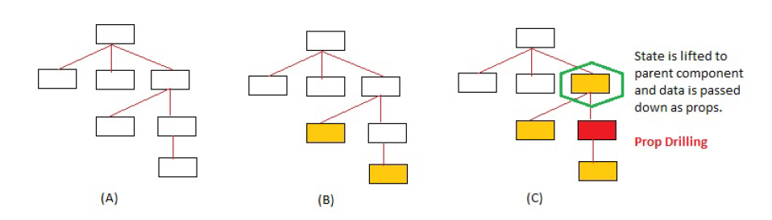

Problem,

If we observe **red** box component, its just passing through the props down, really not using it. When passing props through intermediate components can become overly redundant or unmanageable, if we have more intermediate components. It's called **Prop Drilling**.

**Context provides a way to pass data through the component tree without having to pass props down manually at every level.**

### 17.1. The Context API

Let's build an app that works in English as well as in Kannada and have a button that when it’s clicked, can toggle the text of our entire application between English and Kannada.

The Mental Model

- We need a way to declare the data & that should be available throughout our component tree (app). For an example, that data is Kannada & English values.

- Find a way for any component in the component tree to subscribe to the data changes, so accordingly it can render UI.

To create a new context, use `React.createContext` function.

### 17.2. Create Context

```js
import React from "react";
import ReactDOM from "react-dom";

const LangContext = React.createContext("english");

const rootElement = document.getElementById("root");
ReactDOM.createRoot(rootElement).render(<></>);
```

`LangContext` , has two properties, both of which are React components, `Provider`, and `Consumer`.

- **Provider** allows us to _declare the data that we want available throughout
  our component tree_.
- **Consumer** allows _any component in the component tree that needs that data to be able to subscribe to it_.

### 17.3. Provider

It accepts a `value` prop which is the data that we want available to any of its `children` who need to consume it.

```js
import React from "react";
import ReactDOM from "react-dom";

const LangContext = React.createContext();

const App = () => {
  const [lang, setLang] = React.useState("english");

  return (
    <LangContext.Provider value={lang}>
      <Header />
    </LangContext.Provider>
  );
};

const Header = () => {
  return <NavBar />;
};

const NavBar = () => {
  return <></>;
};

const rootElement = document.getElementById("root");
ReactDOM.createRoot(rootElement).render(<App />);
```

Now, any component in our component tree that needs the value lang have the option to subscribe to it using `<LangContext.Consumer>` OR `useContext(LangContext)`

### 17.4. Consumer

Now in our example, because we passed `lang` as the `value` prop to `LangContext Provider`, we can get access to it by passing `LangContext.Consumer` **a render prop**.

```js
import React from "react";
import ReactDOM from "react-dom";

const LangContext = React.createContext();

const App = () => {
  const [lang, setLang] = React.useState("english");

  return (
    <LangContext.Provider value={lang}>
      <Header />
    </LangContext.Provider>
  );
};

const Header = () => {
  return <NavBar />;
};

const NavBar = () => {
  return (
    <LangContext.Consumer>
      {(selectedLang) => {
        return selectedLang === "english" ? (
          <EnglishNavigation />
        ) : (
          <KannadaNavigation />
        );
      }}
    </LangContext.Consumer>
  );
};

const EnglishNavigation = () => {
  return (
    <>
      <ul>
        <li>
          <a href="#;">Home</a>
        </li>
        <li>
          <a href="#;">Products</a>
        </li>
        <li>
          <a href="#;">Services</a>
        </li>
      </ul>
      <button>ಕನ್ನಡ</button>
    </>
  );
};

const KannadaNavigation = () => {
  return (
    <>
      <ul>
        <li>
          <a href="#;">ಮನೆ</a>
        </li>
        <li>
          <a href="#;">ಉತ್ಪನ್ನಗಳು</a>
        </li>
        <li>
          <a href="#;">ಸೇವೆಗಳು</a>
        </li>
      </ul>
      <button>English</button>
    </>
  );
};

const rootElement = document.getElementById("root");
ReactDOM.createRoot(rootElement).render(<App />);
```

Clicking on the button won't work as it not updating the `lang` yet.

### 17.5. Updating Context State

- Let's add a updater function, that intern updates the `lang`.
- The function should be accessible from anywhere inside of our component tree.

```js
import React from "react";
import ReactDOM from "react-dom";

const LangContext = React.createContext();

const App = () => {
  const [lang, setLang] = React.useState("english");

  const toggleLang = () => {
    setLang((lang) => (lang === "english" ? "kannada" : "english"));
  };

  return (
    <LangContext.Provider value={{ lang, toggleLang }}>
      <Header />
    </LangContext.Provider>
  );
};

const Header = () => {
  return <NavBar />;
};

const NavBar = () => {
  return (
    <LangContext.Consumer>
      {(langObj) => {
        return langObj.lang === "english" ? (
          <EnglishNavigation toggle={langObj.toggleLang} />
        ) : (
          <KannadaNavigation toggle={langObj.toggleLang} />
        );
      }}
    </LangContext.Consumer>
  );
};

const EnglishNavigation = ({ toggle }) => {
  return (
    <>
      <ul>
        <li>
          <a href="#;">Home</a>
        </li>
        <li>
          <a href="#;">Products</a>
        </li>
        <li>
          <a href="#;">Services</a>
        </li>
      </ul>
      <button onClick={toggle}>ಕನ್ನಡ</button>
    </>
  );
};

const KannadaNavigation = ({ toggle }) => {
  return (
    <>
      <ul>
        <li>
          <a href="#;">ಮನೆ</a>
        </li>
        <li>
          <a href="#;">ಉತ್ಪನ್ನಗಳು</a>
        </li>
        <li>
          <a href="#;">ಸೇವೆಗಳು</a>
        </li>
      </ul>
      <button onClick={toggle}>English</button>
    </>
  );
};

const rootElement = document.getElementById("root");
ReactDOM.createRoot(rootElement).render(<App />);
```

Final output, Clicking on button changes the language.

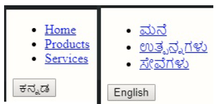

This works, but as always the render-props syntax is a little funky. The problem gets worse if you have multiple context values you need to grab (**Wrapper Hell**).

Example,

```js
export default function Nav() {
  return (
    <AuthedContext.Consumer>
      {({ authed }) =>
        authed === false ? (
          <Redirect to="/login" />
        ) : (
          <LangContext.Consumer>
            {({ lang, toggleLang }) =>
              lang === "english" ? (
                <EnglishNavigation toggle={toggleLang} />
              ) : (
                <KannadaNavigation toggle={toggleLang} />
              )
            }
          </LocaleContext.Consumer>
        )
      }
    </LangContext.Consumer>
  );
}
```

So, whats the solution?

### 17.6. useContext

It takes in a **Context** object as its first argument and returns whatever was passed to the `value` prop of the nearest `Provider` component or `defaultValue`.

```js
export default function Nav() {
  const { authed } = React.useContext(AuthedContext);
  if (authed === false) {
    return <Redirect to="/login" />;
  }
  const { lang, toggleLang } = React.useContext(LangContext);
  return locale === "english" ? (
    <EnglishNavigation toggle={toggleLang} />
  ) : (
    <KannadaNavigation toggle={toggleLang} />
  );
}
```

So, our app can consume Context value as below.  
**ONLY CHANGE AT THE CONSUMER LEVEL NOT AT THE PROVIDER.**

Replace `NavBar` fn with below implementation `React.useContext(LangContext)`

```js
function NavBar() {
  const { lang, toggleLang } = React.useContext(LangContext);
  return lang === "english" ? (
    <EnglishNavigation toggle={toggleLang} />
  ) : (
    <KannadaNavigation toggle={toggleLang} />
  );
}
```

Everything works fine now.

We have a performance issue here.

Just like React re-renders with `prop` changes, whenever the data passed to `value` changes, React will re-render every component which used `Consumer` or `useContext` subscribe to that data.

The way in which React knows if the data changes is by using “reference identity” or comparing the location or reference or memory location address (Like, oldObject === newObject).

- Currently with how we have it set up `value={{ lang, toggleLang }}`
- We’re passing a new object literal to `value` every time that App re-renders with some other state or props changes (these can be related to context or completely unrelated to context).
- What this means is that when React checks if the data passed to `value` has changed, it’ll always think it has since we’re always passing in a new object literal for every re-render.
- As a result of that, every component which used Consumer to subscribe to that data will re-render as well, even if `lang` or `toggleLang` didn’t change.

To fix this, instead of passing a new object literal to value every time, we want to give it a reference to an object it already knows about.

`useMemo`

Replace `App` fn with below code which uses `useMemo`

```js
const App = () => {
  const [lang, setLang] = React.useState("english");

  const toggleLang = () => {
    setLang((lang) => (lang === "english" ? "kannada" : "english"));
  };

  const value = React.useMemo(() => {
    return { lang, toggleLang };
  }, [lang]);

  return (
    <LangContext.Provider value={value}>
      <Header />
    </LangContext.Provider>
  );
};
```

### 17.7. defaultValue

Whenever we render a `Consumer` component, it gets its value from the `value` prop of the nearest `Provider` component of the same Context object.

What if there isn’t a parent `Provider` of the same Context object? In that case, it’ll get its value from the first argument that was passed to createContext when the Context object was created.

```js
const LangContext = React.createContext("kannada"); // We can pass anything like obj, strings, array etc.
```

Now, if we use `<LangContext.Consumer>` without previously rendering a `<LangContext.Provider>` or without `Provider` as a wrapper, the value passed to Consumer will be kannada, the default value.

```js
import React from "react";
import ReactDOM from "react-dom";

const LangContext = React.createContext("kannada");

const App = () => {
  return <Header />;
};

const Header = () => {
  return <NavBar />;
};

const NavBar = () => {
  return (
    <LangContext.Consumer>
      {(lang) => {
        console.log(lang); // prints => kannada
        return <></>;
      }}
    </LangContext.Consumer>
  );
};

const rootElement = document.getElementById("root");
ReactDOM.createRoot(rootElement).render(<App />);
```

NOTE :

- For demo purpose, we have kept the Context and all the components in the same file. - In actual projects, Context are in dedicated files (modules) - LangContext.js, AuthContext.js etc.
- So that, any component from the project can import those context object separately.
- Typically, we create a new Context for each unique piece of data that needs to be available throughout the component tree.
- Example, LangContext, AuthContext, ThemeContext etc.

  ```js
  // LangContext.js
  import React from "react";
  const LangContext = React.createContext();
  export { LangContext };
  ```

## 18. React.memo

Ex-1 , find what the problem with below.

```js
import React from "react";
import ReactDOM from "react-dom";

const Movie = ({ title }) => {
  console.log(`Movie component rendered with: ${title}`);
  return (
    <div>
      Now watching - {title}
      <hr />
      <div
        style={{ width: "250px", height: "100px", border: "2px solid black" }}
      ></div>
    </div>
  );
};

const Makers = ({ title }) => {
  console.log(`Makers component rendered with: ${title}`);
  return (
    <div>
      <br />
      Cast and crew of the movie : {title}
    </div>
  );
};

const App = () => {
  const [movieIndex, setMovieIndex] = React.useState();
  const [rating, setRating] = React.useState(0);
  const movies = ["Into the Wild", "V for Vendetta", "The Man from Earth"];
  const movie = movies[movieIndex];

  console.log("App component rendered");

  return (
    <>
      <h3>Amazon Prem's </h3>
      <ol>
        {movies.map((m, index) => (
          <li key={m} onClick={() => setMovieIndex(index)}>
            {m}
          </li>
        ))}
      </ol>

      {movie && <Movie title={movie} />}
      {movie && <Makers title={movie} />}

      <hr />
      <button onClick={() => setRating((r) => r + 1)}>Rate our website</button>
      <p>Current rating: {rating}</p>
    </>
  );
};

const rootElement = document.getElementById("root");
ReactDOM.createRoot(rootElement).render(<App />);
```

It has performance issues, look at the console.  
While user clicking on rating button, we see `Movie` and `Makers` components are getting re-rendered unnecessarily.

When deciding to update DOM, React first renders your component, then compares the result with the previous render. If the render results are different, then only React updates the DOM.

So, in our condition, though react re-renders component, it will not update the DOM.

Current vs previous render results comparison is fast. But we can speed up the process under some circumstances.

### 18.1. React.memo to help

- It's a High Order Component (HOC) that lets us skip re-rendering a component if its props haven’t changed.
- React.memo() wraps a component, React memoizes the rendered output of the wrapped component then skips unnecessary renderings.

When a component is wrapped in React.memo(), React renders the component and memoizes the result. Before the next render, if the new props are the same, React reuses the memoized result skipping the next rendering.

Solution,

Create the memoized version of components and use it like below,

```js
const MemoizedMovie = React.memo(Movie);
const MemoizedMakers = React.memo(Makers);

// Update App component with below
{
  movie && <MemoizedMovie title={movie} />;
}
{
  movie && <MemoizedMakers title={movie} />;
}
```

Now, React reuses the memoized content as long as `title` prop are the same between renderings.

On re-renders, React will perform a shallow comparison (===) between the previous props and the new props - if the props haven’t changed, React will skip rendering the component and reuse memoized last rendered result.

Lets extend the app with feature - **play next movie**

### 18.2. Custom equality check of props

**play next movie** is added.

Ex-2

```js
import React from "react";
import ReactDOM from "react-dom";

const Movie = ({ title, playNextMovie }) => {
  console.log(`Movie component rendered with: ${title}`);
  return (
    <div>
      Now watching - {title}
      <hr />
      <div
        style={{ width: "250px", height: "100px", border: "2px solid black" }}
      ></div>
      <button onClick={playNextMovie}>Next</button>
    </div>
  );
};

const Makers = ({ title }) => {
  console.log(`Makers component rendered with: ${title}`);
  return (
    <div>
      <br />
      Cast and crew of the movie : {title}
    </div>
  );
};

const MemoizedMovie = React.memo(Movie);
const MemoizedMakers = React.memo(Makers);

const App = () => {
  const [movieIndex, setMovieIndex] = React.useState();
  const [rating, setRating] = React.useState(0);
  const movies = ["Into the Wild", "V for Vendetta", "The Man from Earth"];
  const movie = movies[movieIndex];

  const playNextMovie = () => {
    setMovieIndex((m) => (m + 1) % movies.length);
  };

  console.log("App component rendered");

  return (
    <>
      <h3>Amazon Prem's </h3>
      <ol>
        {movies.map((m, index) => (
          <li key={m} onClick={() => setMovieIndex(index)}>
            {m}
          </li>
        ))}
      </ol>

      {movie && <MemoizedMovie title={movie} playNextMovie={playNextMovie} />}
      {movie && <MemoizedMakers title={movie} />}

      <hr />
      <button onClick={() => setRating((r) => r + 1)}>Rate our website</button>
      <p>Current rating: {rating}</p>
    </>
  );
};

const rootElement = document.getElementById("root");
ReactDOM.createRoot(rootElement).render(<App />);
```

Click on Next button,everything work as expect.

Open console, now, click on names of the movie and next button all good.  
Now, click on `rating` button, 🤯🤯 what? why??? `Movie` component getting re-rendered unnecessarily, did'nt we fix it using React.memo??

Problem,

- For `Movie` component, we’re passing function as `playNextMovie` as props.
- Every we click on `rating` button, it causes re-render of `App` component. This means for every render, we’re creating a brand new function in memory.
- Because functions are reference types, when `React.memo` compares the previous `playNextMovie` prop with the new `playNextMovie` prop, even though they appear the same, **they’re compared by their references which will always be different.**
- So, for the same reason, `Makers` components is not getting re-rendered.

2 solutions,

1. Customize `React.memo` to only compare the `title` prop and ignore the `playNextMovie` props.
2. We can make the `playNextMovie` prop the same reference across renders using `React.useCallback()`

Customize `React.memo` for custom equality check of props

Ex-3

```js
// Replace this code
const MemoizedMovie = React.memo(Movie);

// With this
const MemoizedMovie = React.memo(
  Movie,
  (prevProps, nextProps) => prevProps.title === nextProps.title
);
```

- If the second argument callback func, returns true means, don’t re-render.
- If the second argument callback func, returns false and do re-render.

Lets solve the problem with useCallback.

## 19. useCallback

- `useCallback` returns a memoized callback.
- What this means is that any function we create with `useCallback` won’t be re-created on subsequent re-renders.
- It takes two arguments, a function and an array of values that the function depends on.
- The memoized function it returns will only change if one of the values in the dependency array change.

Ex,

```js
const memoizedCallback = React.useCallback(() => doSomething(a, b), [a, b]);
```

Now,

```js
// Reintroduce the issue by placing below code
const MemoizedMovie = React.memo(Movie);

// Replace current implementation playNextMovie
const playNextMovie = () => {
  setMovieIndex((m) => (m + 1) % movies.length);
};

// With useCallback pattern
const playNextMovie = React.useCallback(() => {
  setMovieIndex((m) => (m + 1) % movies.length);
}, []);
```

Now check the console, everything works fine.

- This is particularly useful for our use case because of the issues we ran into earlier with React.memo
- Instead of passing an function as `playNextMovie` prop and creating a brand new function on every render, we can utilize `useCallback` to create one function on the initial render, and reuse it on subsequent renders.
- This means when `React.memo` compares the previous `playNextMovie` prop with the new `playNextMovie` prop,the reference will be the same and the identity operator (===) will work as expected.

What if, instead of memoizing at the component level using `React.memo`, we memoize the expensive calculations themselves? `React.useMemo()`

## 20. React.useMemo

- `useMemo` takes two arguments, a function and an array of values that the function depends on.

  ```js
  const memoizedValue = useMemo(() => computeExpensiveValue(a, b), [a, b]);
  ```

- During initial rendering, `useMemo(compute, dependencies)` invokes `computeExpensiveValue`, memoizes the calculation result, and returns it to the component.
- If during next renderings the dependencies don't change, then `useMemo()` doesn't invoke compute but returns the memoized value.
- But if dependencies change during re-rendering, then `useMemo()` invokes compute, memoizes the new value, and returns it.

Ex-1, Problem.

```js
import React from "react";
import ReactDOM from "react-dom";

const CalcFact = () => {
  const [number, setNumber] = React.useState(1);
  const [_, setInc] = React.useState(0);

  const factorial = factorialOf(number);

  const onChange = (event) => {
    setNumber(Number(event.target.value));
  };

  return (
    <div>
      Factorial of &nbsp; &nbsp;
      <input type="number" value={number} onChange={onChange} /> &nbsp;&nbsp; is
      &nbsp;{factorial}
      &nbsp;&nbsp;
      <button onClick={() => setInc(Math.random())}>Cause re-render</button>
    </div>
  );
};

const factorialOf = (n) => {
  console.log("factorialOf(n) called!");
  return n <= 0 ? 1 : n * factorialOf(n - 1);
};

const rootElement = document.getElementById("root");
ReactDOM.createRoot(rootElement).render(<CalcFact />);
```

Everything works here but with performance issue.

- Enter some number in textbox we see corresponding times `factorialOf` would be called, we see that in console, thats correct.
- After above step, each time we click **Cause re-render** button, `inc` state value is updated. Updating `inc` state value triggers `<CalcFact />` re-rendering. But, as a secondary effect, during re-rendering the factorial is recalculated again — 'factorialOf(n) called!' is logged to console.

How to solve this issue? Let's memoize the `factorialOf` fn.

```js
// Replace normal function
const factorial = factorialOf(number);

// With memoized fn
const factorial = React.useMemo(() => {
  factorialOf(number);
}, [number]);
```

- Every time you change the value of the number, `factorialOf(n) called!` is logged to console. That's expected.
- if we click `Cause re-render` button, `factorialOf(n) called!` isn't logged to console because `React.useMemo(() => factorialOf(number), [number])` returns the memoized factorial calculation.

> - `useMemo` != `useRef`. To persist the values across re-renders, always use useRef.
> - React treats `useMemo` as a performance hint rather than a guarantee. This means that React may choose to forget previously memoized values in some cases.

## 21. Hooks Corollary

`useState` hook allows us to add state to function components and persist value between renders, trigger re-render.

`useRef` hook persist value between renders, cause **NO re-render**.

`useEffect` Let us add side effects to our function components and run after render.

`useReducer` is a useState in reducer pattern that takes a collection as input and returns a single value as output.

`useMemo` hook allow us memoize value between renders.

`useCallback` hook helps us persists referential equality between renders for functions.

`useContext` - Context lets us pass data to any part of your component tree without passing it down through individual components & `useContext` can consume anywhere down in the component tree.

`React.memo` is a Higher-order component (HOC) that lets you skip re-rendering a component if its props haven't changed.

`Custom Hooks` - In order to share non-visual logic or stateful logic, we had to rely on patterns like Higher-order components or Render-props. Now, we can accomplish the same thing by building our own custom Hooks.

## 22. Code-Splitting

### 22.1. Bundling

- Most React apps will have their files **bundled** using tools like Webpack, esbuild, Parcel or Rollup.
- Bundling is the process of following imported files and merging them into a single file: a **bundle.js**.
- This bundle can then be included on a webpage to load an entire app at once.

Problem statement,

index.jsx

```js
import React from "react";
import ReactDOM from "react-dom";
import { Synopsis } from "./Synopsis";
import Plot from "./Plot";

const Movie = () => {
  const [showPlot, setShowPlot] = React.useState(false);

  return (
    <>
      <h2>Inception</h2>
      <Synopsis />
      <button onClick={() => setShowPlot((prevState) => !prevState)}>
        {showPlot ? "Hide" : "Show full plot.."}
      </button>
      {showPlot && <Plot />}
    </>
  );
};

const rootElement = document.getElementById("root");
ReactDOM.createRoot(rootElement).render(<Movie />);
```

Synopsis.jsx

```js
import React from "react";

const Synopsis = () => {
  return (
    <p>
      A thief who steals corporate secrets through the use of dr eam-sharing
      technology is given the inverse task of planting an idea i nto the mind of
      a C.E.O.
    </p>
  );
};

export { Synopsis };
```

Plot.jsx

```js
import React from "react";

const Plot = () => {
  const styles = {
    container: {
      width: "75%",
      marginTop: "15px",
    },
    movieGif: {
      float: "left",
      marginRight: "21px",
    },
  };

  return (
    <div style={styles.container}>
      
      Dom Cobb is a skilled thief, the absolute best in the dangerous art of extraction,
      stealing valuable secrets from deep within the subconscious during the dream
      state, when the mind is at its most vulnerable. Cobb's rare ability has made
      him a coveted player in this treacherous new world of corporate espionage,
      but it has also made him an international fugitive and cost him everything
      he has ever loved. Now Cobb is bei ng offered a chance at redemption. One last
      job could give him his life back but only if he can accomplish the impossible,
      inception. Instead of the perfect heist, Cobb and his team of specialists have
      to pull off t he reverse: their task is not to steal an idea, but to plant
      one. If t hey succeed, it could be the perfect crime. But no amount of careful
      planning or expertise can prepare the team for the dangerous enemy that seems
      to predict their every move. An enemy that only Cobb could have seen coming.
      <hr />
      —Warner Bros. Pictures
    </div>
  );
};

export default Plot;
```

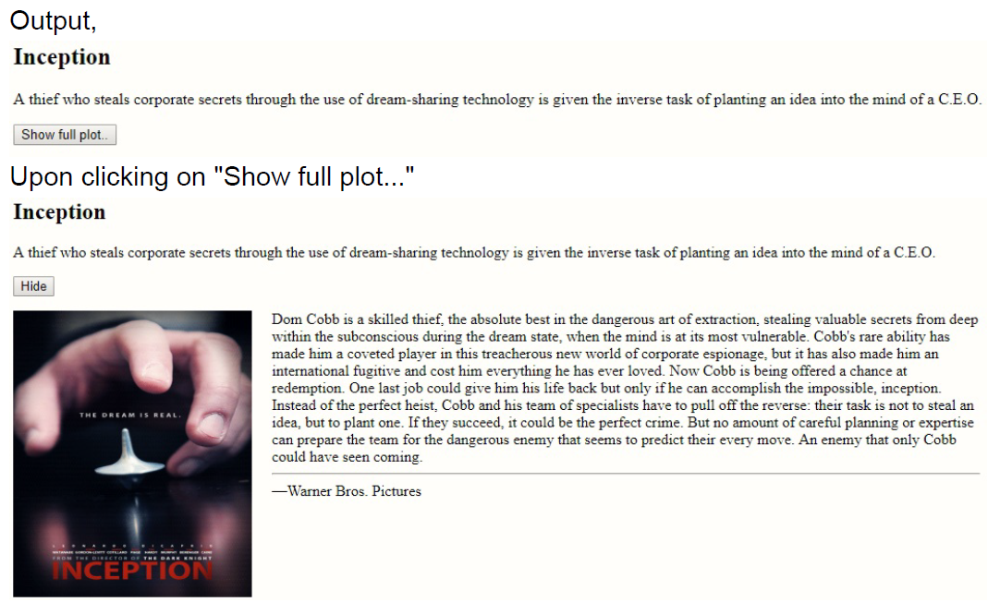

The app just works fine. But there is a room for improvement in terms of performance. What if have list of 100 movies & each plot component has ever growing content and high pixel assets and etc.

We can load JavaScript (module/code) related to these component lazily **Component level Code-Split.**

### 22.2. React.lazy

The `React.lazy` function lets us render a `dynamic import` as a regular component.

Because the import is inside of a function passed to `lazy()`, the loading of the component won’t happen until we actually use the component.

Ex,

```js
// SomeComponent must be Default export, like - export default SomeComponent;
// If we use the Named export it fails, like export { SomeComponent }

const LazyComponent = React.lazy(() => import("./SomeComponent"));

const App = () => {
  return (
    <div>
      <LazyComponent />
    </div>
  );
};
```

> `React.lazy` takes a function that must call a `dynamic import()`.  
> This must return a Promise which resolves to a module with a default export containing a React component.

### 22.3. Suspense

If the module containing the `OtherComponent` is not yet loaded by the time App renders, we must show some fallback content while we’re waiting for it to load - such as a loading indicator. This is done using the `Suspense` component.

```js
const LazyOtherComponent = React.lazy(() => import("./OtherComponent"));

const App = () => {
  return (
    <div>
      <React.Suspense fallback={<div>Loading...</div>}>
        <LazyOtherComponent />
      </React.Suspense>
    </div>
  );
};
```

Now, Movie app can be rewritten like below with lazy loading or code splitting. No change is required at `Synopsis.js` & `Plot.js`

index.js; updated,

```js
import React from "react";
import ReactDOM from "react-dom";

import { Synopsis } from "./Synopsis";

const LazyPlot = React.lazy(() => import("./Plot"));

const Movie = () => {
  const [showPlot, setShowPlot] = React.useState(false);

  return (
    <>
      <h2>Inception</h2>
      <Synopsis />
      <button onClick={() => setShowPlot((prevState) => !prevState)}>
        {showPlot ? "Hide" : "Show full plot.."}
      </button>
      {showPlot && (
        <React.Suspense fallback={<div>Loading</div>}>
          <LazyPlot />
        </React.Suspense>
      )}
    </>
  );
};

const rootElement = document.getElementById("root");
ReactDOM.createRoot(rootElement).render(<Movie />);
```

Output,

- Observe in the dev tools, Click on "Show plot..." button of movie app, it downloads the code from server and caches it for any future call.
- Again click on may times you want on "Show plot...", we will not see network call an all the assets will be cached at the browser level

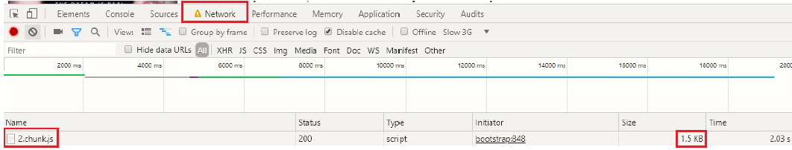

Like this we can lazy load any component which are not needed in initial loading like, Exception handling component, Modal dialog components etc.

> `React.lazy` currently only supports default exports.

## 23. React Router - v6.2.1

React Router is a declarative, component based, client and server-side routing library for React.

`npm i react-router-dom`

### 23.1. `BrowserRouter`

We want to connect our app to the browser's URL, so import `BrowserRouter` and render it around the whole app.

Under the hood, `BrowserRouter` uses both the `history` library as well as `React Context`,

- The `history` library helps React Router keep track of the browsing history of the application using the browser’s built-in history stack
- `React Context` helps make history available wherever React Router needs it.

### 23.2. `Route`

- `Route` allow us to map our app’s location to different React components.
- Like saying, render a `Dashboard` component whenever a user navigated to the `/dashboard` path.
- We can render as many Routes as we’d like.

> With our `Route` elements in this configuration, it’s possible for multiple routes to match on a single URL.

### 23.3. `Routes`

- We can think of `Routes` as the conductor/controller of our routes. Whenever we have one or more `Route`s, we’ll most likely want to wrap them in a `Routes`.
- `Routes` job is to understand all of its children Route elements, and intelligently choose which ones are the best to render.

### 23.4. `Link`

- This is primary means of navigation in React Router. Rendering a `<Link>` allows the user to change the URL when they click it.
- Basically it's wrapper around `<a>` HTML tag but it does more than just navigation.

### 23.5. A Basic Routing

Ex-1,

```js
import React from "react";
import ReactDOM from "react-dom";
import { BrowserRouter, Routes, Route, Link } from "react-router-dom";

const Home = () => <h1>Home</h1>;
const About = () => <h1>About</h1>;
const Topics = () => <h1>Topics</h1>;

const App = () => (
  <BrowserRouter>
    <Link to="/">Home</Link>&nbsp;
    <Link to="/about">About</Link>&nbsp;
    <Link to="/topics">Topics</Link>
    <hr />
    <Routes>
      <Route path="/" element={<Home />} />
      <Route path="/about" element={<About />} />
      <Route path="/topics" element={<Topics />} />
    </Routes>
  </BrowserRouter>
);

const rootElement = document.getElementById("root");
ReactDOM.createRoot(rootElement).render(<App />);
```

### 23.6. Link with an Object

Ex-2,  
We can also pass an object to `Link`. Doing so allows us to add a `querystring` via the `search` property or pass along any data to the new route via `state`.

```js
import React from "react";
import ReactDOM from "react-dom";
import {
  BrowserRouter,
  Routes,
  Route,
  Link,
  useLocation,
} from "react-router-dom";

const Home = () => <h1>Home</h1>;
const About = () => <h1>About</h1>;
const Topics = () => {
  const loc = useLocation();
  return <h4>Topics, with {JSON.stringify(loc)}</h4>;
};

const App = () => (
  <BrowserRouter>
    <Link to="/">Home</Link>&nbsp;
    <Link to="/about">About</Link>&nbsp;
    <Link
      to={{
        pathname: "/topics",
        search: "?sort=date",
      }}
      state={{ fromHome: true }}
    >
      Topics
    </Link>
    <hr />
    <Routes>
      <Route path="/" element={<Home />} />
      <Route path="/about" element={<About />} />
      <Route path="/topics" element={<Topics />} />
    </Routes>
  </BrowserRouter>
);

const rootElement = document.getElementById("root");
ReactDOM.createRoot(rootElement).render(<App />);

/*When we select /topics route,

URL : http://localhost:3000/topics?sort=date
Component output : Topics, with {"pathname":"/topics","search":"?sort=date","hash":"","state":{"fromHome":true},"key":"zlfw60dw"}

*/
```

To pass data through a Link component to a new route, use Link’s `state` prop.

Anytime we pass data along via the `state` prop, that data will be available on the `location’s state` property, which we can get access to by using the custom `useLocation` Hook that comes with React Router.

### 23.7. URL Parameters

URL Parameters allow us to declare **placeholders** for portions of a URL.  
Ex, `https://www.netflix.com/in/title/81497215`

This can represented through the routing like, `https://www.netflix.com/in/title/{this part is placeholder - id}`

The way we tell React Router that a certain portion of the URL is a placeholder (or URL Parameter), is by using a **: in the Route’s path prop**.

```js
<Route path="https://www.netflix.com/in/title/:id" element={<Movie />} />
```

Now the question becomes, how do you access the dynamic portion of the URL – in this case, `id` – in the component that’s rendered?

`useParams` Hook that returns an object with a mapping between the URL parameter(s) and its value.

```js
import React from "react";
import ReactDOM from "react-dom";
import {
  BrowserRouter as Router,
  Route,
  Link,
  Routes,
  useParams,
} from "react-router-dom";

const getMovie = (id) =>
  Promise.resolve(`Here is your movie data with id ${id}`);

const Movie = () => {
  const params = useParams();

  React.useEffect(() => {
    getMovie(params.id).then();
  }, [params.id]);

  return (
    <>
      Movie ID is : {params.id}
      <hr />
      props : <pre>{JSON.stringify(params, null, 3)}</pre>
    </>
  );
};

const App = () => {
  return (
    <Router>
      <p>
        <Link to="/movies/101">Inception</Link>
      </p>
      <p>
        <Link to="/movies/304">Pulp Fiction</Link>
      </p>
      <p>
        <Link to="/movies/420">Kill Bill</Link>
      </p>
      <hr />
      <Routes>
        <Route path="movies/:id" element={<Movie />} />
      </Routes>
    </Router>
  );
};

const rootElement = document.getElementById("root");
ReactDOM.createRoot(rootElement).render(<App />);
```

### 23.8. Nested Routes

Nested Routes allow the parent `Route` to act as  wrapper and control the rendering of a child `Route`.

```js
import React from "react";
import ReactDOM from "react-dom";
import {
  BrowserRouter as Router,
  Routes,
  Route,
  Link,
  useParams,
  Outlet,
} from "react-router-dom";

const styles = {
  border: { border: "2px solid", padding: "10px" },
};

const movies = [
  {
    name: "V for Vendetta",
    id: "vvf",
    description:
      'In a future British tyranny, a shadowy freedom fighter, known only by the alias of "V", plots to overthrow it with the help of a young woman.',
    characters: [
      {
        name: "V",
        id: "v",
        dialogues: [
          "Beneath this mask there is more than flesh, Beneath this mask there is an idea, Mr. Creedy, and ideas are bulletproof.",
          "Remember, remember, the Fifth of November, the Gunpowder Treason and Plot.",
        ],
      },
      {
        name: "Evey",
        id: "evey",
        dialogues: ["God is in the rain."],
      },
    ],
  },
];

const Character = () => {
  const params = useParams();
  const movie = movies.find((a) => a.id === params.movieId);
  const char = movie.characters.find((c) => c.id === params.charId);

  return (
    <div style={styles.border}>
      <h4>Dialogues</h4>
      {char.dialogues.map((d) => {
        return <pre key={d}>{d}</pre>;
      })}
    </div>
  );
};

const Movie = () => {
  const params = useParams();
  const movie = movies.find((a) => a.id === params.movieId);

  return (
    <div style={styles.border}>
      <h2>{movie.name}</h2>
      <p>{movie.description}</p>
      <h4>Characters</h4>
      <ul>
        {movie.characters.map((c) => {
          return (
            <li key={c.id}>
              <Link to={`/movies/${params.movieId}/${c.id}`}>{c.name}</Link>
            </li>
          );
        })}
      </ul>
      <Outlet></Outlet>
    </div>
  );
};

const Home = () => <h1>Home</h1>;

const App = () => {
  return (
    <div style={styles.border}>
      <Router>
        <ul>
          <li>
            <Link to="/">Home</Link>
          </li>
          <li>
            <Link to="/movies/vvf">V for Vendetta</Link>
          </li>
        </ul>
        <hr />
        <Routes>
          <Route path="/" element={<Home />} />
          <Route path="/movies/:movieId" element={<Movie />}>
            <Route path=":charId" element={<Character />} />
          </Route>
        </Routes>
      </Router>
    </div>
  );
};

const rootElement = document.getElementById("root");
ReactDOM.createRoot(rootElement).render(<App />);

/*

Root route (home)             - http://localhost:3000/
Movies route                  - http://localhost:3000/movies/vvf
  Inside Movie, we have Characters link
                              http://localhost:3000/movies/vvf/v
                              http://localhost:3000/movies/vvf/evey

*/
```

How to tell React Router where inside the parent `Route (Movie)` should it render the `child Route (Character)`.

`<Outlet></Outlet>`

### 23.9. Pass props to Route Components

Nothing new here `<Route path="/about" element={<About name="Avinash" />} />`

```js
import React from "react";
import ReactDOM from "react-dom";
import { BrowserRouter, Routes, Route, Link } from "react-router-dom";

const Home = () => <h1>Home</h1>;
const About = ({ name }) => <h1>About - {name}</h1>;

const App = () => (
  <BrowserRouter>
    <Link to="/">Home</Link>&nbsp;
    <Link to="/about">About</Link>&nbsp;
    <hr />
    <Routes>
      <Route path="/" element={<Home />} />
      <Route path="/about" element={<About name="Avinash" />} />
    </Routes>
  </BrowserRouter>
);

const rootElement = document.getElementById("root");
ReactDOM.createRoot(rootElement).render(<App />);

/*When we select /about route,

URL : http://localhost:3000/about
Component output : About - Avinash

*/
```

### 23.10. Programmatically Navigate

React Router has two different ways to programmatically navigate,

- First is the imperative `navigate` method.
- Second is the declarative `Navigate` component.

#### 23.10.1. `useNavigate` imperative method

- To get access to the imperative `navigate` method, we need to use React Router’s `useNavigate` Hook.
- We can pass `navigate` the new path (URL) we’d like the user to be taken to when `navigate` is invoked.

```js
import React from "react";
import ReactDOM from "react-dom";
import {
  BrowserRouter as Router,
  Routes,
  Route,
  useNavigate,
  Link,
} from "react-router-dom";

const Dashboard = () => (
  <div>
    <h1>Dashboard</h1>
    <Link to="/">go to form</Link>
  </div>
);

const Register = () => {
  const navigate = useNavigate();

  const handleSubmit = () => {
    navigate("/dashboard");
  };

  return (
    <div>
      <h1>Register</h1>
      <form>
        email: <input />
        password: <input />
        <input type="button" value="Submit" onClick={handleSubmit} />
      </form>
    </div>
  );
};

const App = () => {
  return (
    <Router>
      <Routes>
        <Route path="/" element={<Register />} />
        <Route path="/dashboard" element={<Dashboard />} />
      </Routes>
    </Router>
  );
};

const rootElement = document.getElementById("root");
ReactDOM.createRoot(rootElement).render(<App />);
```

#### 23.10.2. `<Navigate>` component declarative method

`<Navigate>` works just like any other React component, however, instead of rendering some UI, it navigates the user to a new location.

```js
import React from "react";
import ReactDOM from "react-dom";
import {
  BrowserRouter as Router,
  Routes,
  Route,
  Navigate,
  Link,
} from "react-router-dom";

const Dashboard = () => (
  <div>
    <h1>Dashboard</h1>
    <Link to="/">go to form</Link>
  </div>
);

const Register = () => {
  const [toDashboard, setToDashboard] = React.useState(false);

  const handleSubmit = () => {
    setToDashboard(true);
  };

  if (toDashboard === true) {
    return <Navigate to="/dashboard" />;
  }

  return (
    <div>
      <h1>Register</h1>
      <form>
        email: <input />
        password: <input />
        <input type="button" value="Submit" onClick={handleSubmit} />
      </form>
    </div>
  );
};

const App = () => {
  return (
    <Router>
      <Routes>
        <Route path="/" element={<Register />} />
        <Route path="/dashboard" element={<Dashboard />} />
      </Routes>
    </Router>
  );
};

const rootElement = document.getElementById("root");
ReactDOM.createRoot(rootElement).render(<App />);
```

### 23.11. Query Strings

The URI

`https://www.amazon.com/Atomic-Habits-Proven-Build-Break/dp/0735211299/?_encoding=UTF8&pd_rd_w=BCpfg`

- https - Protocol
- www.amazon.com - Hostname
- /Atomic-Habits-Proven-Build-Break/dp/ - Path
- 0735211299 - URL Parameters
- ?_encoding=UTF8&pd_rd_w=BCpfg - Query Strings

Query Strings starts with **?** and multiple strings are separated by **&**.

JavaScript/Browser has a built-in utility to work with query strings.  
Click here for full documentation - [URLSearchParams](https://developer.mozilla.org/en-US/docs/Web/API/URLSearchParams)

In React Router,we have `useSearchParams` Hook which is a small wrapper over browsers built-in `URLSearchParams` which gives us utility methods for dealing with query strings.

```js
import React from "react";
import ReactDOM from "react-dom";
import {
  BrowserRouter,
  Routes,
  Route,
  Link,
  useSearchParams,
} from "react-router-dom";

const Home = () => (
  <div>
    <h1>Home</h1>
    <Link to="/about?name=avinash&profession=engineer">go to about</Link>
  </div>
);
const About = () => {
  const [searchParams, _] = useSearchParams();
  return (
    <div>
      <h1>About</h1>
      <p>name : {searchParams.get("name")}</p>
      <p>profession : {searchParams.get("profession")}</p>
    </div>
  );
};

const App = () => (
  <BrowserRouter>
    <Link to="/">Home</Link>&nbsp;
    <Link to="/about">About</Link>&nbsp;
    <hr />
    <Routes>
      <Route path="/" element={<Home />} />
      <Route path="/about" element={<About />} />
    </Routes>
  </BrowserRouter>
);

const rootElement = document.getElementById("root");
ReactDOM.createRoot(rootElement).render(<App />);

/*

When we click "About" route, we see
URL - http://localhost:3000/about
UI -  
About
    name : 
    profession : 

When we click on link from home to about, then
URL - http://localhost:3000/about?name=avinash&profession=engineer
UI -  
About
    name : avinash
    profession : engineer

*/
```

### 23.12. Handling 404 pages (catch all routes)

All you have to do is render a Route with a path of *****, and React Router will make sure to only render the element if none of the other Routes match.

```js
import React from "react";
import ReactDOM from "react-dom";
import { BrowserRouter, Routes, Route, Link } from "react-router-dom";

const Home = () => <h1>Home</h1>;
const About = () => <h1>About</h1>;
const NotFound = () => <h1>NOOOOOOT FOUND</h1>;

const App = () => (
  <BrowserRouter>
    <Link to="/">Home</Link>&nbsp;
    <Link to="/about">About</Link>&nbsp;
    <hr />
    <Routes>
      <Route path="*" element={<NotFound />} />
      <Route path="/" element={<Home />} />
      <Route path="/about" element={<About />} />
    </Routes>
  </BrowserRouter>
);

const rootElement = document.getElementById("root");
ReactDOM.createRoot(rootElement).render(<App />);

/*

URL - http://localhost:3000/
UI - Home

URL - http://localhost:3000/about
UI - About

URL - http://localhost:3000/settings
UI - NOOOOOOT FOUND

*/
```

### 23.13. Single Route, Render Multiple Components

Often we need this feature in building a Sidebar or Breadcrumbs.

How to render multiple components for matching single route?

In React Router, we can render another multiple sets of `Routes` anywhere in our app like in the Sidebar, Breadcrumbs etc.

```js
import React from "react";
import ReactDOM from "react-dom";
import { BrowserRouter as Router, Route, Routes, Link } from "react-router-dom";

const routes = [
  {
    path: "/",
    Sidebar: () => <div>home!</div>,
    Main: () => <h2>Home</h2>,
  },
  {
    path: "/bubblegum",
    Sidebar: () => <div>bubblegum!</div>,
    Main: () => <h2>Bubblegum</h2>,
  },
  {
    path: "/shoelaces",
    Sidebar: () => <div>shoelaces!</div>,
    Main: () => <h2>Shoelaces</h2>,
  },
];

const App = () => {
  return (
    <Router>
      <div style={{ display: "flex" }}>
        <div
          style={{
            padding: "10px",
            width: "40%",
            background: "#f0f0f0",
          }}
        >
          <ul style={{ listStyleType: "none", padding: 0 }}>
            <li>
              <Link to="/">Home</Link>
            </li>
            <li>
              <Link to="/bubblegum">Bubblegum</Link>
            </li>
            <li>
              <Link to="/shoelaces">Shoelaces</Link>
            </li>
          </ul>
          <Routes>
            {routes.map((route) => (
              <Route
                key={route.path}
                path={route.path}
                element={<route.Sidebar />}
              />
            ))}
          </Routes>
        </div>
        <div style={{ flex: 1, padding: "10px" }}>
          <Routes>
            {routes.map((route) => (
              <Route
                key={route.path}
                path={route.path}
                exact={route.exact}
                element={<route.Main />}
              />
            ))}
          </Routes>
        </div>
      </div>
    </Router>
  );
};

const rootElement = document.getElementById("root");
ReactDOM.createRoot(rootElement).render(<App />);
```

### 23.14. Custom Active Link

- Let’s say we wanted to create a custom Link component that is  with class `active` and added the 👉 emoji to whatever Link was active.
- To do that, all we have to do it compose Link and then `useLocation` to get the app’s current location.

```js
import React from "react";
import ReactDOM from "react-dom";
import {
  BrowserRouter,
  Route,
  Routes,
  Link,
  useLocation,
} from "react-router-dom";

const LinkEnhanced = ({ children, to }) => {
  const location = useLocation();
  const match = location.pathname === to;

  return (
    <span className={match ? "active" : ""}>
      {match ? "👉 " : ""}
      <Link to={to}>{children}</Link>
    </span>
  );
};

const Home = () => <h1>Home</h1>;
const About = () => <h1>About</h1>;
const Topics = () => <h1>Topics</h1>;

const App = () => (
  <BrowserRouter>
    <LinkEnhanced to="/">Home</LinkEnhanced>&nbsp;
    <LinkEnhanced to="/about">About</LinkEnhanced>&nbsp;
    <LinkEnhanced to="/topics">Topics</LinkEnhanced>
    <hr />
    <Routes>
      <Route path="/" element={<Home />} />
      <Route path="/about" element={<About />} />
      <Route path="/topics" element={<Topics />} />
    </Routes>
  </BrowserRouter>
);

const rootElement = document.getElementById("root");
ReactDOM.createRoot(rootElement).render(<App />);
```

### 23.15. Auth pattern for protected Routes

What if, for every route we want to be private, instead of giving our Routes element prop the component we want it to render directly, we wrap it inside of a new component we’ll call `RequireAuth`.

```js
import React, { useState } from "react";
import ReactDOM from "react-dom";
import {
  BrowserRouter,
  Route,
  Routes,
  Link,
  useLocation,
  Navigate,
  useNavigate,
} from "react-router-dom";

const Home = () => <h1>Home</h1>;
const Pricing = () => <h1>Pricing</h1>;
const Settings = () => <h1>Settings</h1>;

const Login = () => {
  const location = useLocation();
  const navigate = useNavigate();

  const handleLogin = () => {
    // Let's assume,
    // Here is the API call the login a user.
    // We execute next line after logged in
    localStorage.setItem("auth", "YES");
    navigate(location.state?.prevPath || "/settings");
  };

  return (
    <div>
      <h1>Login Page </h1>
      <button onClick={handleLogin}>LOGIN</button>
      {JSON.stringify(location)}
    </div>
  );
};

const RequireAuth = ({ children }) => {
  const isLoggedIn = Boolean(localStorage.getItem("auth"));
  const location = useLocation();

  return isLoggedIn === true ? (
    children
  ) : (
    <Navigate to="/login" state={{ prevPath: location.pathname }} />
  );
};

const App = () => (
  <BrowserRouter>
    <Link to="/">Home</Link>&nbsp;
    <Link to="/pricing">Pricing</Link>&nbsp;
    <Link to="/settings">Settings</Link>
    <Link to="/login">Login</Link>
    <hr />
    <Routes>
      <Route path="/" element={<Home />} />
      <Route path="/pricing" element={<Pricing />} />
      <Route
        path="/settings"
        element={
          <RequireAuth>
            <Settings />
          </RequireAuth>
        }
      />
      <Route path="/login" element={<Login />} />
    </Routes>
  </BrowserRouter>
);

const rootElement = document.getElementById("root");
ReactDOM.createRoot(rootElement).render(<App />);
```

- Two main things about `RequireAuth`
  - First, it’s only api is a children element.
  - Second, if the user is authenticated, it should render that children element, if not, it should redirect the user to a page where they can  authenticate (in our case, `/login`).
- Notice because we get the initial location the user is trying to visit via the `useLocation` hook, and pass that as a state prop when we redirect them to `/login`, after they authenticated, we can redirect them back to this original path.
- Clear the `localStorage` time to time to play with feature

### 23.16. Route based Code Splitting

src/index.js

```js
import React from "react";
import ReactDOM from "react-dom";
import { BrowserRouter, Routes, Route, Link } from "react-router-dom";

const Home = React.lazy(() => import("./Home"));
const Products = React.lazy(() => import("./Products"));
const Services = React.lazy(() => import("./Services"));
const Administration = React.lazy(() => import("./Administration"));

const App = () => (
  <BrowserRouter>
    <ul>
      <li>
        <Link to="/">Home</Link>
      </li>
      <li>
        <Link to="/products">Products</Link>
      </li>
      <li>
        <Link to="/services">Services</Link>
      </li>
      <li>
        <Link to="/administration">Administration</Link>
      </li>
    </ul>
    <hr />
    <React.Suspense fallback={<div>Loading...</div>}>
      <Routes>
        <Route path="/" element={<Home />} />
        <Route path="/products" element={<Products />} />
        <Route path="/services" element={<Services />} />
        <Route path="/administration" element={<Administration />} />
      </Routes>
    </React.Suspense>
  </BrowserRouter>
);

const rootElement = document.getElementById("root");
ReactDOM.createRoot(rootElement).render(<App />);
```

```js
// src/Home.js
export default () => "Home";

// src/Products.js
export default () => "Products";

// src/Services.js
export default () => "Services";

// src/Administration.js
export default () => "Administration";
```

We can place the `Suspense` component anywhere above the lazy component. We can even wrap multiple lazy components with a single Suspense component.

> Don't over use the Lazy Loading or Code-Splitting for everything, check the UX and DX before implementing.

## 24. Testing

### 24.1. 24.1 Tools and terminologies

- **Testing** is checking or validating or verifying the correctness.
- **Unit Test** is testing the individual units or components of the software. A unit might be an individual function, method, module, or object. A unit test isolates a section of code and verifies its correctness.
- **Component Test** -  React applications are made up of several components, so component testing deals with testing these components individually.
- **Jest** is a JavaScript testing framework or test runner that allows developers to run tests on JavaScript applications.
- **React Testing Library (RTL)** is a JavaScript testing utility built specifically to test React components. It simulates user interactions on isolated components and asserts their outputs to ensure the UI is behaving correctly.

### 24.2. 24.2 Jest vs RTL

- Jest is a test runner that finds tests, runs the tests, and determines whether the tests passed or failed. Additionally, Jest offers functions for test suites, test cases, and assertions.
- React Testing Library provides fake DOM for rendering and  testing React components.
- Whenever we run tests without a web browser, we need a virtual/fake/mock DOM to render the app, interact with the elements, and observe if the virtual DOM behaves like it should (like changing the width of a div on a button click).
  
### 24.3. 24.3 First test case

`create-react-app` (CRA) uses both **Jest** and **React Testing Library** by default.

Let's create a CRA app, `npx create-react-app react-testing`

src/App.js - Default react App.js code

```js
import logo from './logo.svg';
import './App.css';

function App() {
  return (
    <div className="App">
      <header className="App-header">
        
        <p>
          Edit <code>src/App.js</code> and save to reload.
        </p>
        <a
          className="App-link"
          href="https://reactjs.org"
          target="_blank"
          rel="noopener noreferrer"
        >
          Learn React
        </a>
      </header>
    </div>
  );
}

export default App;
```

src/App.test.js Default react testing code for App.js

```js
import { render, screen } from "@testing-library/react";
import App from "./App";

test("renders learn react link", () => {
  render(<App />);
  const linkElement = screen.getByText(/learn react/i);
  expect(linkElement).toBeInTheDocument();
});
```

Run the app using `npm run test` then we will see below output at terminal.

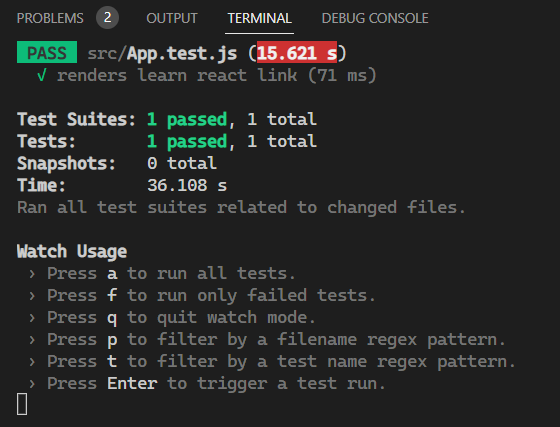

- RTL's `render` method to virtually render the `App` component imported from `App.js` file and append it to the `document.body` node.
- We can access the rendered HTML through the RTL's `screen` object.
- Jest's `expect` and RTL's `toBeInTheDocument` to verify the correctness.

How to see the how and what DOM/HTML generated by RTL ??  

To see the result of the `render()` call, we can use the `screen.debug()` method:

src/App.test.js

```js
import { render, screen } from "@testing-library/react";
import App from "./App";

test("renders learn react link", () => {
  render(<App />);
  screen.debug();
});

// Outputs in the terminal
{
  /* <body>
  <div>
    <div class="App">
      <header class="App-header">
        
        <p>
          Edit
          <code>src/App.js</code>
          and save to reload.
        </p>
        <a
          class="App-link"
          href="https://reactjs.org"
          rel="noopener noreferrer"
          target="_blank"
        >
          Learn React
        </a>
      </header>
    </div>
  </div>
</body>; */
}

```

- The `screen` object also has the DOM testing methods already bound into it.
- That's why the test code above could use `screen.getByText()` to query the anchor `<a>` element by its `textContent` value.
- The test code will assert whether the link element is available in the document object model or not with the `expect` method from Jest and RTL's `toBeInTheDocument` to verify the correctness.
- When the link element is not found, Jest will mark the test as **failed**.

### 24.4. 24.4 RTL's methods for finding elements

RTL has several methods to find an element in DOM by specific attributes.

- `getByText()` find the element by its `textContent` value

- `getByRole()`: by its `role` attribute value

- `getByPlaceholderText()`: by its `placeholder` attribute value

- `getByDisplayValue()`: by its `value` attribute, usually for `<input>` elements.

- `getByTestId()` method, which allows us to find an element by its `data-testid` attribute.

```js
import { render, screen } from "@testing-library/react";

test("<App>", () => {
  render(
    <>
      <div role="article" data-testid="my-article">
        Lipsum
      </div>
      Name : <input value="avinash" placeholder="enter name" />
    </>
  );
  expect(screen.getByText("Lipsum").textContent).toEqual("Lipsum");
  expect(screen.getByRole("article").textContent).toEqual("Lipsum");
  expect(screen.getByPlaceholderText("enter name..").value).toEqual("avinash");
  expect(screen.getByDisplayValue("avinash").placeholder).toEqual("enter name");
  expect(screen.getByTestId("my-article")).toBeInTheDocument();
});
```

### 24.5. 24.5 RTL's way to simulate DOM events

How to test DOM events, such as clicking on a button and typing values into a textbox etc.

The `user-event` library is peer depended library for simulating user-browser interaction.

Let's build an app,  

src/App.js

```js
import React from "react";
import "./App.css";

function App() {
  const [count, setCount] = React.useState(0);
  return (
    <>
      <button onClick={() => setCount(count + 1)}>+</button>
      <span>{count}</span>
    </>
  );
}

export default App;
```

Next, we create a test that finds the button and simulates a click event by using the `userEvent.click()` method. Once the button is clicked, we can assert the test is a success by inspecting whether count is incremented or not.

src/App.test.js

```js
import { render, screen } from "@testing-library/react";
import userEvent from "@testing-library/user-event";
import App from "./App";

test("<App>", () => {
  render(<App />);
  const button = screen.getByText("+");
  userEvent.click(button);
  expect(screen.getByText("1")).toBeInTheDocument();
  screen.debug();
});

// outputs
{
  /* <body>
  <div>
    <button>+</button>
    <span>1</span>
  </div>
</body>; */
}
```

The `user-event` library also has several other methods like `dblClick` for double clicking an element and `type` for typing into a textbox and so on.

Note:

- Call `userEvent.click(button);` two times and notice the output.
- [React Testing Library](https://testing-library.com/docs/react-testing-library/intro/) official documentation.
- [user-event](https://testing-library.com/docs/user-event/intro) official documentation.

## 25. Class Components

### 25.1. 25.1 Define class components

The simplest way to define a class component is to write a ES6 `class`:

```js
import React from "react";
import ReactDOM from "react-dom/client";

class Hello extends React.Component {
  render() {
    return <h1>Hello World</h1>;
  }
}

const rootElement = document.getElementById("root");
ReactDOM.createRoot(rootElement).render(<Hello />);
```

- To make a ES6 class to Component, we derive/extend it from `React.Component`
- It should have a `render()` method returning react elements/JSX.
- Calling/invoking/creating instances of either the functional or class components in react is same,i.e. `<Hello />`

### 25.2. 25.2 Props with class components

```js
import React from "react";
import ReactDOM from "react-dom/client";

class Hello extends React.Component {
  render() {
    return <h1>Hello, {this.props.name}</h1>;
  }
}

const rootElement = document.getElementById("root");
ReactDOM.createRoot(rootElement).render(<Hello name={"Avinash"} />);
```

- In a `class` component, we can get access to props from the props key on the component’s instance `this`.
- We use `this.props` to access the props passed to the components
- We call `root.render()` with the `<Hello name={"Avinash"} />` element.
- React calls the `Hello` component with `name={"Avinash"}` as the props.
- Our `Hello` component returns a `<h1>Hello, Avinash</h1>` element as the result.
React DOM efficiently updates the DOM to match `<h1>Hello, Avinash</h1>`.

### 25.3. 25.2 Adding state in class components

```js
import React from "react";
import ReactDOM from "react-dom/client";

class Hello extends React.Component {
  state = {
    name: "avinash",
  };

  render() {
    return <h1>Hello, {this.state.name}</h1>;
  }
}

const rootElement = document.getElementById("root");
ReactDOM.createRoot(rootElement).render(<Hello />);
```

- To add state to a class component, we’ll use `state` static member of ES6 class spec and isn’t a React specific method.
- By adding `state` to the component, we can now access it (via `this.state`) anywhere in our class.

### 25.4. 25.2 Updating state in class components

- React has helper method to update the state of a component and re-render the UI.
- It is called `setState` and it lives on the component’s instance, `this`.
- It is always immutable update.

```js
import React from "react";
import ReactDOM from "react-dom/client";

class Hello extends React.Component {
  state = {
    name: "Avinash",
  };

  updateName = () => {
    this.setState({
      name: "React",
    });
  };

  render() {
    return (
      <>
        <h1>Hello, {this.state.name}</h1>
        <button onClick={this.updateName}>Change Name</button>
      </>
    );
  }
}

const rootElement = document.getElementById("root");
ReactDOM.createRoot(rootElement).render(<Hello />);
```

- **NEVER set state like this.state.name= "something".**
- Direct mutation not allowed. React will have no idea that the component’s state changed and therefore won’t be able to update the UI.
- When `this.setState()` invoked, React will update the `name` property on the component’s state to be whatever new name is.
- Then, because the state changed, React will re-invoke the render method (re-render) and get a new description of the UI based on the new state.
- Finally, with that new description of the UI, React will update the DOM.

### 25.5. 25.3 The Component Lifecycle

Every time a React app runs, all of our components go through a specific lifecycle, we can break down that lifecycle into three parts.

1. When the component gets added to the DOM (**mounting**).
2. When the component updates its state or receives new data via props
(**updating**).
3. When the component gets removed from the DOM (**unmounting**).

Here are the most common things occurs in any typical application (in order in which they occur).

- Set the component’s initial state
- Render a DOM node (return React elements)
- Make an Ajax requests/http calls/Network calls
- Set up listeners (i.e. addEventListener) or manipulating DOM directly without using React or Timers
  
Will see how these are fit into React components lifecycle methods.

#### 25.5.1. 25.3.1 Mounting

```js
import React from "react";
import ReactDOM from "react-dom/client";

class Hello extends React.Component {
  state = {
    // Set the component’s initial state
    name: "Avinash",
    place: "Mysore",
  };

  componentDidMount() {
    // Make an Ajax requests/http calls/Network calls
    fetch("https://jsonplaceholder.typicode.com/users/4")
      .then((res) => res.json())
      .then((user) => {
        this.setState({ name: user.name });
      });
  }

  render() {
    // Render a DOM node (return React elements)
    return (
      <>
        <h1>
          Hello, {this.state.name}, {this.state.place}
        </h1>
      </>
    );
  }
}

const rootElement = document.getElementById("root");
ReactDOM.createRoot(rootElement).render(<Hello />);

```

- Set the component’s initial state
  - To set the initial state of the component, we will use `state` static variable
- Render a DOM node (return React elements)
  - Once the initial state of the component is set, the next lifecycle method to be called is `render`.
  - Though we’re not exactly rendering a DOM node ourself, we’ll use the `render` lifecycle method in order to describe (using JSX) the type of DOM node you want to render. (Actual DOM or HTML element will be created at `ReactDOM.render()`.
- Make an Ajax requests/http calls/Network calls
  - `componentDidMount` is invoked only one time when the component is first mounted to the DOM. Because of this, it’s a great place to make an http calls.

> Note: **Set up listeners, Timers**
>
> Similar to making an Ajax http calls, we can set up any listeners once the component has been mounted to the DOM, i.e., in `componentDidMount`. Why here, because component is already mounted and DOM APIs area available for access.
>
> Ex,
>
>  ```js
>   componentDidMount() {
>      this.timerId = setTimeout(() => {
>        console.log("timeout");
>      }, 1000);
>     window.addEventListener("resize", () => {});
>    }
>   ```

#### 25.5.2. 25.3.2 Updating

We want to hook into when a component updates its state or receives new data
via props? For an example,

- Re-render the UI with the updated state or props
- Re-fetching data
- Re-setting a listener

##### Re-render <!-- omit in toc -->

It’s important to note that `render` will be invoked not only when the component is first added to the DOM, but also any time after that when its `state` changes (via `setState` ) or when it receives new, updated `props`.

##### Re-fetching data <!-- omit in toc -->

`componentDidUpdate` is invoked after the component’s local state changes or after it receives new props - **but it’s not invoked on the initial render**. It’s passed two arguments, the component’s previous props and the component’s previous state.

Ex, Prop changing,

```js
import React from "react";
import ReactDOM from "react-dom/client";

class Hello extends React.Component {
  state = {
    name: "Avinash",
    place: "Mysore",
  };

  componentDidMount() {
    fetch(`https://jsonplaceholder.typicode.com/users/${this.props.id}`)
      .then((res) => res.json())
      .then((user) => {
        this.setState({ name: user.name });
      });
  }

  componentDidUpdate(prevProps, prevState) {
    // Called on when, component re-renders (that is state change or props change)
    if (prevProps.id != this.props.id)
      fetch(`https://jsonplaceholder.typicode.com/users/${this.props.id}`)
        .then((res) => res.json())
        .then((user) => {
          this.setState({ name: user.name });
        });
  }

  render() {
    return (
      <>
        <h1>
          Hello, {this.state.name}, {this.state.place}
        </h1>
      </>
    );
  }
}

function UserSelector() {
  const [selectedUser, setSelectedUser] = React.useState(1);
  return (
    <>
      <button onClick={() => setSelectedUser(2)}>2</button>
      <button onClick={() => setSelectedUser(3)}>3</button>
      <Hello id={selectedUser}></Hello>
    </>
  );
}

const rootElement = document.getElementById("root");
ReactDOM.createRoot(rootElement).render(<UserSelector />);
```

Ex, Internal/local component state changing,

```js
import React from "react";
import ReactDOM from "react-dom/client";

class Hello extends React.Component {
  state = {
    name: "Avinash",
    place: "Mysore",
    id: 1,
  };

  componentDidMount() {
    fetch(`https://jsonplaceholder.typicode.com/users/${this.state.id}`)
      .then((res) => res.json())
      .then((user) => {
        this.setState({ name: user.name });
      });
  }

  componentDidUpdate(prevProps, prevState) {
    // Called on when, component re-renders (that is state change or props change)
    if (prevState.id != this.state.id)
      fetch(`https://jsonplaceholder.typicode.com/users/${this.state.id}`)
        .then((res) => res.json())
        .then((user) => {
          this.setState({ name: user.name });
        });
  }

  render() {
    return (
      <>
        <button onClick={() => this.setState({ id: 2 })}>2</button>
        <button onClick={() => this.setState({ id: 3 })}>3</button>
        <h1>
          Hello, {this.state.name}, {this.state.place}
        </h1>
      </>
    );
  }
}

const rootElement = document.getElementById("root");
ReactDOM.createRoot(rootElement).render(<Hello></Hello>);
```

This allows you to compare the previous props/state to the current props/state so
you can decide if you need to do anything.

> **Re-setting a Listener or timers**  
> Similar to re-fetching data, we’d use `componentDidUpdate` to listen for prop/state changes in order to re-set a listener.

#### 25.5.3. 25.3.3 Unmounting

What should happen when Components gets removed from DOM. Nullify timers, remove event listeners, otherwise memory leaks.

To do this, you can hook into React’s `componentWillUnmount` lifecycle method. It’ll be called when the component is about to be removed from the DOM.

```js
import React from "react";
import ReactDOM from "react-dom/client";

class Home extends React.Component {
  componentDidMount() {
    this.timerId = setTimeout(() => {
      console.log("timeout");
    }, 1000);
    window.addEventListener("resize", () => {});
  }
  componentWillUnmount() {
    // clearTimeout(this.timerId);
    window.removeEventListener("resize", () => {});
  }
  render() {
    return <></>;
  }
}

const rootElement = document.getElementById("root");
ReactDOM.createRoot(rootElement).render(<Home></Home>);
```

#### 25.5.4. 25.3.4 Summary

```js
import React from "react";
import ReactDOM from "react-dom/client";

class App extends React.Component {
  constructor(props) {
    // Good for establishing the initial state of a component
    super(props);
    this.state = {};
  }
  componentDidMount() {
    // Invoked once the component is mounted to the DOM.
    // Good for making AJAX requests.
  }
  componentDidUpdate() {
    // Invoked immediately after updating occurs.
    // Good for AJAX requests based on changing props or DOM ope rations.
  }
  componentWillUnmount() {
    // Called right before a component is unmounted.
    // Good for cleaning up listeners.
  }
  render() {
    return <></>;
  }
}

const rootElement = document.getElementById("root");
ReactDOM.createRoot(rootElement).render(<Home></Home>);
```

Other less or rarely used lifecycle methods.

- getDerivedStateFromProps
- shouldComponentUpdate
- getSnapshotBeforeUpdate

## 26. Error Handling

### 26.1. 26.1 The error

This code will produces the blank white scree in the browser giving no clue to user, that what happened?

```js
import React from "react";
import ReactDOM from "react-dom/client";

function Welcome({ name }) {
  return <>Welcome, {name.toUpperCase()}</>;
}

const rootElement = document.getElementById("root");
ReactDOM.createRoot(rootElement).render(<Welcome />);
```

If we open the browser's console, we'll see something like `index.js:5 Uncaught TypeError: Cannot read properties of undefined (reading 'toUpperCase')` in red color.

Let's handle the error using Try catch.

### 26.2. 26.2 Try Catch

```js
import React from "react";
import ReactDOM from "react-dom/client";

function ErrorComponent({ errorMessage }) {
  return <h1 style={{ color: "red" }}>{errorMessage}</h1>;
}

function Welcome({ name }) {
  try {
    return <div>Welcome, {name.toUpperCase()}</div>;
  } catch (error) {
    return <ErrorComponent errorMessage={error.message} />;
  }
}

const rootElement = document.getElementById("root");
ReactDOM.createRoot(rootElement).render(<Welcome />);
```

This will show the error message in browser's UI - `Cannot read properties of undefined (reading 'toUpperCase')`.

But, but what if I don't want to wrap every component in my app in a try/catch block?

### 26.3. 26.3 getDerivedStateFromError

`static getDerivedStateFromError(error)`

This lifecycle is invoked after an error has been thrown by a descendant component. It receives the error that was thrown as a parameter and should return a value to update state.

```js
import React from "react";
import ReactDOM from "react-dom/client";

function ErrorComponent({ message }) {
  return <h1>{message}</h1>;
}

class ErrorBoundary extends React.Component {
  state = { errorMessage: "" };

  static getDerivedStateFromError(error) {
    // Update state so the next render will show the fallback UI.
    return { errorMessage: error.message };
  }

  render() {
    if (this.state.errorMessage) {
      // You can render any custom fallback UI
      return <ErrorComponent message={this.state.errorMessage} />;
    }

    return this.props.children;
  }
}

function Welcome({ name }) {
  return <div>Welcome, {name.toUpperCase()}</div>;
}
const rootElement = document.getElementById("root");
ReactDOM.createRoot(rootElement).render(
  <ErrorBoundary>
    <Welcome />
  </ErrorBoundary>
);
```

> Note: `getDerivedStateFromError()` is called during the `render` phase, so side-effects are not permitted. For those use cases, use `componentDidCatch()` instead.

### 26.4. 26.4 componentDidCatch

`componentDidCatch(error, info)`

**Produce the condition where getDerivedStateFromError is insufficient and fix that issue with componentDidCatch with an example.**

## 27. State management with Redux

Redux is a predictable state container for JavaScript apps.

Redux can be described in three fundamental principles:

- Single source of truth
- State is read-only
- Changes are made with pure functions

### 27.1. 27.1 Single source of truth

The global state of your application is stored in an object tree within a single store.

```js
console.log(store.getState())

/* Prints
{
  visibilityFilter: 'SHOW_ALL',
  todos: [
    {
      text: 'Consider using Redux',
      completed: true,
    },
    {
      text: 'Keep all state in a single tree',
      completed: false
    }
  ]
}
*/
```

### 27.2. 27.2 State is read-only

The only way to change the state is to emit an action, an object describing what happened.

```js
store.dispatch({
  type: 'COMPLETE_TODO',
  index: 1
})

store.dispatch({
  type: 'SET_VISIBILITY_FILTER',
  filter: 'SHOW_COMPLETED'
})
```

### 27.3. 27.3 Changes are made with pure functions

To specify how the state tree is transformed by actions, you write pure reducers.

```js
function visibilityFilter(state = 'SHOW_ALL', action) {
  switch (action.type) {
    case 'SET_VISIBILITY_FILTER':
      return action.filter
    default:
      return state
  }
}

function todos(state = [], action) {
  switch (action.type) {
    case 'ADD_TODO':
      return [
        ...state,
        {
          text: action.text,
          completed: false
        }
      ]
    case 'COMPLETE_TODO':
      return state.map((todo, index) => {
        if (index === action.index) {
          return Object.assign({}, todo, {
            completed: true
          })
        }
        return todo
      })
    default:
      return state
  }
}

import { combineReducers, createStore } from 'redux'
const reducer = combineReducers({ visibilityFilter, todos })
const store = createStore(reducer)
```  

### 27.4. 27.4 An example, React with Redux

1. `npx create-react-app redux-counter`
2. `cd redux-counter`
3. `npm install redux react-redux`
4. Write below code to `index.js` file

src/index.js

```js
import React from "react";
import ReactDOM from "react-dom/client";
import { createStore } from "redux";
import { Provider, useDispatch, useSelector } from "react-redux";

function counterReducer(state = 0, action) {
  if (action.type == "up") {
    return state + action.value;
  }
  if (action.type == "down") {
    return state - action.value;
  }
  if (action.type == "reset") {
    return 0;
  }
  return state;
}

const store = createStore(counterReducer);

function Counter() {
  const dispatch = useDispatch();
  const count = useSelector(function (state) {
    return state;
  });
  return (
    <>
      <button onClick={() => dispatch({ type: "up", value: 1 })}>+</button>
      <span>{count}</span>
      <button onClick={() => dispatch({ type: "down", value: 1 })}>-</button>
      <button onClick={() => dispatch({ type: "reset" })}>reset</button>
    </>
  );
}

const rootElement = document.getElementById("root");
ReactDOM.createRoot(rootElement).render(
  <Provider store={store}>
    <Counter />
  </Provider>
);
```

------------------->